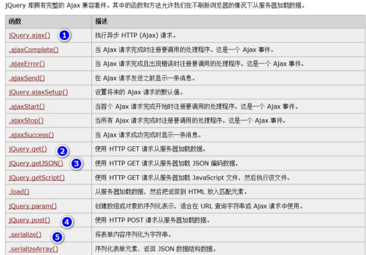
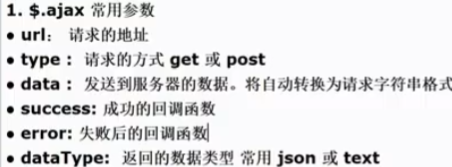
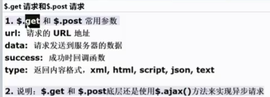
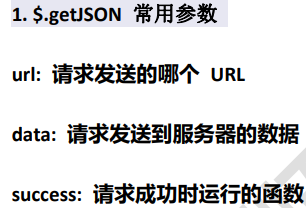

# Ajax

Ajax是什么？
1. AJAX即 `Asynchronous Javascript And XML`，异步JavaScript和XML
2. Ajax是一种浏览器**异步发起请求(指定发哪些数据)，局部更新页面**的技术
3. 

## 传统的Web应用

- 
- 缺点：
    1. 表单提交是把表单的所有数据，都提交给服务端、数据大，而且没有意义
    2. 在服务端没有Http响应前，浏览器前端页面处于等待状态，处于一个挂起状态
    3. 不能进行局部刷新，而是刷新整个页面

## Ajax原理示意图

- 
- 

## JavaScript原生Ajax请求

### 应用实例-验证与户名是否存在

- 
1. 在输入框输入用户名
2. 点击验证用户名，使用 `ajax` 方式，服务端验证该用户名是否已经被占用了，如果该用户已经占用，
  以 `json` 格式返回该用户信息
3. 对页面进行局部刷新，显示返回信息
- 
1. 使用ajax引擎发送http请求
2. 服务端处理请求
3. ajax接收返回的数据
4. 完成局部刷新/数据更新

```html
<!DOCTYPE html>
<html lang="en">
<head>
    <meta charset="UTF-8">
    <title>用户注册</title>
    <script type="text/javascript">
        window.onload = function () {   // 页面加载后执行 function
            var checkButton = document.getElementById("checkButton");
            // 给 checkButton 绑定 onclick
            checkButton.onclick = function () {
                // 1. 创建XMLHttpRequest对象!!![ajax引擎对象]
                var xhr = new XMLHttpRequest();

                // 获取用户填写的用户名
                var uname = document.getElementById("uname").value;
                // alert(uname);

                // 2. 准备发送指定数据 open, send
                // open(method, url, async)
                // 1) GET 请求方式，可以是 GET/POST
                // 2) url
                // 3） true 表示异步发送
                xhr.open("GET", "/ajax/checkUserServlet?username=" + uname, true);

                // 说明：在send函数调用前，给 XMLHttpRequest 绑定一个事件 onreadystatechange
                // 该事件表示，可以去指定一个函数，当 readyState 变化时，会触发 onreadystatechange
                // 每当 readyState 改变时，就会触发 onreadystatechange 事件
                xhr.onreadystatechange = function () {
                    // 如果请求已完成，响应已就绪，并且响应码是200
                    if (xhr.readyState === 4 && xhr.status === 200) {
                        // 把返回的json数据，显示在div中
                        document.getElementById("div1").innerText = responseText;
                        var responseText = xhr.responseText;
                        // {"id":100,"username":"king","pwd":"666","email":"king@sohu.com"}
                        // console.log("返回的信息：", responseText);
                        if (responseText !== "") {
                            document.getElementById("myres").value = "用户已被占用！";
                        } else {
                            document.getElementById("myres").value = "用户可用";
                        }
                    }
                    // console.log("xhr=", xhr);
                }

                // 3. 真正发送ajax请求[底层仍然是http请求]
                // 如果是POST请求，在 send("") 中使用字符串填写数据
                xhr.send();
            }
        }
    </script>
</head>
<body>
<h1>用户注册</h1>
<form action="/ajax/checkUserServlet" method="post">
    用户名称：<input type="text" name="username" id="uname">
    <input type="button" id="checkButton" value="验证用户名">
    <input style="border-width: 0;color: red" type="text" id="myres"><br/>
    用户密码：<input type="password" name="password"><br/><br/>
    电子邮件：<input type="text" name="email"><br/><br/>
    <input type="submit" value="用户注册">
</form>
<h1>返回的json数据</h1>
<div id="div1"></div>
</body>
</html>
```

```java
package com.charlie.ajax.servlet;

import com.charlie.ajax.entity.User;
import com.google.gson.Gson;

import javax.servlet.ServletException;
import javax.servlet.http.HttpServlet;
import javax.servlet.http.HttpServletRequest;
import javax.servlet.http.HttpServletResponse;
import java.io.IOException;

public class CheckUserServlet extends HttpServlet {
    @Override
    protected void doGet(HttpServletRequest req, HttpServletResponse resp) throws ServletException, IOException {
//        System.out.println("CheckUserServlet 被调用...");

        // 接收ajax提交的数据，参数要与ajax提交的数据匹配
        // xhr.open("GET", "/ajax/checkUserServlet?username=" + uname, true);
        String username = req.getParameter("username");
        System.out.println("username: " + username);

        resp.setContentType("text/html;charset=utf-8");
        // 假定用户名为king，就不可用，其它用户名可以
        if ("king".equals(username)) {
            // 以后这个信息，是从DB获取
            User king = new User(100, "king", "666", "king@sohu.com");
            // 转成json
            String strKing = new Gson().toJson(king);
            // 返回
            resp.getWriter().write(strKing);
        } else {
            // 如果用户名可以用，返回 ""
            resp.getWriter().write("");
        }
    }

    @Override
    protected void doPost(HttpServletRequest req, HttpServletResponse resp) throws ServletException, IOException {
        doGet(req, resp);
    }
}
```

- 
- 

```java
package com.charlie.ajax.utils;

import com.alibaba.druid.pool.DruidDataSourceFactory;

import javax.sql.DataSource;
import java.sql.Connection;
import java.sql.PreparedStatement;
import java.sql.ResultSet;
import java.sql.SQLException;
import java.util.Properties;

public class JDBCUtilsByDruid {

    private static final DataSource ds;

    static {
        Properties properties = new Properties();
        try {
            /*
            1. 目前是使用JavaWeb方式启动
            2. 所以要获取src目录的文件，需要使用类加载器
            */
//            不能使用该这种方式，因为src是在JavaSE application上使用的路径
//            properties.load(new FileInputStream("src\\druid.properties"));
            properties.load(JDBCUtilsByDruid.class.getClassLoader().
                    getResourceAsStream("druid.properties"));
            ds = DruidDataSourceFactory.createDataSource(properties);
        } catch (Exception e) {
            throw new RuntimeException(e);
        }
    }

    public static Connection getConnection() throws SQLException {
        return ds.getConnection();
    }

    // 关闭连接
    // 注意：在数据库连接池技术中，close不是真正地断掉连接，而是把使用地Connection对象放回到连接池
    public static void close(ResultSet resultSet, PreparedStatement preparedStatement, Connection connection) {
        try {
            if (resultSet != null) {
                resultSet.close();
            }
            if (preparedStatement != null) {
                preparedStatement.close();
            }
            if (connection != null) {
                connection.close();
            }
        } catch (SQLException e) {
            throw new RuntimeException(e);
        }
    }
}
```

```java
package com.charlie.ajax.servlet;

import com.charlie.ajax.entity.User;
import com.charlie.ajax.service.UserService;
import com.google.gson.Gson;

import javax.servlet.ServletException;
import javax.servlet.http.HttpServlet;
import javax.servlet.http.HttpServletRequest;
import javax.servlet.http.HttpServletResponse;
import java.io.IOException;

public class CheckUserServlet extends HttpServlet {

    // 定义一个UserService属性
    private UserService userService = new UserService();

    @Override
    protected void doGet(HttpServletRequest req, HttpServletResponse resp) throws ServletException, IOException {
//        System.out.println("CheckUserServlet 被调用...");

        // 接收ajax提交的数据，参数要与ajax提交的数据匹配
        // xhr.open("GET", "/ajax/checkUserServlet?username=" + uname, true);
        String username = req.getParameter("username");
        System.out.println("username: " + username);

        resp.setContentType("text/html;charset=utf-8");

        // 到数据库中去检测用户名是否重复
        User user = userService.getUserByName(username);
        if (user != null) { // 说明用户已经存在，返回该user的json格式数据
            Gson gson = new Gson();
            String strUser = gson.toJson(user);
            resp.getWriter().write(strUser);
        } else {
            resp.getWriter().write("");
        }

//        // 假定用户名为king，就不可用，其它用户名可以
//        if ("king".equals(username)) {
//            // 以后这个信息，是从DB获取
//            User king = new User(100, "king", "666", "king@sohu.com");
//            // 转成json
//            String strKing = new Gson().toJson(king);
//            // 返回
//            resp.getWriter().write(strKing);
//        } else {
//            // 如果用户名可以用，返回 ""
//            resp.getWriter().write("");
//        }
    }

    @Override
    protected void doPost(HttpServletRequest req, HttpServletResponse resp) throws ServletException, IOException {
        doGet(req, resp);
    }
}
```

## JQuery的Ajax请求

- 
- [JQuery-Ajax在线文档](https://www.w3school.com.cn/jquery/jquery_ref_ajax.asp)
- 

- 
- 
- 

> 提示：当项目中有文件是直接拷贝过来时，有可能识别不到。这时可以 `Build->Rebuild Project`

```html
<!DOCTYPE html>
<html lang="en">
<head>
    <meta charset="UTF-8">
    <title>用户注册-JQuery+Ajax</title>
<!--    引入jquery-->
    <script type="text/javascript" src="./script/jquery-3.6.0.min.js"></script>
    <script type="text/javascript">
        $(function() {
            // 绑定事件
            $("#btn1").click(function () {
                /*
                发出ajax请求
                1. 指定参数时，需要在 {} 中
                2. 给参数时，前面需要指定参数名
                3. dataType: "json" 要求服务器返回数据是json
                 */
                // $.ajax({
                //     url: "/ajax/checkUserServlet2",
                //     type: "POST",
                //     data: { // 这里直接给json
                //         username: $("#uname").val(),
                //         date: new Date()    // 传一个日期，为了解决浏览器缓存
                //     },
                //     error: function () {    // 失败后的回调函数
                //         console.log("失败~")
                //     },
                //     // success(response,status,xhr)
                //     success: function (data, status, xhr) {
                //         console.log("成功！");
                //         console.log("data=", data);
                //         console.log("status=", status);
                //         console.log("xhr=", xhr);
                //         // data是json对象 -> 显示转成json的字符串
                //         $("#div1").html(JSON.stringify(data));
                //         // 对返回的结果进行处理
                //         if ("" === data.username) {
                //             $("#myres").val("该用户名可用");
                //         } else {
                //             $("#myres").val("该用户名不可用");
                //         }
                //     },
                //     dataType: "json"    // 返回数据类型
                // })

                // .get() 使用
                /*
                1. $.get() 默认是get请求，不需要指定请求方式
                2. 不需要指定参数名
                3. 填写的实参是顺序的，url, data, success, dataType
                    $(selector).get(url,data,success(response,status,xhr),dataType)
                 */
                // $.get(
                //     "/ajax/checkUserServlet2",
                //     { // 这里直接给json
                //         username: $("#uname").val(),
                //             date: new Date()    // 传一个日期，为了解决浏览器缓存
                //     },
                //     function (data, status, xhr) {
                //         $("#div1").html(JSON.stringify(data));
                //         if ("" === data.username) {
                //             $("#myres").val("用户名已被占用~")
                //         } else {
                //             $("#myres").val("该用户名可用！")
                //         }
                //     },
                //     "json"
                // )

                /*
                1. $.post() 和 $.get() 的调用方式一样
                2. 区别仅在于 使用 POST 方式发送请求
                 */
                // $.post(
                //     "/ajax/checkUserServlet2",
                //     { // 这里直接给json
                //         username: $("#uname").val(),
                //         date: new Date()    // 传一个日期，为了解决浏览器缓存
                //     },
                //     function (data, status, xhr) {
                //         console.log("成功！");
                //         console.log("data=", data);
                //         console.log("status=", status);
                //         console.log("xhr=", xhr);
                //         $("#div1").html(JSON.stringify(data));
                //         if ("" === data.username) {
                //             $("#myres").val("用户名已被占用~")
                //         } else {
                //             $("#myres").val("该用户名可用！")
                //         }
                //     },
                //     "json"
                // )

                /*
                $.getJson
                1. 如果通过jquery发出的ajax请求是get请求 并且 返回的数据格式是json
                2. 可以直接使用 getJson() 函数
                 */
                $.getJSON(
                    "/ajax/checkUserServlet2",
                    { // 这里直接给json
                        username: $("#uname").val(),
                        date: new Date()    // 传一个日期，为了解决浏览器缓存
                    },
                    function (data, status, xhr) {  // 成功后的回调函数
                        console.log("成功！");
                        console.log("data=", data);
                        console.log("status=", status);
                        console.log("xhr=", xhr);
                        $("#div1").html(JSON.stringify(data));
                        if ("" === data.username) {
                            $("#myres").val("该用户名可用！")
                        } else {
                            $("#myres").val("用户名已被占用~")
                        }
                    },
                    "json"
                )
            })
        })
    </script>
</head>
<body>
<h1>用户注册-JQuery+Ajax</h1>
<form action="/ajax/checkUserServlet2" method="post">
    用户名称：<input type="text" name="username" id="uname">
    <input type="button" id="btn1" value="验证用户名">
    <input style="border-width: 0;color: red" type="text" id="myres"><br/>
    用户密码：<input type="password" name="password"><br/><br/>
    电子邮件：<input type="text" name="email"><br/><br/>
    <input type="submit" value="用户注册">
</form>
<h1>返回的json数据</h1>
<div id="div1"></div>
</body>
</html>
```

```java
package com.charlie.ajax.servlet;

import com.charlie.ajax.entity.User;
import com.charlie.ajax.service.UserService;
import com.google.gson.Gson;

import javax.servlet.ServletException;
import javax.servlet.http.HttpServlet;
import javax.servlet.http.HttpServletRequest;
import javax.servlet.http.HttpServletResponse;
import java.io.IOException;

public class CheckUserServlet2 extends HttpServlet {

    private UserService userService = new UserService();

    @Override
    protected void doPost(HttpServletRequest req, HttpServletResponse resp) throws ServletException, IOException {
//        System.out.println("checkUserServlet2被调用...");
        // 接收jquery发送的ajax数据
        String username = req.getParameter("username");
//        System.out.println("jquery ajax username=" + username);
        resp.setContentType("text/json;charset=utf-8");
        Gson gson = new Gson();

        // 到数据库去验证，用户名是否已被占用
        User user = userService.getUserByName(username);
        if (user == null) {
            user = new User(-1, "", "", "");
        }

//        if ("king".equals(username)) {
//            user = new User(100, "king", "abc", "king@sohu.com");
//        } else {
//            // 返回一个不存在的user
//            user = new User(-1, "", "", "");
//        }

        resp.getWriter().write(gson.toJson(user));
    }

    @Override
    protected void doGet(HttpServletRequest req, HttpServletResponse resp) throws ServletException, IOException {
        doPost(req, resp);
    }
}
```
