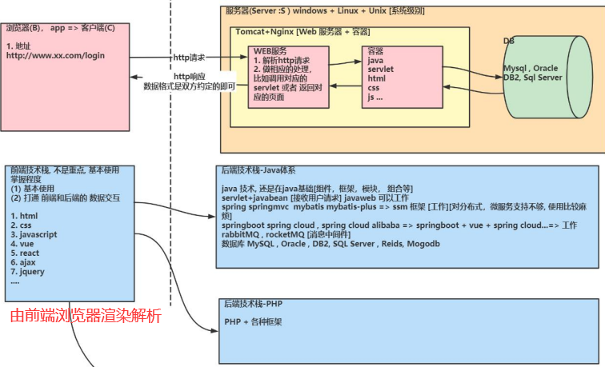

# JavaWeb

## B/S软件开发架构简述

1. B/S架构，即前端(Browser，浏览器)和服务器端(Server)组成的系统的框架结构。
2. B/S架构也可以理解为web架构，包含**前端、后端、数据库**三大组成部分
3. 示意图
    - 

- 前端：开发技术工具包括三件套：HTML,CSS和JavaScript，还有很多高级的前端框架，如jquery，vue等
- 后端：开发工具主要有Java、Go、PHP等
- 数据库：主流的三种关系型数据库：Mysql、SQLServer、Oracle，还有Nosql非关系型数据库：Redis、Mogodb等
