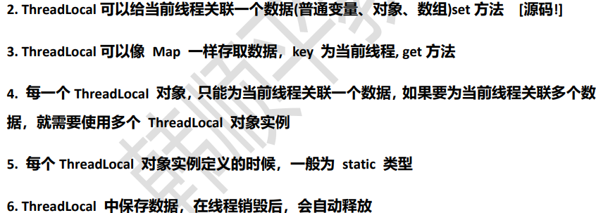
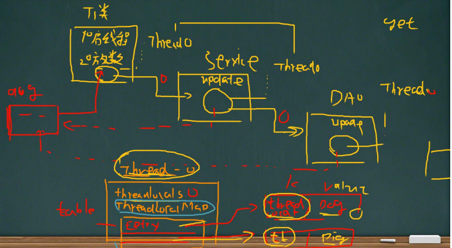
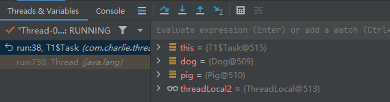
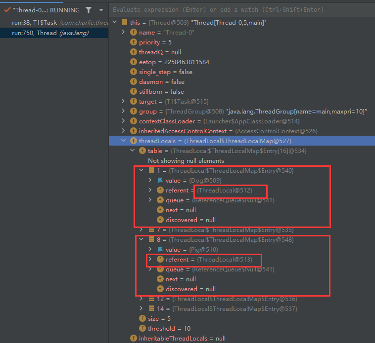

# ThreadLocal

线程数据共享和安全-ThreadLocal
- ThreadLocal可以实现**在同一个线程数据共享**，从而解决多线程数据安全问题
- 

- 
- [T1.java](src/com/charlie/threadlocal/T1.java)
  - [T1Service](src/com/charlie/threadlocal/T1Service.java)
    - [T1DAO](src/com/charlie/threadlocal/T1DAO.java)
- 
- 

```java
package com.charlie.threadlocal;

public class T1 {

    // 创建ThreadLocal对象,是public static
    public static ThreadLocal<Object> threadLocal1 = new ThreadLocal<>();
    public static ThreadLocal<Object> threadLocal2 = new ThreadLocal<>();

    // Task是线程类 -> 内部类
    public static class Task implements Runnable {
        @Override
        public void run() {
            Dog dog = new Dog();
            Pig pig = new Pig();
            // 给 threadLocal1对象 放入set dog
            System.out.println("Task 放入了 dog=" + dog);
            /* 源码解读
            public void set(T value) {
                // 1. 获取当前线程，关联到当前线程
                Thread t = Thread.currentThread();
                // 2. 通过线程对象，获取到ThreadLocalMap
                // ThreadLocalMap是ThreadLocal的一个内部静态类
                ThreadLocalMap map = getMap(t);
                // 3. 如果map不为null，将数据(dog, pig, ...) 放入 map
                // key：threadLocal1, value: 存放的数据
                // 从源码中可以看出，一个ThreadLocal对象只能存放一个对象，如果再set就会替换
                if (map != null) {
                    map.set(this, value);
                } else {
                // 4. 如果map为null，就创建一个和当前线程关联的ThreadLocalMap，并且将该数据放入
                    createMap(t, value);
                }
            }
             */
            threadLocal1.set(dog);
//            threadLocal1.set(pig);  // 替换value
            threadLocal2.set(pig);  // 这个数据就会和threadLocal2关联，并且都被当前Thread线程共享
            System.out.println("在Task run方法中 线程=" + Thread.currentThread().getName());
            new T1Service().update();
        }
    }

    public static void main(String[] args) {
        // 在主线程中启动一个新线程，注意不是主线程
        new Thread(new Task()).start();
    }
}
```

```java
package com.charlie.threadlocal;

public class T1Service {
    public void update() {
        // 取出threadLocal1对象关联的对象
        /* ThreadLocal的get方法源码解读
        public T get() {
            // 1. 先得到当前的线程对象
            Thread t = Thread.currentThread();
            // 2. 通过线程获取到对应的ThreadLocalMap
            ThreadLocalMap map = getMap(t);
            if (map != null) {
                // 3. 如果map不为空，根据当前的ThreadLocal对象，得到对应的Entry
                ThreadLocalMap.Entry e = map.getEntry(this);
                // 4. 如果 e不为null
                if (e != null) {
                    @SuppressWarnings("unchecked")
                    // 4. 返回当前threadLocal关联的数据value
                    T result = (T)e.value;
                    return result;
                }
            }
            return setInitialValue();
        }
         */
        Object o = T1.threadLocal1.get();
        // 获取当前线程名
        String name = Thread.currentThread().getName();
        System.out.println("在T1Service的update() 线程=" + name
                        + " dog=" + o);
        new T1DAO().update();
    }
}
```

```java
package com.charlie.threadlocal;

public class T1DAO {
    public void update() {
        // 取出线程关联的threadLocal1对象的数据
        Object o = T1.threadLocal1.get();
        // 获取当前线程名
        String name = Thread.currentThread().getName();
        System.out.println("在T2DAO的update() 线程=" + name
                        + " 取出的dog=" + o);
    }
}
```
