# Web开发会话技术-Cookie&Session

## 会话

### 基本介绍

1. 什么是会话？
   - **会话**可以简单理解为：用户开一个浏览器，点击多个超链接，访问服务器多个 web 资源，然
   后关闭浏览器，整个过程称之为一个会话。
2. 会话过程中要解决得一些问题？
   - 每个用户在使用浏览器与服务器进行会话的过程中，不可避免各自会**产生一些数据**，服务器要想办法为**每个用户**保存这些数据

### 会话得两种技术

1. Session
2. Cookie

## Cookie功能

Cookie(曲奇)：是客户端技术，服务器把每个用户得数据以 cookie 得形式写给用户各自浏览器。当用户使用浏览器再去访问服务器的 web 资源时，
就会带着各自的数据去。这样，web资源处理的就是用户各自的数据了。

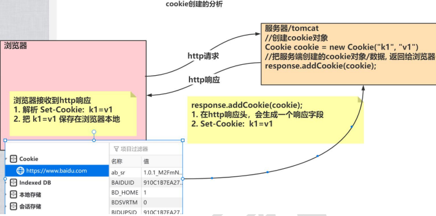

## cookie介绍

> cookie 是 servlet 发送到 Web 浏览器的**少量信息**，这些信息**由浏览器保存**，然后发送回服务器。
> cookie 的值可以唯一地标识客户端，因此 cookie 常用于会话管理。

1. cookie是服务端**在客户端保存用户的信息**，比如登录名、浏览历史等，就可以以cookie方式保存
2. cookie信息就像曲奇一样，数据量并不大，**服务端在需要的时候可以从客户端/浏览器读取(http协议)**

| 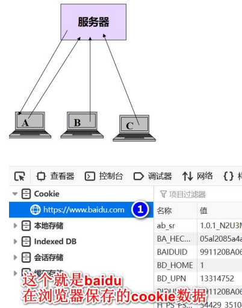 | 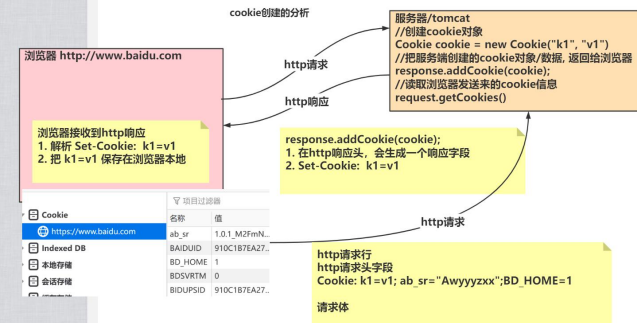 |
|-----------------------|-----------------------|

### cookie可以用来做什么

1. 保存上次登录时间等信息
2. 保存用户名、密码，在一定时间不要重新登录
3. 网站的个性化，比如定制网站的服务，内容等

## cookie基本使用

`文档：java_ee_api.chm`

### cookie常用方法

1. Cookie像一张表(k-v)，分两列，一列是名字一列是指，数据类型都是 `String`，如果所示
   - 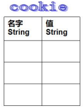
2. 如果创建一个 Cookie(**在服务端创建**)
   - `Cookie c = new Cookie(String name, String val);`
   - `c.setMaxAge();    // 保存时间`
3. 如何将一个cookie**添加到客户端**
   - `resp.addCookie(e);`
4. 如何读取cookie(**在服务端读取到cookie信息**)
   - `req.getCookies();`

## cookie底层实现机制-创建和读取cookie

```java
package com.charlie.cookie;

import javax.servlet.ServletException;
import javax.servlet.http.Cookie;
import javax.servlet.http.HttpServlet;
import javax.servlet.http.HttpServletRequest;
import javax.servlet.http.HttpServletResponse;
import java.io.IOException;
import java.io.PrintWriter;

/**
 * 演示如何创建Cookie，并保存到浏览器
 */
public class CreateCookie extends HttpServlet {
    @Override
    protected void doGet(HttpServletRequest req, HttpServletResponse resp) throws ServletException, IOException {
        System.out.println("CreateCookie 被调用...");
        // 1. 创建一个Cookie对象
        /*
        1) username 该cookie的名字，唯一，可以理解为 key
        2) charlie: 该coolie的值
        3) 可以创建多个cookie
        4) 此时cookie在服务器端，还没有到浏览器
         */
        Cookie cookie = new Cookie("username", "charlie");

        resp.setContentType("text/html;charset=utf-8");
        // 2. 将cookie发送给浏览器，让浏览器将该cookie保存
        resp.addCookie(cookie);

        PrintWriter writer = resp.getWriter();
        writer.println("<h1>创建cookie成功~</h1>");
        writer.flush();
        writer.close();
    }

    @Override
    protected void doPost(HttpServletRequest req, HttpServletResponse resp) throws ServletException, IOException {
        doGet(req, resp);
    }
}
```

```java
package com.charlie.cookie;

import javax.servlet.ServletException;
import javax.servlet.annotation.WebServlet;
import javax.servlet.http.Cookie;
import javax.servlet.http.HttpServlet;
import javax.servlet.http.HttpServletRequest;
import javax.servlet.http.HttpServletResponse;
import java.io.IOException;
import java.io.PrintWriter;

/**
 * 读取从浏览器发送来的cookie[底层仍然是http协议]
 */
@WebServlet(urlPatterns = {"/readCookies"})
public class ReadCookies extends HttpServlet {
    @Override
    protected void doGet(HttpServletRequest req, HttpServletResponse resp) throws ServletException, IOException {
        System.out.println("ReadCookies 被调用...");
        // 1. 通过req对象读取cookies信息
        Cookie[] cookies = req.getCookies();
        // 2. 遍历cookie
        System.out.println("cookies:");
        if (cookies != null && cookies.length != 0) {
            for (Cookie cookie : cookies) {
                System.out.println("name: " + cookie.getName()
                + ", value: " + cookie.getValue());
            }
        }
        // 3. 给浏览器返回信息
        resp.setContentType("text/html;charset=utf-8");
        PrintWriter writer = resp.getWriter();
        writer.println("<h1>读取cookie信息成功~</h1>");
        writer.flush();
        writer.close();
    }

    @Override
    protected void doPost(HttpServletRequest req, HttpServletResponse resp) throws ServletException, IOException {
        doGet(req, resp);
    }
}
```

| 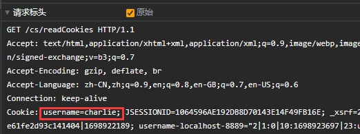 | 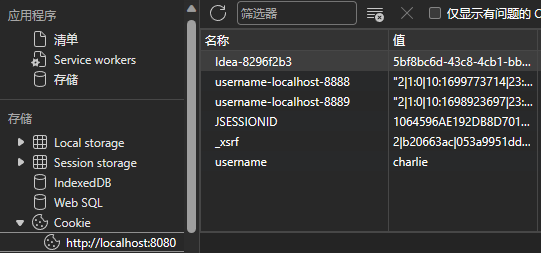 |
|----------------------|----------------------|

> 不同会话，`JSESSIONID`不同，需要关闭浏览器再重新打开才有效。

## Cookie应用实例

### 读取指定Cookie

```java
package com.charlie.cookie;

import javax.servlet.ServletException;
import javax.servlet.annotation.WebServlet;
import javax.servlet.http.Cookie;
import javax.servlet.http.HttpServlet;
import javax.servlet.http.HttpServletRequest;
import javax.servlet.http.HttpServletResponse;
import java.io.IOException;
import java.io.PrintWriter;

@WebServlet(urlPatterns = {"/readCookieByNameServlet"})
public class ReadCookieByNameServlet extends HttpServlet {
    @Override
    protected void doGet(HttpServletRequest req, HttpServletResponse resp) throws ServletException, IOException {
        System.out.println("ReadCookieByNameServlet 被调用...");
        // 得到指定的cookie值
        // 1. 先得到浏览器携带的所有的cookie
        Cookie[] cookies = req.getCookies();
        // 2. 使用工具类来获取指定的cookie值
        Cookie emailcookie = CookieUtils.readCookieByName("email", cookies);
        if (emailcookie != null) {
            System.out.println("得到cookie name= " + emailcookie.getName()
            + ", cookie value= " + emailcookie.getValue());
        } else {
            System.out.println("Sorry，没有找到这个cookie！");
        }
        // 3. 给浏览器返回信息
        resp.setContentType("text/html;charset=utf-8");
        PrintWriter writer = resp.getWriter();
        writer.println("<h1>完成读取cookie的任务...</h1>");
        writer.flush();
        writer.close();
    }

    @Override
    protected void doPost(HttpServletRequest req, HttpServletResponse resp) throws ServletException, IOException {
        doGet(req, resp);
    }
}
```

### 修改Cookie

```java
package com.charlie.cookie;

import javax.servlet.ServletException;
import javax.servlet.annotation.WebServlet;
import javax.servlet.http.Cookie;
import javax.servlet.http.HttpServlet;
import javax.servlet.http.HttpServletRequest;
import javax.servlet.http.HttpServletResponse;
import java.io.IOException;
import java.io.PrintWriter;

@WebServlet(urlPatterns = {"/updateCookie"})
public class UpdateCookie extends HttpServlet {
    @Override
    protected void doGet(HttpServletRequest req, HttpServletResponse resp) throws ServletException, IOException {
        System.out.println("UpdateCookie 被调用...");
        // 演示如何修改 cookie
        // 1. 根据名字查找cookie
        String cookieName = "email";
        Cookie[] cookies = req.getCookies();

        Cookie userNameCookie = new Cookie("username", "Yann LeCun");

        Cookie cookie = CookieUtils.readCookieByName(cookieName, cookies);
        if (cookie == null) {   // 在浏览器没有email cookie
            System.out.println("当前访问服务器的浏览器没有 该cookie");
        } else {
            cookie.setValue("Charlie-Hi~");
            // 此时浏览器的cookie并未改变，需要返回才行
        }
        // 2. 遍历cookie
        if (cookies != null && cookies.length != 0) {
            for (Cookie cookie1 : cookies) {
                System.out.println("cookie1 name= " + cookie1.getName()
                + ", value= " + cookie1.getValue());
            }
        }
        // 3. 给浏览器返回信息
        resp.setContentType("text/html;charset=utf-8");
        // 4. 如果希望本地的浏览器cookie也修改，需要使用 resp.addCookie(cookie);
        if (cookie != null) {
            resp.addCookie(cookie);
        }
        if (userNameCookie != null) {
            // 把新创建的userNameCookie重新保存到浏览器
            // 如果保存的userNameCookie和已经存在的cookie同名，则等价于修改该同名cookie
            System.out.println("修改为自定义的cookie");
            resp.addCookie(userNameCookie);
        }
        PrintWriter writer = resp.getWriter();
        writer.println("<h1>完成修改cookie的任务...</h1>");
        writer.flush();
        writer.close();
    }

    @Override
    protected void doPost(HttpServletRequest req, HttpServletResponse resp) throws ServletException, IOException {
        doGet(req, resp);
    }
}
```

## Cookie生命周期

1. Cookie的生命周期指的是如何管理 Cookie 什么时候被销毁/删除
2. `setMaxAge(-1)`
   - 正数，表示在指定的秒数后国企
   - 负数，表示浏览器关闭，Cookie就会被删除(默认值为-1)
   - 0，表示立即删除Cookie

```java
package com.charlie.cookie;

import javax.servlet.ServletException;
import javax.servlet.annotation.WebServlet;
import javax.servlet.http.Cookie;
import javax.servlet.http.HttpServlet;
import javax.servlet.http.HttpServletRequest;
import javax.servlet.http.HttpServletResponse;
import java.io.IOException;
import java.io.PrintWriter;
import java.net.InetAddress;

@WebServlet(urlPatterns = {"/live"})
public class CookieLiveServlet extends HttpServlet {
    @Override
    protected void doGet(HttpServletRequest req, HttpServletResponse resp) throws ServletException, IOException {
        System.out.println("CookieLiveServlet 被调用...");
        // 演示创建一个cookie，生命周期为60s
        Cookie cookie = new Cookie("job", "java");
        // 1. 从创建该cookie开始计时，60s后无效
        // 2. 浏览器根据创建的时间计时，计时到60s后，就认为该cookie无效
        // 3. 如果该cookie无效，那么浏览器在法http请求时，就不再携带该cookie
        cookie.setMaxAge(60);
        // 将cookie保存到浏览器
        resp.addCookie(cookie);

        // 演示如何删除一个cookie，比如删除username
        // 1. 先得到username cookie
        Cookie[] cookies = req.getCookies();
        Cookie userNameCookie = CookieUtils.readCookieByName("username", cookies);
        if (userNameCookie != null) {
            // 2. 将生命周期设置为0
            userNameCookie.setMaxAge(0);
            // 3. 重新保存该cookie，因为将生命周期设置为0，就等价于让浏览器删除该cookie
            // 4 该cookie会被浏览器直接删除 Set-Cookie: username=charlie; Expires=Thu, 01-Jan-1970 00:00:10 GMT
            resp.addCookie(userNameCookie); // 必要通知浏览器才行，返回一个 Set-Cookie: xxxx
        } else {
            System.out.println("没有找到该cookie，无法删除...");
        }

        // 给浏览器返回信息
        resp.setContentType("text/html;charset=utf-8");
        PrintWriter writer = resp.getWriter();
        writer.println("<h1>Cookie生命周期...</h1>");
        writer.flush();
        writer.close();
    }

    @Override
    protected void doPost(HttpServletRequest req, HttpServletResponse resp) throws ServletException, IOException {
        doGet(req, resp);
    }
}
```

## cookie有效路径

### 有效路径规则

1. Cookie有效路径path的设置
2. Cookie的path属性可以有效地过滤哪些Cookie可以发送给服务器，哪些不发。path属性是通过请求的地址来进行有效的过滤的。
3. 规则如下：
   > cookie1.setPath = /工程路径
   > 
   > cookie2.setPath = /工程路径/aaa
   > 
   > 请求地址：http://ip:port/工程路径/资源
   > 
   > cookie1会发给服务器
   > 
   > cookie2不会发给服务器
   > 
   > 请求地址:http://ip:port/工程路径/aaa/资源
   > 
   > cookie1会发给服务器
   > 
   > cookie2会发给服务器

```java
package com.charlie.cookie;

import javax.servlet.ServletException;
import javax.servlet.annotation.WebServlet;
import javax.servlet.http.Cookie;
import javax.servlet.http.HttpServlet;
import javax.servlet.http.HttpServletRequest;
import javax.servlet.http.HttpServletResponse;
import java.io.IOException;
import java.io.PrintWriter;

@WebServlet(urlPatterns = {"/cookiePath"})
public class CookiePath extends HttpServlet {
    @Override
    protected void doGet(HttpServletRequest req, HttpServletResponse resp) throws ServletException, IOException {
        System.out.println("CookiePath 被调用...");
        // 1. 创建两个Cookie
        Cookie cookie = new Cookie("address", "bj");
        Cookie cookie2 = new Cookie("salary", "30000");
        // 2. 设置不同的有效路径
        // req.getContextPath() => /cs
        cookie.setPath(req.getContextPath());
        // cookie2有效路径 /cs/aaa
        cookie2.setPath(getServletContext().getContextPath() + "/aaa");

        /***   如果没有设置cookie路径，默认为 /cs 即 /构成路径          ****/

        // 3. 保存到浏览器
        resp.addCookie(cookie);
        resp.addCookie(cookie2);
        // 4. 给浏览器返回信息
        resp.setContentType("text/html;charset=utf-8");
        PrintWriter writer = resp.getWriter();
        writer.println("<h1>设置Cookie有效路径成功~</h1>");
        writer.flush();
        writer.close();
    }

    @Override
    protected void doPost(HttpServletRequest req, HttpServletResponse resp) throws ServletException, IOException {
        doGet(req, resp);
    }
}
```

## Cookie注意事项和细节

1. 一个Cookie只能标识一种信息，它至少含有一个标识该信息的名称(name)和设置值(value)
2. 一个web长点可以给一个浏览器发送多个Cookie，一个浏览器也可以存储多个web站点提供的cookie
3. cookie的总数量没有限制，但是每个域名的cookie数量和每个cookie的大小是有限制的(不同浏览器限制不同)，cookie不适合存放
   数据量大的信息。
4. 注意：删除cookie时，path必须一致，否则不会删除
5. Java Servlet中cookie中文乱码解决。如果存放中文的cookie，默认报错，可以通过URL编码和解码来解决(不建议存放中文的cookie信息)

```java
package com.charlie.cookie;

import javax.servlet.ServletException;
import javax.servlet.annotation.WebServlet;
import javax.servlet.http.Cookie;
import javax.servlet.http.HttpServlet;
import javax.servlet.http.HttpServletRequest;
import javax.servlet.http.HttpServletResponse;
import java.io.IOException;
import java.io.PrintWriter;
import java.net.URLEncoder;

@WebServlet(urlPatterns = {"/encoder"})
public class EncoderCookie extends HttpServlet {
    @Override
    protected void doGet(HttpServletRequest req, HttpServletResponse resp) throws ServletException, IOException {
        System.out.println("EncoderCookie 被调用...");
        // 1. 创建cookie，带中文
        /*
        1. 如果直接存放中文cookie，无论是name还是value
        2. 解决方法：将中文编码为URL编码
        3. 编码后再保存即可
         */
        // 将指定编码方式(utf-8)的中文内容 转化为 URL编码格式(%E6%9D%8E%E5%B0%8F%E9%BE%99)
        String nameVal = URLEncoder.encode("李小龙", "utf-8");
        System.out.println("李小龙：" + nameVal);
        Cookie cookie = new Cookie("name", nameVal);
        // 2. 保存cookie到浏览器
        resp.addCookie(cookie);
        // 3. 给浏览器返回信息
        resp.setContentType("text/html;charset=utf-8");
        PrintWriter writer = resp.getWriter();
        writer.println("<h1>中文Cookie保存成功~</h1>");
        writer.flush();
        writer.close();
    }

    @Override
    protected void doPost(HttpServletRequest req, HttpServletResponse resp) throws ServletException, IOException {
        doGet(req, resp);
    }
}
```

```java
package com.charlie.cookie;

import javax.servlet.ServletException;
import javax.servlet.annotation.WebServlet;
import javax.servlet.http.Cookie;
import javax.servlet.http.HttpServlet;
import javax.servlet.http.HttpServletRequest;
import javax.servlet.http.HttpServletResponse;
import java.io.IOException;
import java.io.PrintWriter;
import java.net.URLDecoder;
import java.net.URLEncoder;

/**
 * 解码 url编码格式 的cookie内容
 */
@WebServlet(urlPatterns = {"/decoder"})
public class DecoderCookie extends HttpServlet {
    @Override
    protected void doGet(HttpServletRequest req, HttpServletResponse resp) throws ServletException, IOException {
        System.out.println("DecoderCookie 被调用...");
        // 读取到中文cookie
        Cookie[] cookies = req.getCookies();
        Cookie nameCookie = CookieUtils.readCookieByName("name", cookies);
        String name = nameCookie.getValue();
        System.out.println("姓名：" + name);
        // 解码
        String decodeName = URLDecoder.decode(name, "utf-8");
        System.out.println("解码后：" + decodeName);

        resp.setContentType("text/html;charset=utf-8"); // 使用 utf-8编码 解码 url编码格式的内容
        PrintWriter writer = resp.getWriter();
        writer.println("<h1>读取Cookie保存成功~</h1>");
        writer.flush();
        writer.close();
    }

    @Override
    protected void doPost(HttpServletRequest req, HttpServletResponse resp) throws ServletException, IOException {
        doGet(req, resp);
    }
}
```

## session

> 问题：
> 
> - 不同的用户登录网站后，不管该用户浏览该网站的哪个页面，都可显示登录人的名字，还可以随时去查看自己的购物车中的商品, 是如何实现的?

1. `Session`是**服务器端技术**，服务器在运行时为每一个用户的浏览器创建一个其独享的session对象/集合
2. 由于session为各个用户浏览器独享，所以用户在访问服务器的不同页面时，可以从各自的session中读取/添加数据，从而完成相应任务

## session基本原理

| 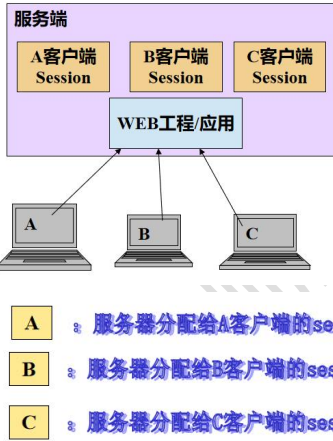    | 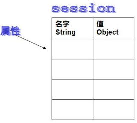 |
|-------------------------------|------------------------------|

> session提供一种方式，跨多个页面请求或对 Web 站点的多次访问标识用户并存储有关该用户的信息。

1. 当用户打开浏览器，访问某个网站, 操作session时，**服务器就会在内存(在服务端)为该浏览器分配一个session对象**，该session对象被这个浏览器独享，如上图所示。
2. 这个session独享也可看作是一个容器/集合，session对象默认存在时间为30min(tomcat/conf/web.xml)，也可修改

```xml
  <!-- ==================== Default Session Configuration ================= -->
  <!-- You can set the default session timeout (in minutes) for all newly   -->
  <!-- created sessions by modifying the value below.                       -->

    <session-config>
        <session-timeout>30</session-timeout>
    </session-config>
```

**Session可以做什么**
1. 网上商城中的购物车
2. 保存登录用户的信息
3. 将数据放入到session中，供用户在访问不同页面时，实现跨页面访问数据
4. 防止用户非法登录到某个页面

**如何理解Session**
1. 可以把session看作是一个容器，类似HashMap，有两列(K-V)，每一行就是session的一个属性
2. 每个属性包含两个部分，一个是该属性的名字(String)，另外一个是它的值(Object)

## session常用方法

`参考文档：java_ee_api_中英文对照版.chm:HttpSession`

1. 创建和获取Session `HttpSession hs = req.getSession();`
   - 第1次调用是创建Session会话，之后调用是获取创建好的Session对象
2. 向session添加属性 `hs.setAttribute(String name, Object val)`
3. 从session得到某个属性 `Object obj = hs.getAttribute(String name);`
4. 从session删除某个属性 `hs.removeAttribute(String name);`
5. `isNew();` 判断是不是刚创建出来的session
6. 每个session都有1个唯一标识的ID值，通过 `getId()` 得到Session的会话id值

## session底层实现机制

| 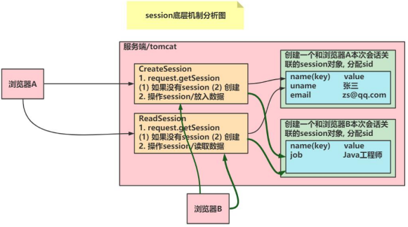 | 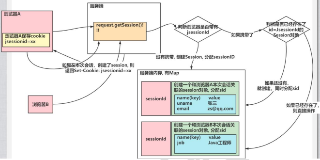 |
|-----------------------|-----------------------|

注意事项：
1. 一次会话只能创建一个Session
2. 当服务器携带 `jsessionid` 时，服务器会比对有无该sid对应的session，如果没有，服务器会创建，同时分配sid。此时会返回 `SetCookie` ，原cookie被修改。
3. 只有在本次会话创建了Session时，才会返回 `SetCookie: jsessionid=xxx;` 添加/修改浏览器的cookie

## session生命周期

1. `public viod setMaxInactiveInterval()` 设置session的超市时间(以秒为单位)，超过指定的时长，session就会销毁
2. 值为正数时，设定session的超时时长
3. **负数表示永不超时**
4. `public int getMaxInactivateInterval()` 获取session的超时时间
5. `public void invalidate()` 让当前session会话立即无效
6. 如果没有调用 `setMaxInactivateInterval()` 来指定session的生命时长，Tomcat会以session默认时长为准(30min)，可以
   在 `tomcat/conf/web.xml` 设置
7. Session的生命周期指的是：客户端/浏览器两次请求**最大间隔时长**，而不是累计时长。即当客户端访问了自己的session(`getSession()`)，
   session的生命周期将从0开始重新计算
8. 底层：Tomcat用一个线程来轮询会话状态，如果某个会话的空闲时长超过设定的最大值，则将该会话销毁

> Session的生命周期
> 1. 指的是两次访问session的最大间隔时间
> 2. 如果在session没有过期的时候，操作session，则会重新开始计算生命周期
> 3. session是否过期，是由服务器来维护和管理的
> 4. 如果调用了 `invalite()` ，则会直接将该session删除/销毁
> 5. 如果希望删除session对象的某个属性，使用 `removeAttribute("xx");`

## session经典案例：防止非法进入管理页面

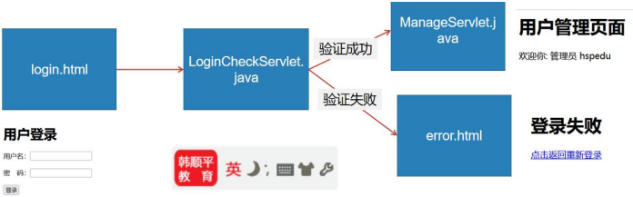

案例说明:
1. 只要密码为666666且用户名不为空,就认为登录成功
2. 如果验证成功,则进入管理页面 `ManageServlet.java`,否则进入 `error.html`
3. 如果用户直接访问 `ManageServlet.java`,重定向到 `userlogin.html`

- 用户登录界面:[userlogin.html](web/userlogin.html)
- 验证Servlet:[LoginCheckServlet.java](src/com/charlie/session/homework/LoginCheckServlet.java)
- 管理Servlet:[ManageServlet.java](src/com/charlie/session/homework/ManageServlet.java)
- 登录失败界面:[error.html](web/error.html)
