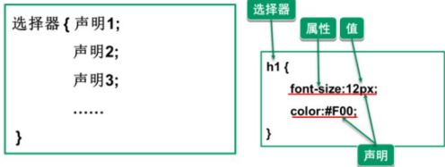

# CSS

## CSS基本介绍

- CSS(`Cascading Style Sheets`, 层叠样式表)，CSS将HTML页面的内容与样式分离提高了web开发的工作效率。
- [CSS官方文档](https://www.w3school.com.cn/css/index.asp)

```html
<!DOCTYPE html>
<html lang="en">
<head>
    <meta charset="UTF-8">
    <title>CSS快速入门</title>
<!--    解读：
    1. 在 head标签内，出现了 <style type="text/css"></style>
    2. 表示要写 css内容
    3. div{} 表示对 div元素 进行样式指定 div就是一个选择其(元素/标签选择器)
    4. width: 200px(属性)；表示对 div样式 的具体指定，可以有多个
    5. 如果有多个，使用 ; 隔开，最后属性可以没有; 但是建议加上
    6. 当运行页面时，div就会被 div{} 渲染修饰
    7. 在调试css时，可以通过修改颜色/大小方便查看
-->
    <style type="text/css">
        div {
            width: 200px;
            height: 100px;
            background-color: aqua;
        }
    </style>
</head>
<body>
<div>hello, beijing</div><br/>
<div>hello, shanghai</div><br/>
<div>hello, tianjin</div><br/>
</body>
</html>
```

## CSS语法

1. CSS语法可以分为两部分：
   1) 选择器
   2) 声明
   3) 
2. 声明由属性和值组成，多个声明之间用分号 `;` 分隔
3. 最后一条声明可以不加分号(建议加上)
4. 一般每行只描述一个属性
5. CSS注释： `/* 注释内容，类似Java */`

## 常用样式1

1. 颜色(color)：可以写颜色名，比如 `green`，也可以写 `rgb`值，如 `rgb(200,200,200)` 和十六进制表示值，如 `#708090`
   - 
2. 边框(border)
   - [演示代码](color.html)
3. 大小(width/height)
    - 

```html
<!DOCTYPE html>
<html lang="en">
<head>
    <meta charset="UTF-8">
    <title>字体颜色</title>
    <style type="text/css">
        div {
            /*有三种方式可以指定颜色
            1. 英文单词
            2. 16进制 $ff7d44 [使用最多]
            3. rgb三原色
            */
            /*color: red;*/
            /*color: rgb(100, 200, 125);*/
            color: #ff7d44;
            /*边框 三种属性顺序任意
            1. 宽度 像素值
            2. 线条样式 dashed：虚线 solid：实线
            3. 颜色
            */
            border: 1px dashed red;
            /* 宽度width/高度height
            1. 可以是像素值，如300px
            2. 也可以是百分比值 50%
            */
            width: 50%;
            height: 300px;
        }
    </style>
</head>
<body>
<div>大道之行也，天下为公</div>
</body>
</html>
```

## 常用样式2

> - 背景颜色
> - 字体样式
>   - 

```html
<!DOCTYPE html>
<html lang="en">
<head>
    <meta charset="UTF-8">
    <title>背景颜色与字体样式</title>
    <style type="text/css">
        div {
            border: 1px dashed red;
            height: 30px;
            /*背景颜色*/
            background-color: deepskyblue;
        /*    字体样式
        1. font-size 字体大小
        2. font-weight 指定是否粗体
        3. font-family 指定字体类型
        */
            font-size: 20px;
            font-weight: bold;
            /*电脑上必须有该字体类型*/
            font-family: 新細明體-ExtB;
        }
    </style>
</head>
<body>
<div>世人都晓神仙好，唯有功名忘不了，古今将相今何在，荒草青冢草没了</div>
</body>
</html>
```

## 常用样式3

> - div居中
> - 文本居中
>   - 

```html
<!DOCTYPE html>
<html lang="en">
<head>
    <meta charset="UTF-8">
    <title>div居中和文本居中</title>
    <style type="text/css">
        div {
            height: 40px;
            width: 500px;
            border: 1px solid whitesmoke;
            font-size: 20px;
            font-weight: bold;
            font-family: 微软雅黑;
            color: #ff7d44;
        /*    div居中，相对于浏览器页面*/
            margin-left: auto;
            margin-right: auto;
            /*文本居中，相对于整个div块*/
            text-align: center;
        }
    </style>
</head>
<body>
<div>待到秋来九月八，我花开后百花杀</div>
<div>冲天香气透长安，满城尽带黄金甲</div>
</body>
</html>
```

## 常用样式4

> - 超链接去掉下划线
> - 表格
>   - 

```html
<!DOCTYPE html>
<html lang="en">
<head>
    <meta charset="UTF-8">
    <title>超链接去掉下划线</title>
<!--
    1. decoration ： 修饰

-->
    <style type="text/css">
        a {
            text-decoration: none;
        }
        /* table, tr, td 表示组合选择器
         即 三者都用统一的样式指定，可以提高复用性
         */
        table, tr, td{
            border: 1px solid black;
            width: 300px;
            height: 20px;
            /* 将边框合并为一条线 */
            border-collapse: collapse;

            /*文本内容相对于div块居中*/
            text-align: center;
            /*div块在浏览器页面居中*/
            margin-left: auto;
            margin-right: auto;
        }
    </style>
</head>
<body>
<a href="http://fanyi.baidu.com">百度翻译</a><br/>
<table>
    <tr>
        <td colspan="3">星期一菜谱</td>
    </tr>
    <tr>
        <td rowspan="2">素菜</td>
        <td>12</td>
        <td>12</td>
    </tr>
    <tr>
        <td>12</td>
        <td>12</td>
    </tr>
    <tr>
        <td rowspan="2">荤菜</td>
        <td>12</td>
        <td>12</td>
    </tr>
    <tr>
        <td>12</td>
        <td>12</td>
    </tr>
</table>
</body>
</html>
```

## CSS三种使用方式

1. 方式1：在标签的 `style` 属性上设置CSS样式。(可读性差；CSS代码没有复用性；标签太多，样式多了，代码量庞大复杂)
   ```html
        <!DOCTYPE html>
        <html lang="en">
        <head>
            <meta charset="UTF-8">
            <title>在标签的 style 属性上设置CSS样式</title>
        </head>
        <body>
        <div style="color: red;font-size: 20px; font-weight: bold; font-family: 微软雅黑; height: 50px">小李广-花荣</div>
        <div style="color: blue;font-size: 20px; font-weight: bold; font-family: 微软雅黑; height: 50px">玉麒麟-卢俊义</div>
        <div style="color: yellow;font-size: 20px; font-weight: bold; font-family: 微软雅黑; height: 50px">智多星-吴用</div>
        <div style="color: cyan;font-size: 20px; font-weight: bold; font-family: 微软雅黑; height: 50px">花和尚-鲁智深</div>
        </body>
        </html>
    ```
2. 方式2：在 head标签中，使用 `style` 标签来定义需要的css样式。(只能在同一页面内复用代码维护不方便)
    ```
    <!DOCTYPE html>
    <html lang="en">
    <head>
        <meta charset="UTF-8">
        <title>在head表中，使用style属性设置css样式</title>
        <style type="text/css">
            div {
                width: 300px;
                height: 100px;
                background-color: cyan;
            }
            span {
                color: #ff7d44;
                border: 1px dashed white;
            }
        </style>
    </head>
    <body>
    <div>小李广-花荣</div>
    <div>玉麒麟-卢俊义</div>
    <div>智多星-吴用</div>
    <div>花和尚-鲁智深</div>
    <span>双鞭-呼延灼</span>
    </body>
    </html>
   ```
3. 把CSS样式写成单独的css文件，再通过 `link` 标签引入。[css文件](css/my.css)
    ```html
    <!DOCTYPE html>
    <html lang="en">
    <head>
        <meta charset="UTF-8">
        <title>引入外部的css文件</title>
    <!--
        1. rel: relation 关联
        2. href: 表示要引入的css文件的位置，可以是相对路径，也可以是web的完整路径
        3. type：type="text/css" 可以有，也可以不写
        4. 推荐使用该种方式
    -->
        <link rel="stylesheet" type="text/css" href="./css/my.css"/>
    </head>
    <body>
    <div>小李广-花荣</div>
    <div>玉麒麟-卢俊义</div>
    <div>智多星-吴用</div>
    <div>花和尚-鲁智深</div>
    <span>双鞭-呼延灼</span>
    </body>
    </html>
    ```

## CSS选择器

### css元素选择器

1. 最常见的css选择器是元素选择器，即文档的元素就是最基本的选择器
2. css元素/标签选择器通常是某个html元素，比如 p, h1, div, a等
3. [元素选择器应用实例](element-selector.html)

### id选择器

1. `id` 选择器可以**为标有特定id的html元素指定特定的样式**
2. id选择器以 `#` 来定义，如 `#css1 {color: red;}`
3. id是唯一的，不能重复
4. [id选择器](id.html)

```html
<!DOCTYPE html>
<html lang="en">
<head>
    <meta charset="UTF-8">
    <title>id选择器应用实例</title>
<!--
    1. 使用id选择器，需要先在要修饰的元素指定id属性
    2. id是唯一的，不能重复
    3. 在 style 标签中指定id选择器时，前面需要用 #id 值
-->
    <style type="text/css">
        #css1 {
            font-family: "Adobe 宋体 Std L";
        }
        #css2 {
            border: 1px dashed blue;
            color: red;
            text-align: center;
        }
    </style>
</head>
<body>
<h1 id="css1">教育要面向现代化、面向世界、面向未来</h1>
<p id="css2">hello, world</p>
</body>
</html>
```

### class选择器(类选择器)

1. class类选择器，可以通过 `class` 属性选择去使用这个样式
2. 基本语法 `.class`
3. [类选择器](class-selector.html)

```html
<!DOCTYPE html>
<html lang="en">
<head>
    <meta charset="UTF-8">
    <title>类选择器</title>
<!--  class选择器
  1. 使用class选择器，需要在被修饰的元素上，设置class属性，属性值自定义
  2. class属性的值可以重复
  3. 在 <style></style> 指定类选择器的具体样式时，前面需要使用 .类选择器名称
-->
  <style type="text/css">
    .css1 {
        color: red;
        text-align: center;
        font-size: 20px;
        font-family: "华文宋体";
    }
    .css2 {
        color: blue;
      font-family: 幼圆;
      text-align: center;
    }
  </style>
</head>
<body>
<div class="css1">九州</div>
<p class="css2">天地玄黄，宇宙洪荒</p>
<p class="css2">日月盈昃，辰宿列张</p>
</body>
</html>
```

### 组合选择器

1. 组合选择器可以让多个选择器共用同一个css样式代码
2. 语法格式：`选择器1, 选择器2, 选择器n{属性: 值;}`
3. [组合选择器](all-selector.html)
   - 

```html
<!DOCTYPE html>
<html lang="en">
<head>
    <meta charset="UTF-8">
    <title>组合选择器</title>
    <style type="text/css">
        .class01, #id01 {
            border: 2px red dashed;
            height: 100px;
            width: 500px;
        }
    </style>
</head>
<body>
<div class="class01">千字文</div>
<p id="id01">寒来暑往，秋收冬藏</p>
</body>
</html>
```

### 选择器优先级

> - 行内/内联样式 > ID选择器 > class选择器 > 元素选择器
> - 即相同的属性，属性实际值以上顺序按优先级高的为是
> - **范围越小，优先级越高**
> 
> 

```html
<!DOCTYPE html>
<html lang="en">
<head>
    <meta charset="UTF-8">
    <title>选择器的优先级说明</title>
<!--    优先级顺序
    1. 行内样式 > id选择器 > class选择器 > 元素选择器
    2. 指定的范围越小，优先级越高
-->
    <style type="text/css">
        h1 {
            color: red;
        }
        #id1, #id2, #id3 {
            text-align: center;
            color: yellow;
        }
        .cls1, .cls2, .cls3 {
            text-align: right;
            color: rgb(210,55,150);
            border: 1px dashed green;
        }

    </style>
</head>
<body>
<h1 style="color: cyan" id="id1">选择器的优先级说明</h1>
<div id="id2" class="cls1">九州大地</div>
<p class="cls2">一人为大世界同</p>
<span style="color: #ff7d44; text-align: center" id="id3" class="cls3">黄帝，颛顼，帝喾，尧，舜</span>
</body>
</html>
```
