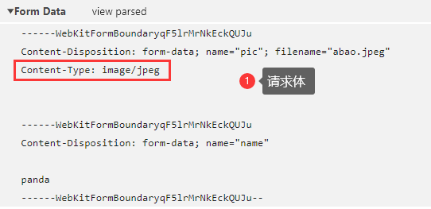
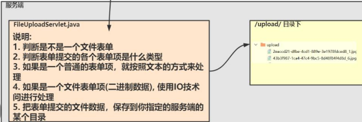

# Servlet文件上传和下载

- 文件的上传和下载，是常见的功能
- 

## 文件上传

### 文件上传的解读

1. 还是使用表单提交
2. `action`还是按照以前规定来指定
3. `method`指定为`post`，数据量较大
4. `enctype:multipart.form-data`编码类型(`encodetype`)默认是 `application/x-www-urlencoded`即 `url编码`
   ，这种编码不适于二进制文件数据的提交，一般适用文本数据 
5. 如果是要进行二进制文件的提交 `enctype` 要制定为 `multitype/form-data` 表示**表单提交的数据是由多个部分组成**，
   也就是可以提交二进制数据和文本数据

```html
<%--表单的enctype属性要设置为 multipart/form-data
    enctype="multipart/form-data";  表示提交的数据是由多个部分组成，有文件和文本
--%>
<form action="fileUploadServlet" method="post" enctype="multipart/form-data">
    家具图1：
    <input type="file" name="pic" id="f1" value="" onchange="prev(this)"><br/>
    家具名：<input type="text" name="name"><br/>
    <input type="submit" value="上传">
```

- 
- 
- 

- [工具类WebUtils](src/com/charlie/utils/WebUtils.java)

```java
package com.charlie.servlet;

import com.charlie.utils.WebUtils;
import org.apache.commons.fileupload.FileItem;
import org.apache.commons.fileupload.disk.DiskFileItemFactory;
import org.apache.commons.fileupload.servlet.ServletFileUpload;

import javax.servlet.ServletException;
import javax.servlet.http.HttpServlet;
import javax.servlet.http.HttpServletRequest;
import javax.servlet.http.HttpServletResponse;
import java.io.File;
import java.io.IOException;
import java.util.List;
import java.util.UUID;

public class FileUploadServlet extends HttpServlet {
    @Override
    protected void doPost(HttpServletRequest req, HttpServletResponse resp) throws ServletException, IOException {
        System.out.println("FileUploadServlet 被调用...");

        // 1. 判断是不是文件表单(enctype="multipart/form-data")
        if (ServletFileUpload.isMultipartContent(req)) {
            System.out.println("OK!");
            // 2. 创建 DiskFileItemFactory对象，用于构建一个解析上传数据的工具对象
            DiskFileItemFactory diskFileItemFactory = new DiskFileItemFactory();
            /**
             * 表单提交的数据就是 input 元素
             *     <input type="file" name="pic" id="" value="" onchange="prev(this)">
             *     家具名：<input type="text" name="name"><br/>
             *     <input type="submit" value="上传">
             */
            // 3. 创建一个解析上传数据的工具对象
            ServletFileUpload servletFileUpload = new ServletFileUpload(diskFileItemFactory);

            // 解决到接收到的文件名是中文乱码问题
            servletFileUpload.setHeaderEncoding("utf-8");

            // 4. 关键：servletFileUpload对象 可以把表单提交的数据 text/文件，
            // 将其封装到 FileItem 文件项中
            try {
                List<FileItem> list = servletFileUpload.parseRequest(req);
//                System.out.println("list==>" + list);   // 遍历并分别处理
                /*
                list==>[name=ikun.png, StoreLocation=D:\apache-tomcat-8.0.50\temp\\upload_41fe1bb9_18ce2e483c5__7fd5_00000000.tmp, size=3856bytes, isFormField=false, FieldName=pic,
                name=null, StoreLocation=D:\apache-tomcat-8.0.50\temp\\upload_41fe1bb9_18ce2e483c5__7fd5_00000001.tmp, size=4bytes, isFormField=true, FieldName=name]
                 */
                for (FileItem fileItem : list) {
//                    System.out.println("fileItem=" + fileItem);
                    // 判断是不是一个文件
                    if (fileItem.isFormField()) {   // 如果为true表示文本：text
                        String name = fileItem.getString(); // 得到文本输入框的value
                        System.out.println("家具名=" + name);
                    } else {    // 是一个文件

//                        // 获取上传的文件的名字
//                        String name = fileItem.getName();
//                        // System.out.println("文件名=" + name);
//                        /*
//                         把这个文件上传到服务器的temp下的文件保存到指定目录
//                         1. 指定一个目录，就是我们网站工作目录下
//                         2. 获取完整目录 io/servlet基础
//                         3. fileRealPath目录如下，该目录是和web项目运行环境绑定的，动态
//                         E:\Javaweb\fileupdown\out\artifacts\fileupdown_war_exploded\\upload\
//                         */
//                        String filePath = "/upload/";
//                        String fileRealPath = req.getServletContext().getRealPath(filePath + WebUtils.getYearMonthDay());
//                        // 4. 创建这个上传的目录 => 创建目录(Java基础)
//                        File fileRealPathDirectory = new File(fileRealPath);
//                        if (!fileRealPathDirectory.exists()) {  // 不存在，就创建
//                            fileRealPathDirectory.mkdirs(); // 创建
//                        }
//                        // 5. 将文件拷贝到 fileRealPathDirectory 目录
//                        //  构建了一个上传文件的完整路径：目录+文件名
//                        //  对上传的文件名进行处理，前面增加一个前缀，保证是唯一即可
//                        name = UUID.randomUUID().toString() + "_" + System.currentTimeMillis() + "_" + name;
//                        String fileFullPath = fileRealPathDirectory + "/" + name;
//                        fileItem.write(new File(fileFullPath));

                        WebUtils.uploadFile(req, fileItem);

                        // 6. 提示信息
                        resp.setContentType("text/html;charset=utf-8");
                        resp.getWriter().write("<h1>上传成功!</h1>");
                    }
                }
            } catch (Exception e) {
                throw new RuntimeException(e);
            }
        } else {
            System.out.println("不是文件表单...");
        }
    }

    @Override
    protected void doGet(HttpServletRequest req, HttpServletResponse resp) throws ServletException, IOException {
        doPost(req, resp);
    }
}
```

### 文件上传注意事项和细节

1. 如果将文件都上传到一个目录下，当上传文件很多时，会造成访问文件速度变慢，因此可以将文件上传到不同目录，
   比如一年一月上传的文件统一放到一个文件夹，如微信文件
2. 
3. 文件上传功能，在项目中建议有限制的使用，一般用在头像、证明、合同、产品展示等，如果不加限制，会造成服务器空间被大量占用
4. 

## 文件下载

### 文件下载原理分析图

- 

```html
<h1>文件下载</h1>
<a href="fileDownloadServlet?name=ikun.png">点击下载ikun专属图片</a><br/><br/>
<a href="fileDownloadServlet?name=Java基础.pdf">点击下载 Java.pdf</a><br/><br/>
```

- 
- 
- 

```java
package com.charlie.servlet;

import org.apache.commons.io.IOUtils;
import sun.misc.BASE64Encoder;

import javax.servlet.ServletContext;
import javax.servlet.ServletException;
import javax.servlet.ServletOutputStream;
import javax.servlet.http.HttpServlet;
import javax.servlet.http.HttpServletRequest;
import javax.servlet.http.HttpServletResponse;
import java.io.IOException;
import java.io.InputStream;
import java.net.URLEncoder;

public class FileDownloadServlet extends HttpServlet {
    @Override
    protected void doPost(HttpServletRequest req, HttpServletResponse resp) throws ServletException, IOException {
        System.out.println("FileDownServlet被调用...");
        // 1. 先准备要下载的文件[假定这些文件是公共的资源]
        // 重要：保证当tomcat启动后，在工作目录 out下有download文件夹，并且有提供了可供下载的文件
        // 如果没有看到创建的download在工作目录out下 -> rebuild project -> restart，就ok

        // 2. 获取到下载的文件的名字
        req.setCharacterEncoding("utf-8");
        String downloadFileName = req.getParameter("name");
        System.out.println("downloadFileName=" + downloadFileName); // downloadFileName=ikun.png

        // 3. 给http响应，设置响应头 Content-Type，就是文件MIME
        // 通过 servletContext 来获取
        ServletContext servletContext = req.getServletContext();
        // 下载目录从web工程根目录计算 /download/ikun.png
        String downloadPath = "/download/";
        String downloadFullPath = downloadPath + downloadFileName;
        // 根据文件名得到对应的MIME类型
        String mimeType = servletContext.getMimeType(downloadFullPath);
        /*
        ikun.png:       image/png
        Java基础.pdf:    application/pdf
         */
        // System.out.println("mimeType=" + mimeType);
        resp.setContentType(mimeType);

        // 4. 给http响应，设置响应头 Content-Disposition
        // 这里考虑的细节比较多，比如不同的浏览器写法不一样，考虑编码
        // ff 是文件名中文需要 base64 而 ie/chrome 是 URL编码
        /* 解读
        1) 判断发送请求的浏览器类型(火狐/ie/chrome)，如果是Firefox，则中文编码需要 base64
        2) Content-Disposition 是指定下载的数据的展示形式，如果是attachment 则使用文件下载方式
        3) 其它(主流id/chrome) 中文编码使用URL编码
         */
        if (req.getHeader("User-Agent").contains("Firefox")) {
            // 火狐 base64编码
            resp.setHeader("Content-Disposition", "attachment; filename==?UTF-8?B?" +
                    new BASE64Encoder().encode(downloadFileName.getBytes("UTF-8")) + "?=");
        } else {
            // 其它(主流ie/chrome)使用URL编码操作
            resp.setHeader("Content-Disposition", "attachment; filename=" +
                    URLEncoder.encode(downloadFileName, "UTF-8"));
        }

        // 5. 读取下载的文件数据，返回给客户端/浏览器
        // 1) 创建一个和要下载的文件关联的输入流
        InputStream resourceAsStream =
                servletContext.getResourceAsStream(downloadFullPath);
        // 2) 得到返回数据的输出流，因为返回的文件大多数是二进制(字节)
        ServletOutputStream outputStream = resp.getOutputStream();
        // 3) 使用工具类，将输入流关联的文件，对拷到输出流，并返回给客户端/浏览器
        IOUtils.copy(resourceAsStream, outputStream);
    }

    @Override
    protected void doGet(HttpServletRequest req, HttpServletResponse resp) throws ServletException, IOException {
        doPost(req, resp);
    }
}
```

### 注意事项和细节

- 两个关键
  1. 根据要下载的文件名，判断返回数据的 `Content-Type`
  2. 根据浏览器类型，设置中文编码
- 
