# HTML

- [官方文档](https://www.w3school.com.cn/html/index.asp)

## 网页

网页的组成
- **结构(HTML)：HTML是网页内容的载体**。内容就是网页制作者放在页面上**想要用户浏览的信息**，可以包含文字、图片、视频等
- **表现(CSS)：CSS样式是表现**。就像网页的外衣，比如标题字体、颜色变化，或为标题加入背景图片、边框等。
    所有这些**用来改变内容外观的东西**都称之为表现。
- **行为(JavaScript/JQuery)：JavaScript是用来实现网页的特效效果**。如：鼠标滑过弹出下拉菜单等。
    可以这么理解，**有动画或者交互的**一般都是用JS来实现的。

## HTML介绍

1. HTML(HyperText Mark-up Language)即**超文本标签语言**，可以展示的内容类型很多
2. HTML文本是**由HTML标签组成的文本**，可以包括文字、图形、动画、声音、表格、链接等
3. HTML的结构包括头部(Head)、主体(Body)两大部分，其中头部描述浏览器所需的信息，而主体则包含所要说明的具体内容。

```html
<!--文档类型说明 注释-->
<!DOCTYPE html>
<!--使用语言的地区 en表示英国 美国：en-US-->
<html lang="en">
<!--html头-->
<head>
<!--    charset文件的字符集-->
    <meta charset="UTF-8">
<!--    文件标题-->
    <title>Title</title>
</head>
<!--body体，主体部分-->
<body>
    hello, world!
</body>
</html>
```

> 注意事项和细节
> - **HTML文件不需要编译，直接由浏览器进行解析执行**

## HTML基本结构

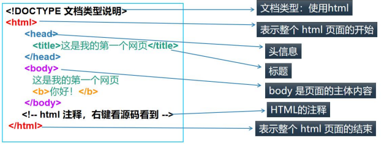

## HTML标签

### html的标签/元素说明

1. HTML标签用两个尖括号 `<>` 括起来
2. HTML标签一般是双标签，如 `<b> </b>` 前一个标签是起始标签，后一个标签是结束标签
3. 两个标签之间的文本是 `html` 元素的内容
4. 某个标签称为单标签，因为它只需要单独使用就能完整地表达意思，如 `<br/> <hr/>`
5. HTML元素指的是从开始标签到结束标签的所有代码
   - 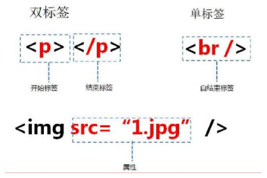

### html标签注意事项和细节

```html
<!DOCTYPE html>
<html lang="en">
<head>
    <meta charset="UTF-8">
    <title>标签使用细节</title>
</head>
<body>
<!--
    标签使用细节：
    1. 标签不能交叉嵌套
    2. 标签必须正确关闭
    3. 注释不能嵌套
    4. html语言不严谨，有时候标签不闭合，属性不带 "" 也不会报错
-->
<!--1. 标签不能交叉嵌套-->
<!--<div><span>tom</div></span> 错误示例-->
<!--2. 标签必须正确关闭-->
<!--<span>jack-->
<!--4. html语言不严谨，有时候标签不闭合，属性不带 "" 也不会报错-->
<font color="red">张飞</font><br/>
<font color=blue>关羽</font>
</body>
</html>
```

### font标签

```html
<!DOCTYPE html>
<html lang="en">
<head>
    <meta charset="UTF-8">
    <title>font标签</title>
</head>
<body>
<!--字体标签
    应用实例：在网页上显示 北京 ，并修改字体为 微软雅黑，颜色为蓝色
    font标签是字体标签，可以用来修改文本的字体，颜色，大小(尺寸)
    1. color属性 修改颜色
    2. face属性 修改字体
    3. size属性 修改文本大小
    注意：对应标签的属性，顺序不做要求
-->
<font size="40px" face="微软雅黑" color="blue">北京</font>
</body>
</html>
```

### 字符实体

```html
<!DOCTYPE html>
<html lang="en">
<head>
    <meta charset="UTF-8">
    <title>字符实体</title>
</head>
<body>
<!--特殊字符
    应用实例：把 <hr/> 变成文本 显示在页面上
    常用的特殊字符：
    <: &lt;
    >: &gt;
    空格: &nbsp;
    注意：html中无论输入多少个空格，浏览器都只会解析成一个
-->
jack
<!--浏览器会将 <hr/> 解析成一条线-->
<hr/>
&lt;hr/&gt;<br/>
smith     bruce &nbsp;&nbsp;&nbsp;leslie
</body>
</html>
```

| 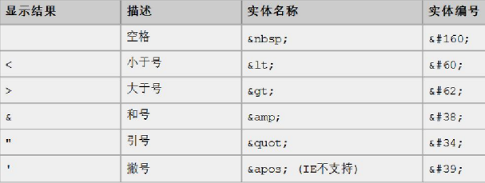 | 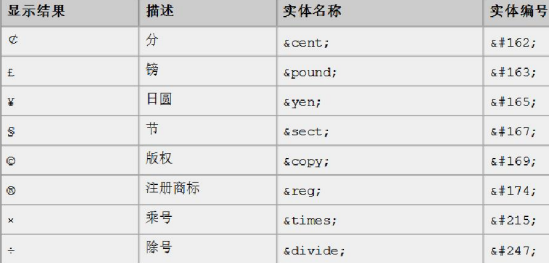 |
|------------------------|-------------------------|

### 标题标签

```html
<!DOCTYPE html>
<html lang="en">
<head>
    <meta charset="UTF-8">
    <title>标签标签</title>
</head>
<body>
<!-- 标题标签
    应用实例：演示标题 1 到 标题 6 的
    h1-h6都是标题标签，h1最大，h6最小
    align属性：对齐属性
    left：左对齐
    right：右对齐
    center：居中
-->
<h1 align="center">标题1</h1>
<h2>标题2</h2>
<h3 align="right">标题3</h3>
<h4>标题4</h4>
<h5>标题5</h5>
<h6>标题6</h6>
</body>
</html>
```

### 超链接标签

- 超链接是指从一个网页指向一个目标的链接关系，这个目标可以是另一个网页，也可以是相同网页的不同位置，
    还可以是一个图片，一个电子邮件地址，一个文件，甚至是一个应用程序

```html
<!DOCTYPE html>
<html lang="en">
<head>
    <meta charset="UTF-8">
    <title>超链接</title>
</head>
<body>
<!-- 超链接
    a标签 是超链接标签
    href属性      设置链接的地址
    target属性    设置哪个目标进行跳转
        _self：表示当前页面(默认)
        _blank：表示打开新页面来进行跳转
-->
<a href="http://sohu.com">搜狐</a><br/>
<a href="http://sohu.com" target="_blank">搜狐2</a><br/>
<a href="tom@qq.com">联系tom</a>
</body>
</html>
```

### 列表

1. `ul/li`基本语法
   - 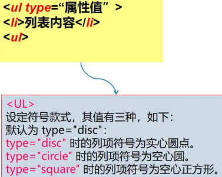
2. `ol/li`基本语法
   - 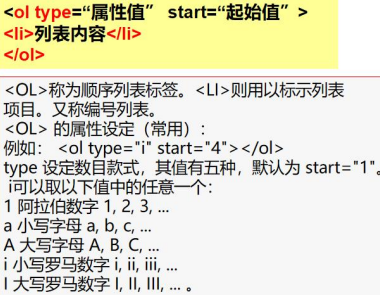

```html
<!DOCTYPE html>
<html lang="en">
<head>
    <meta charset="UTF-8">
    <title>无序列表</title>
</head>
<body>
<!-- ul : 表示无序列表
    li : 列表项
    type 属性：指定列表项前的符号
-->
<h1>五虎上将</h1>
<ul type="circle">
    <li>关羽</li>
    <li>张飞</li>
    <li>赵云</li>
    <li>马超</li>
    <li>黄忠</li>
</ul>
</body>
</html>
```

```html
<!DOCTYPE html>
<html lang="en">
<head>
    <meta charset="UTF-8">
    <title>有序列表</title>
</head>
<body>
<!-- ol : 表示有序
    li : 列表项
    type 属性：指定列表项排序方式
    type 设定数目款式 i，其值有五种，默认为 start="1"
    i 可以取以下的任意一个：
    1 阿拉伯数字 1, 2, 3
    a 小写字母 a, b, c
    A 大写字母 A, B, C
    i 小写罗马数字 i, ii, iii, ..
    I 大写罗马数字 I, II, III, ... 
-->
<h1>五虎上将</h1>
<ol type="i" start="4">
    <li>关羽</li>
    <li>张飞</li>
    <li>赵云</li>
    <li>马超</li>
    <li>黄忠</li>
</ol>
</body>
</html>
```

### 图像标签(img)

- `img` 标签可以在html页面上显示图片

```html
<!DOCTYPE html>
<html lang="en">
<head>
    <meta charset="UTF-8">
    <title>图片</title>
</head>
<body>
<!-- 应用实例：使用 img 标签显示一张美女的照片。
  img: 标签是图片标签,用来显示图片
  src: 属性可以设置图片的路径
  width: 属性设置图片的宽度
  height: 属性设置图片的高度
  border: 属性设置图片边框大小
  alt: 属性设置当指定路径找不到图片时,用来代替显示的文本内容
  相对路径:从工程名开始算
  绝对路径:盘符:/目录/文件名
  在 web 中路径分为相对路径和绝对路径两种
  相对路径: . 表示当前文件所在的目录
  .. 表示当前文件所在的上一级目录
  文件名 : 表示当前文件所在目录的文件,相当于 ./文件名 ./ 可以省
  略
  绝对路径: 正确格式是: http://IP 地址:port/工程名/资源路径
  错误格式是: 盘符:/目录/文件名
-->
<h1>图片演示</h1>
<!--如果只指定 width 或者 height 浏览器会按比例显示，不会变形-->
<br/>
<br/>
<br/>
</body>
</html>
```

### 表格(table)标签

1. 基本语法
   - ```
        <table border="边框宽度" cellspacing="空隙大小" cellpadding="填充大小">
        </table>
    ```
2. [应用实例](table.html)

```html
<!DOCTYPE html>
<html lang="en">
<head>
    <meta charset="UTF-8">
    <title>表格标签</title>
</head>
<body>
<!--说明：
    table标签：表格标签 border：设置表格裱框
    width：设置表格宽度 height：设置表格高度
    align：设置表格相对于页面的对齐方式
    cellspacing：设置单元格间距
    tr：行便派遣 th：表头标签 td：单元格标签
    align：设置单元格对齐方式 b：加粗标签
    px：表示像素
-->
<h1>表格标签的使用</h1>
<table width="500" border="1" align="center">
    <tr>
        <th>学号</th>
        <th>姓名</th>
    </tr>
    <tr>
        <td align="center">01</td>
        <td align="center">李自成</td>
    </tr>
    <tr>
        <td align="center">02</td>
        <td align="center">张三</td>
    </tr>
</table>
</body>
</html>
```

### 表格标签-跨行跨列表格

- 编写如下类似网页[表格跨行跨列演示](table2.html)
  - 

```html
<!DOCTYPE html>
<html lang="en">
<head>
    <meta charset="UTF-8">
    <title>表格(跨行跨列)</title>
</head>
<body>
<!-- 表格内容跨行跨列演示
  合并列：colspan="列数"
  合并行：rowspan="行数"
  cellspacing：指定单元格间的空隙大小 0表示没有空隙
  bordercolor：指定表格边框颜色
  border：边框
  width：表格宽度
  思路：
  1. 先把整个表格的完整的行和列，展示出来 5*3
  2. 再使用合并技术来处理
  3. 如果是16进制的颜色，前面要带 #
-->
<h1>表格标签跨行跨列演示</h1>
<table border="1" cellspacing="0" align="center" width="500px">
    <tr>
        <td colspan="3" align="center">第1行第1列</td>
    </tr>
    <tr>
        <td rowspan="2">第2行第1列</td>
        <td>第2行第2列</td>
        <td>第2行第3列</td>
    </tr>
    <tr>
        <td>第3行第2列</td>
        <td>第3行第3列</td>
    </tr>
    <tr>
        <td rowspan="2">第4行第1列</td>
        <td>第4行第2列</td>
        <td>第4行第3列</td>
    </tr>
    <tr>
        <td>第5行第2列</td>
        <td>第5行第3列</td>
    </tr>
</table>
</body>
</html>
```

### form(表单)标签!

```html
<!DOCTYPE html>
<html lang="en">
<head>
    <meta charset="UTF-8">
    <title>表单登录</title>
</head>
<body>
<!--说明
    1. form 表示表单
    2. action 提交到哪个页面
    3. method 提交方式，常用get和post，默认为get
    4. input type=text 输入框
    5. input type=password 密码框
    6. input type=submit 提交按钮
    7. input type=reset 重置按钮
    小技巧：为了汉字对齐，输入全角的空格即可
-->
<h1>登录系统</h1>
<form action="ok.html" method="post">
    用户名：<input type="text" name="username"><br/>
    密　码：<input type="password" name="pwd"><br/>
    <input type="submit" value="登录"> <input type="reset" value="重新填写">
</form>
</body>
</html>
```

### input标签/元素

| 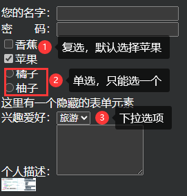 | 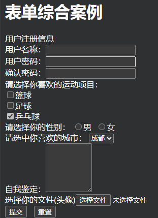 | 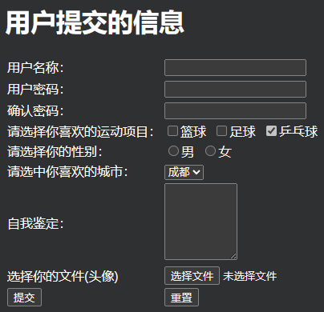 |
|-----------------------|----------------------|---------------------|

```html
<!DOCTYPE html>
<html lang="en">
<head>
    <meta charset="UTF-8">
    <title>input标签/元素</title>
</head>
<body>
您的名字：<input type="text" name="username"><br/>
密　　码：<input type="password" name="pwd"><br/>
<!--复选框，同一个复选框的name属性相同-->
<input type="checkbox" name="水果1">香蕉<br/>
<!--checked 表示默认选中-->
<input type="checkbox" name="水果1" checked>苹果<br/>
<input type="radio" name="水果">橘子<br/>
<input type="radio" name="水果">柚子<br/>
<input type="hidden" name="add" value="hoge@hoge.jp">
这里有一个隐藏的表单元素<br/>
兴趣爱好：<select name="like">
    <option value="游泳" selected>游泳</option>
    <option value="旅游">旅游</option>
    <option value="足球">足球</option>
    <option value="同发号">吃饭</option>
</select><br/>
个人描述：<textarea name="comment" rows="5" cols="10"></textarea><br/>
<input type="image" name="submit" align="top" src="imgs/img.png" width="50px">
</body>
</html>
```

```html
<!DOCTYPE html>
<html lang="en">
<head>
    <meta charset="UTF-8">
    <title>表单综合案例</title>
</head>
<body>
<h1>表单综合案例</h1>
<!--提示：一定一定要用 form标签 将 input元素 包起来-->
<!--注意:checkbox是复选框，如果希望是同一个，则 name属性必须一致-->
<form>
    用户注册信息<br/>
    用户名称：<input type="text" name="username"><br/>
    用户密码：<input type="password" name="pwd1"><br/>
    确认密码：<input type="password" name="pwd2"><br/>
    请选择你喜欢的运动项目：<br/>
    <input type="checkbox" name="sport" value="篮球">篮球<br/>
    <input type="checkbox" name="sport" value="足球">足球<br/>
    <input type="checkbox" name="sport" value="乒乓球" checked>乒乓球<br/>
    请选择你的性别：
    <input type="radio" name="gender" value="male">男&nbsp;
    <input type="radio" name="gender" value="female">女<br/>
    请选中你喜欢的城市：
    <select name="city">
        <option value="成都">成都</option>
        <option value="北京">北京</option>
        <option value="上海">上海</option>
    </select><br/>
    自我鉴定：<textarea name="comment" rows="6" cols="10"></textarea><br/>
    选择你的文件(头像)<input type="file" name="head"><br/>
    <input type="submit" value="提交">&nbsp;&nbsp;&nbsp;<input type="reset" value="重置">
</form>
</body>
</html>
```

```html
<!DOCTYPE html>
<html lang="en">
<head>
    <meta charset="UTF-8">
    <title>表单格式化</title>
</head>
<body>
<!--使用表格排版表单内容-->
<h1>用户提交的信息</h1>
<form>
    <table>
        <tr>
            <td>用户名称：</td>
            <td><input type="text" name="username"></td>
        </tr>
        <tr>
            <td>用户密码：</td>
            <td><input type="password" name="pwd1"></td>
        </tr>
        <tr>
            <td>确认密码：</td>
            <td><input type="password" name="pwd2"></td>
        </tr>
        <tr>
            <td>请选择你喜欢的运动项目：</td>
            <td>
                <input type="checkbox" name="sport" value="篮球">篮球&nbsp;
                <input type="checkbox" name="sport" value="足球">足球&nbsp;
                <input type="checkbox" name="sport" value="乒乓球" checked>乒乓球
            </td>
        </tr>
        <tr>
            <td>请选择你的性别：</td>
            <td>
                <input type="radio" name="gender" value="male">男&nbsp;
                <input type="radio" name="gender" value="female">女
            </td>
        </tr>
        <tr>
            <td>请选中你喜欢的城市：</td>
            <td>
                <select name="city">
                    <option value="成都">成都</option>
                    <option value="北京">北京</option>
                    <option value="上海">上海</option>
                </select><br/>
            </td>
        </tr>
        <tr>
            <td>自我鉴定：</td>
            <td><textarea name="comment" rows="6" cols="10"></textarea></td>
        </tr>
        <tr>
            <td>选择你的文件(头像)</td>
            <td><input type="file" name="head"></td>
        </tr>
        <tr>
            <td><input type="submit" value="提交"></td>
            <td><input type="reset" value="重置"></td>
        </tr>
    </table>
</form>
</body>
</html>
```

### 表单提交数据的注意事项和细节

1. `action` 表示form表单的数据提交给哪个url，即服务器的哪个资源(servlet)
2. `method` 表示提交的方式 主要是 get/post，默认为get
3. 如果form表单的某个元素，没有设置name属性，则数据不会提交
4. 对于 select(下拉框) checkbox(复选框) radio(单选项) 标签，提交的数据是value指定的值
5. 对于 checkbox 复选框，可以提交多个值，但是name是统一的，都是如 sport=篮球&sport=乒乓球
6. **提交的数据一定要放在form标签内**，否则不会提交

- `GET`请求的特点：
  1. 浏览器地址栏的地址是：action属性 + ? + 请求参数，
      如 `http://localhost:63342/html/html/form-format.html?username=burce&gender=male&city=cd`
  2. 不安全
  3. 有数据长度的限制，不同浏览器规定不同
- `POST`请求的特点：
  1. 浏览器地址栏中只有 `action` 属性值，提交的数据是在http请求
  2. 相对于GET请求更安全
  3. 理论上没有数据长度的限制

### div标签

1. `<div>` 标签可以文档分割为独立的、不同的部分
2. **`<div>` 是一个块级元素，它的内容自动地开始一个新行**

```html
<!DOCTYPE html>
<html lang="en">
<head>
    <meta charset="UTF-8">
    <title>div标签</title>
</head>
<body>
<!--div标签解读
    1. <div> 标签可以文档分割为独立的、不同的部分
    2. `<div>` 是一个块级元素，它的内容自动地开始一个新行
-->
<!--hello world后面不需要换行就可以与后面部分分开-->
hello world
<div>
    <h3>This is a h3</h3>
    <a href="http://www.baidu.com" target="_blank">goto百度</a>
</div>
</body>
</html>
```

### p标签和span标签

1. `<p>` 标签定义段落
2. p元素会自动在其后创建一些空白


1. span标签是**内联元素**，不像块级元素(如，div标签、p标签等)有换行的效果
2. 如果不对span应用演示，span标签没有任何的显示效果
3. 语法 `<span>内容</span>`
4. span标签往往是为了控制某个关键的内容
   - 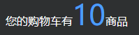

```html
<!DOCTYPE html>
<html lang="en">
<head>
    <meta charset="UTF-8">
    <title>span标签</title>
</head>
<body>
<!--
    1. span标签是**内联元素**，不像块级元素(如，div标签、p标签等)有换行的效果
    2. 如果不对span应用演示，span标签没有任何的显示效果
    3. 语法 `<span>内容</span>`
    4. span标签往往是为了控制某个关键的内容
-->
您的购物车有<span style="color: blue;font-size: 40px">10</span>商品
</body>
</html>
```

## 课后练习

| 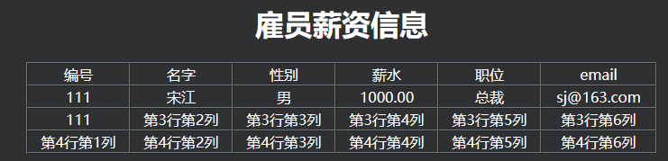 | 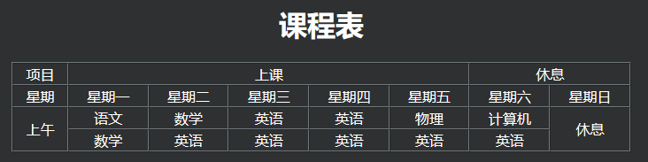 |
|------------------|-------------------|

- [员工表格](homework1.html)
- [课程表](homework2.html)
