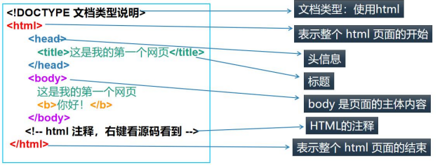
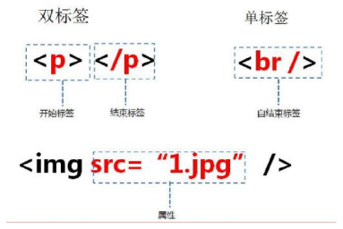
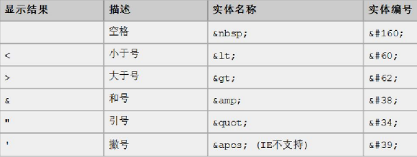
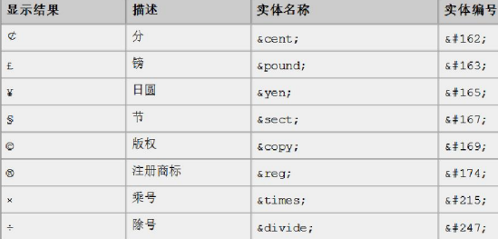

# HTML

- [官方文档](https://www.w3school.com.cn/html/index.asp)

## 网页

网页的组成
- **结构(HTML)：HTML是网页内容的载体**。内容就是网页制作者放在页面上**想要用户浏览的信息**，可以包含文字、图片、视频等
- **表现(CSS)：CSS样式是表现**。就像网页的外衣，比如标题字体、颜色变化，或为标题加入背景图片、边框等。
    所有这些**用来改变内容外观的东西**都称之为表现。
- **行为(JavaScript/JQuery)：JavaScript是用来实现网页的特效效果**。如：鼠标滑过弹出下拉菜单等。
    可以这么理解，**有动画或者交互的**一般都是用JS来实现的。

## HTML介绍

1. HTML(HyperText Mark-up Language)即**超文本标签语言**，可以展示的内容类型很多
2. HTML文本是**由HTML标签组成的文本**，可以包括文字、图形、动画、声音、表格、链接等
3. HTML的结构包括头部(Head)、主体(Body)两大部分，其中头部描述浏览器所需的信息，而主体则包含所要说明的具体内容。

```html
<!--文档类型说明 注释-->
<!DOCTYPE html>
<!--使用语言的地区 en表示英国 美国：en-US-->
<html lang="en">
<!--html头-->
<head>
<!--    charset文件的字符集-->
    <meta charset="UTF-8">
<!--    文件标题-->
    <title>Title</title>
</head>
<!--body体，主体部分-->
<body>
    hello, world!
</body>
</html>
```

> 注意事项和细节
> - **HTML文件不需要编译，直接由浏览器进行解析执行**

## HTML基本结构



## HTML标签

### html的标签/元素说明

1. HTML标签用两个尖括号 `<>` 括起来
2. HTML标签一般是双标签，如 `<b> </b>` 前一个标签是起始标签，后一个标签是结束标签
3. 两个标签之间的文本是 `html` 元素的内容
4. 某个标签称为单标签，因为它只需要单独使用就能完整地表达意思，如 `<br/> <hr/>`
5. HTML元素指的是从开始标签到结束标签的所有代码
   - 

### html标签注意事项和细节

```html
<!DOCTYPE html>
<html lang="en">
<head>
    <meta charset="UTF-8">
    <title>标签使用细节</title>
</head>
<body>
<!--
    标签使用细节：
    1. 标签不能交叉嵌套
    2. 标签必须正确关闭
    3. 注释不能嵌套
    4. html语言不严谨，有时候标签不闭合，属性不带 "" 也不会报错
-->
<!--1. 标签不能交叉嵌套-->
<!--<div><span>tom</div></span> 错误示例-->
<!--2. 标签必须正确关闭-->
<!--<span>jack-->
<!--4. html语言不严谨，有时候标签不闭合，属性不带 "" 也不会报错-->
<font color="red">张飞</font><br/>
<font color=blue>关羽</font>
</body>
</html>
```

### font标签

```html
<!DOCTYPE html>
<html lang="en">
<head>
    <meta charset="UTF-8">
    <title>font标签</title>
</head>
<body>
<!--字体标签
    应用实例：在网页上显示 北京 ，并修改字体为 微软雅黑，颜色为蓝色
    font标签是字体标签，可以用来修改文本的字体，颜色，大小(尺寸)
    1. color属性 修改颜色
    2. face属性 修改字体
    3. size属性 修改文本大小
    注意：对应标签的属性，顺序不做要求
-->
<font size="40px" face="微软雅黑" color="blue">北京</font>
</body>
</html>
```

### 字符实体

```html
<!DOCTYPE html>
<html lang="en">
<head>
    <meta charset="UTF-8">
    <title>字符实体</title>
</head>
<body>
<!--特殊字符
    应用实例：把 <hr/> 变成文本 显示在页面上
    常用的特殊字符：
    <: &lt;
    >: &gt;
    空格: &nbsp;
    注意：html中无论输入多少个空格，浏览器都只会解析成一个
-->
jack
<!--浏览器会将 <hr/> 解析成一条线-->
<hr/>
&lt;hr/&gt;<br/>
smith     bruce &nbsp;&nbsp;&nbsp;leslie
</body>
</html>
```

|  |  |
|------------------------|-------------------------|

### 标题标签

```html
<!DOCTYPE html>
<html lang="en">
<head>
    <meta charset="UTF-8">
    <title>标签标签</title>
</head>
<body>
<!-- 标题标签
    应用实例：演示标题 1 到 标题 6 的
    h1-h6都是标题标签，h1最大，h6最小
    align属性：对齐属性
    left：左对齐
    right：右对齐
    center：居中
-->
<h1 align="center">标题1</h1>
<h2>标题2</h2>
<h3 align="right">标题3</h3>
<h4>标题4</h4>
<h5>标题5</h5>
<h6>标题6</h6>
</body>
</html>
```

### 超链接标签

- 超链接是指从一个网页指向一个目标的链接关系，这个目标可以是另一个网页，也可以是相同网页的不同位置，
    还可以是一个图片，一个电子邮件地址，一个文件，甚至是一个应用程序

```html
<!DOCTYPE html>
<html lang="en">
<head>
    <meta charset="UTF-8">
    <title>超链接</title>
</head>
<body>
<!-- 超链接
    a标签 是超链接标签
    href属性      设置链接的地址
    target属性    设置哪个目标进行跳转
        _self：表示当前页面(默认)
        _blank：表示打开新页面来进行跳转
-->
<a href="http://sohu.com">搜狐</a><br/>
<a href="http://sohu.com" target="_blank">搜狐2</a><br/>
<a href="tom@qq.com">联系tom</a>
</body>
</html>
```
