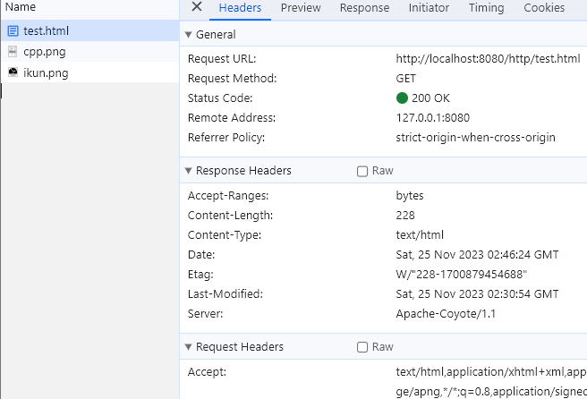
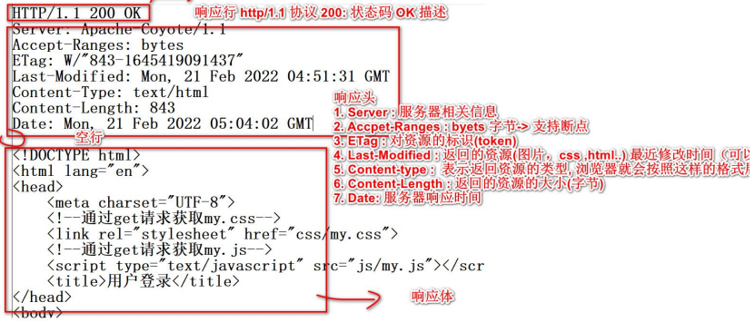
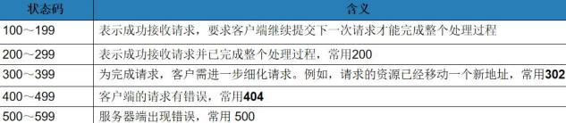
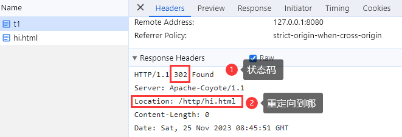
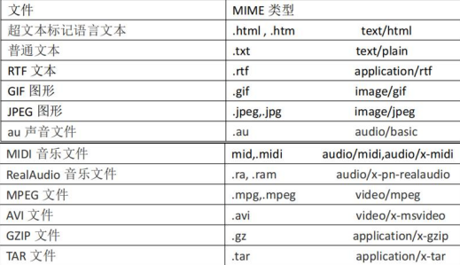

# WEB开发通信协议-HTTP协议

## 什么是HTTP协议

1. 超文本传输协议(HTTP, HyperText Transfer Protocol)是互联网上应用广泛的一种网络协议。
    是工作tcp/ip协议基础上的，所有的WWW文件都遵守这个标准。
2. `http1.0`：短链接；`http1.1`：长连接
3. `http`是`TCP/IP`协议的一个应用层协议，http也是web开发的基础

```
# General
Request URL:    http://localhost:8080/servlet/ok1
Request Method: GET
Status Code:    200 OK
Remote Address: 127.0.0.1:8080
Referrer Policy:strict-origin-when-cross-origin


# Respone Headers 响应头
HTTP/1.1 200 OK                 [200：状态码]
Server: Apache-Coyote/1.1
Content-Length: 0               [响应体的长度]
Date: Sat, 25 Nov 2023 01:49:04 GMT


# Request Headers 请求头
GET /servlet/ok1 HTTP/1.1       [GET：请求方式 /servlet/ok1：URL  HTTP/1.1：协议]
Accept:                         [指定客户端能够接收的内容类型]
    text/html,application/xhtml+xml,application/xml;q=0.9,image/avif,image/webp,image/apng,*/*;q=0.8,application/signed-exchange;v=b3;q=0.7
Accept-Encoding: gzip, deflate, br  [浏览器可以接收的数据压缩方式(算法)]
Accept-Language: zh-CN,zh;q=0.9 [浏览器接收的语音 zh-CN中文 en-US英语...]
Cache-Control: max-age=0
Connection: keep-alive          [告诉浏览器处理连接方式，keep-alive：要求服务器回送数据后，继续保持一段时间连接；closed：立即断掉连线]
Cookie: Idea-8296f2b3=5bf8bc6d-43c8-4cb1-bb34-d1c0686c62cd
Host: localhost:8080            [指定请求的服务器的域名和端口号，主机:端口号]
Sec-Fetch-Dest: document
Sec-Fetch-Mode: navigate
Sec-Fetch-Site: none
Sec-Fetch-User: ?1
Upgrade-Insecure-Requests: 1
User-Agent:                     [User-Agent 的内容包含发出请求的用户信息]
sec-ch-ua: "Google Chrome";v="119", "Chromium";v="119", "Not?A_Brand";v="24"
sec-ch-ua-mobile: ?0
sec-ch-ua-platform: "Windows"
```

### HTTP状态码(`HTTP Status Code`)

当浏览者访问一个网页时，浏览者的浏览器会向网页所在服务器发出请求。当浏览器接收并显示网页前，此网页所在的服务器
会返回一个包含HTTP状态码的信息头(server header)用以响应浏览器的请求。

常见的HTTP状态码
- 200(OK)：请求成功
- 301(Moved Permanently)：资源(网页等)被永久转移到其它URL
- 403(Forbidden)：服务器理解客户端的请求，但是拒绝执行此请求
- 404(Not Found)：请求的资源(网页等)不存在
- 500(Internal Server Error)：内部服务器错误

使用浏览器抓取Http请求和响应数据包快捷键：`ctrl+shift+i`

## 页面请求的一个问题分析

```html
<!DOCTYPE html>
<html lang="en">
<head>
    <meta charset="UTF-8">
    <title>http请求的问题</title>
</head>
<body>
<h1>图片</h1>


</body>
</html>
```

当浏览器访问 `http://localhost:8080/http/test.html` 时，浏览器发出几次http请求？

> 答：3次
> 1. 第一次请求 test.html
> 2. 当浏览器解析发现 test.html 中有 `` 等时
> 3. 会向服务器继续发出请求，要 `ikun.png` 和 `cpp.png` ，一共3次



## HTTP请求包分析(GET)

```
请求行
- GET：请求方式    /http/login：URI资源   username=Tom&pwd=123456：表单数据[GET]    HTTP/1.1：协议和版本号
GET /http/login.html?username=Tom&pwd=123456 HTTP/1.1

请求头
- Accept：浏览器可以接收什么格式的返回数据
Accept: text/html,application/xhtml+xml,application/xml;q=0.9,image/avif,image/webp,image/apng,*/*;q=0.8,application/signed-exchange;v=b3;q=0.7
- Accept-Encoding: 可以接收什么格式的压缩算法
Accept-Encoding: gzip, deflate, br
- Accept-Language: 表示浏览器是接收什么语言
Accept-Language: zh-CN,zh;q=0.9
Connection: keep-alive  - 表示长连接
- Cookie: 重点！表示浏览器发给服务器的cookie信息
Cookie: Idea-8296f2b3=5bf8bc6d-43c8-4cb1-bb34-d1c0686c62cd
- Host: 主机[浏览器+端口]，表示向哪个主机发出请求
Host: localhost:8080
- Referer: 表示这个请求是从哪个页面发起的(防盗链)
Referer: http://localhost:8080/http/login.html?username=tom&pwd=123456
```

## HTTP请求包分析(POST)

```
请求行
- POST请求不会把表单数据附加在uri后面
POST /http/login HTTP/1.1

请求头
Accept: text/html,application/xhtml+xml,application/xml;q=0.9,image/avif,image/webp,image/apng,*/*;q=0.8,application/signed-exchange;v=b3;q=0.7
Accept-Encoding: gzip, deflate, br
Accept-Language: zh-CN,zh;q=0.9
Cache-Control: max-age=0
Connection: keep-alive
Content-Length: 23                                          [urlencoded：表示表单数据的url]
Content-Type: application/x-www-form-urlencoded             [Content-Type：表示提交的数据格式]
Cookie: Idea-8296f2b3=5bf8bc6d-43c8-4cb1-bb34-d1c0686c62cd
Host: localhost:8080                [Host：主机，表示向谁发出请求]
Origin: http://localhost:8080       [Origin：表示该请求是从哪个主机发出的]
Referer: http://localhost:8080/http/login.html

请求体
From Data表单数据，会通过 urlencoded 方式进行编码，在服务端会自动解码
username=Tom&pwd=123456     --->     username%3DTom%26pwd%3D123456
```

## GET/POST请求分别有哪些

- GET请求有
1. form 标签 method=get[指定]
2. a 标签
3. link 标签引入 css 文件
4. script 标签引入 js 文件
5. img 标签引入图片
6. iframe 引入 html 页面
7. **在浏览器地址栏中输入地址后敲回车**

- POST请求有哪些
1. form 标签 method=post

- HTTP请求中怎样选择GET/POST方式
> 传输的数据大小区别
> 1. get传送的数据量较小。不能大于2KB(不同浏览器不一样)
> 2. post传送的数据量较大。一般默认不受限制
> 
> 什么情况下使用post请求
> 1. post 请求是会在浏览器上隐藏參数部分的，在安全要求的部分都会使用到 POST 请求。
     如用户登录。数据增上改等等。都会把参数隐藏起来，这样就不会通过你的请求暴露你
     的參数格式
> 2. 在向 server 传递数据较大的时候。使用 POST，get 是有限制的, 比如发帖, 上传文件
> 
> 什么情况下使用get方式
> 1. 在前台页面展示，比如分页内容等，可以保留传递参数, 可用来非常好的分享和传播, POST 中链接地址是不变化的。
> 
> 建议：
> 1. get方式的安全性较post方式要差些。包括机密信息的化，建议用post方式提交数据
> 2. 在做数据查询时，建议用get方式；而在做数据加入、修改或删除时，建议用post方式

## HTTP响应包分析

HTTP响应包括3个部分：响应行、响应头和响应体。

```
HTTP/1.1 304 Not Modified               响应行：协议 状态码  描述
Server: Apache-Coyote/1.1               1. Server：服务器相关信息
ETag: W/"802-1700897031782"             2. ETage：请求变量的实体标签的当前值。对资源的标识(token)
Date: Sat, 25 Nov 2023 08:03:15 GMT     3. Date：原始服务器消息发出的时间。服务器响应时间
                                        空行
<!DOCTYPE html>                         响应体
<html lang="en">
<head>
    <meta charset="UTF-8">
    <title>用户登录</title>
</head>
<body>
<h1>用户登录</h1>
<form action="http://localhost:8080/http/login" method="post">
    u: <input type="text" name="username"/><br/>
    p: <input type="password" name="pwd"/><br/>
    <input type="submit" value="用户登录"> <input type="reset" value="清空">
</form>
</body>
</html>
```



## 常用的状态码说明

状态码用于标识服务器对请求的处理结果,是一个三位地十进制数.响应状态码分为5类



### 302状态码

> 302 Found 资源重定向

```java
public class T1Servlet extends HttpServlet {
    // 这里把 doGet 和 doPost 合并处理
    @Override
    protected void doGet(HttpServletRequest req, HttpServletResponse resp) throws ServletException, IOException {
        // 如果有一个请求来，重定向到hi.html
        // 1. 返回302状态码
        // 2. 响应头Location:/http/hi.html
        resp.sendRedirect("/http/hi.html"); // 重定向到 http://localhost:8080/http/hi.html
//        resp.sendRedirect("http://www.baidu.com");  // 重定向到百度页面
    }

    @Override
    protected void doPost(HttpServletRequest req, HttpServletResponse resp) throws ServletException, IOException {
        doGet(req, resp);
    }
}
```

1. 浏览器输入 `http://localhost:8080/http/t1` ,请求 `T1Servlet`
2. `T1Servlet` 返回 302 状态码,并且指定浏览器重定向到 `h1.html`
3. 浏览器发出第二次请求 `h1.html`



### 304状态码

> 304 Not Modified 未修改.
> - 所请求的资源未修改,服务器返回此状态码时,不会返回任何资源.客户端通常会缓存访问过的资源,通过提供一个头信息
> 指出客户端希望只返回在指定日期之后修改的资源.
> 
> 1. 如果浏览器没有禁用缓存,浏览器在请求时,就会返回 `If-Modified-Since: xxx`
>    - 告诉服务器有该资源
>    - 该资源的最近修改时间是 xxx
> 2. 这是服务器就会比较时间,如果服务器的资源更新,就会返回该资源,如果没有就修改再返回

## MIME类型

### MIME介绍

1. MIME是HTTP协议中数据类型,英文全称是 `Multipurpose Internet Mail Extensions` 多功能Internet邮件扩充服务.
    MIME类型的格式是 `大类型/小类型` ,并与某一种文件的扩展名相对应
2. 在响应包的 `Content-Type` 指定

### 常见的MIME类型



## HTTP作业

1. 如果浏览器传递给WEB服务器的参数内容超过2K,应该使用哪种方式发送请求信息,为什么?
    > 使用 `POST`,因为POST方式传递的数据是封装在http请求体中,可以携带更多的数据.
2. 描述200,302,304,404和500等响应状态码所表示的含义
   > 200:成功返回资源;302:重定向;304:请求的资源未修改过,因此不返回资源,仍然使用缓存数据;404:资源未找到;500:服务器内部错误
