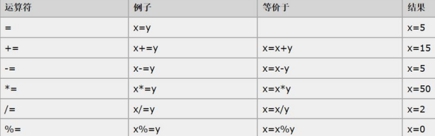
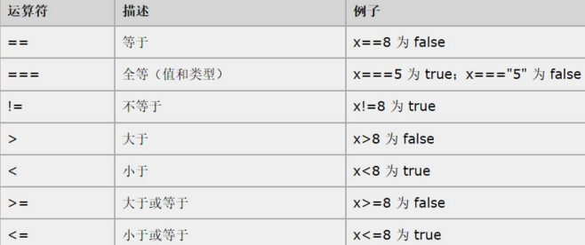

# JavaScript

- [官方文档](https://www.w3school.com.cn/js/index.asp)

## 基本介绍

1. `JavaScript`能改变HTML内容，改变HTML属性，能改变HTML样式(CSS)，完成页面的数据验证。
2. JS需要运行浏览器来解析执行JavaScript代码
3. JS是 `Netscape` 网景公司的产品，最早取名为 `LiveScript`，后更名为JavaScript，和Java没有关系
4. JavaScript特点
   1. `JavaScript` 是一种**解释型的脚本语言**，C/C++等语言先编译后执行，而**JS是在程序的运行过程中逐行进行解释**
   2. JS是一种**基于对象的脚本语言，可以创建对象，也能使用现有的对象**
   3. JS是**弱类型**的，对变量的数据类型不做严格的要求，变量的数据类型在运行过程中可以变化
   4. 跨平台性(只要是可以解释JS的浏览器都可以执行，和平台无关)

```html
<!DOCTYPE html>
<html lang="en">
<head>
    <meta charset="UTF-8">
    <title>JavaScript是弱类型的</title>
<!--
    1. js代码可以写在 script 标签中
    2. type="text/javascript" 表示这个脚本(script)类型是js
    3. type属性可以写，也可以不写[建议写上]
    4. js语句可以不写 ; [建议写上]
    5. var
-->
    <script type="text/javascript">
        // 弱类型
        var name = 12;
        // 输出 alert() 使用弹窗方式
        // 输出 console.log() 在调试输出
        console.log(name);
        // 输出变量的类型
        console.log(typeof name)
        name = "charlie"; // 给name重新赋值
        console.log(typeof name)

        var n = 123 + "abc";
        console.log(n);
        console.log(typeof n);

    </script>
</head>
<body>

</body>
</html>
```

## 快速入门

JS使用方式
1. 在 `script` 标签内容写JS代码
2. 在 `script` 标签内使用 `src` 属性指定引入JS文件
3. **同一个script标签内**二者不能混用，虽然不会报错，但是只有一个生效

```html
<!DOCTYPE html>
<html lang="en">
<head>
    <meta charset="UTF-8">
    <title>script标签中写JS代码</title>
<!--
    1. 可以在head和body嵌入script
    2. 执行顺序 从上到下
    3. 建议放在 head
-->
    <script type="text/javascript">
        // 在head内使用script写js
        console.log("hello");
    </script>
</head>
<body>
<script type="text/javascript">
    console.log("hi");
</script>
</body>
</html>
```

```html
<!DOCTYPE html>
<html lang="en">
<head>
    <meta charset="UTF-8">
    <title>使用script标签引入JS代码</title>
    <!--
    1. 混用时不会报错
    2. 两种引入方式不能混用
    3. 同一个script标签内，二者混用时只有一个生效，即前面引入的js生效(src)
    -->
    <script type="text/javascript" src="./js/my.js">
        console.log("Hello, JS.");  // 不会生效
    </script>
    <script type="text/javascript">
        console.log("second.")      // 有效
    </script>
</head>
<body>
</body>
</html>
```

查看JS错误信息
- 在浏览器界面 `ctrl+shift+i` 进入控制台查看
- [错误示例](error.html)

## JavaScript变量和数据类型

### JS数据类型

1. js变量表示存储数据的容器
2. [js变量](js变量.html)

|       |    数据类型     |     示例      |
|-------|:-----------:|:-----------:|
| 数值    |  `number`   |   1;3.14;   |
| 字符串   |  `string`   |  'a';"hi";  |
| 对象    |  `object`   |             |
| 布尔    |  `boolean`  | true;false; |
| 函数    | `function`  |             |

### JS特殊值

| 特殊值         |                        |
|-------------|------------------------|
| `undefined` | 变量未赋初始值时，默认`undefined` |
| `null`      | 空值                     |
| `NaN`       | `Not a Number`非数值      |

```html
<!DOCTYPE html>
<html lang="en">
<head>
    <meta charset="UTF-8">
    <title>数据类型</title>
    <script type="text/javascript">
        /*
        1. typeof() 是 JS语言提供的一个函数
        2. 返回变量的数据类型
        */
        var email;  // 特殊值 undefined
        console.log("email=" + email);
        var address = null;
        console.log("address=" + address);  // null
        console.log(10 * "abc");    // NaN: Not a Number
    </script>
</head>
<body>

</body>
</html>
```

> 注意事项：
> - `string`字符串，可以用双引号括起来，也可以用单引号括起来。
> - 如 `'abcd'`, `"Bruce"`, `"a"`

## 运算符

### 算术运算符

1. 算术运算符用于执行变量/或值之间的算术运算
2. `y = 5;`，下面的表格解释了这些算术运算符
3. 

### 赋值运算符

1. 赋值运算符用于给JS变量赋值
2. 给定 `x=10;y=5;` ，下面的表格解释了赋值运算符
3. 

### 关系运算符

1. 关系(比较)运算符在逻辑语句中使用，以测定变量或值是否相等
2. 给定 `x=5;` 下面的表格解释了比较运算符
3. 

> 关系运算符注意事项：
> 1. 等于：`==` 是简单地做字面值的比较
> 2. 全等于：`===` 除了做字面值的比较之外，还会比较两个变量的数据类型
> 3. [关系运算符示例](relationship-operator.html)

```html
<!DOCTYPE html>
<html lang="en">
<head>
    <meta charset="UTF-8">
    <title>关系运算符</title>
    <script type="text/javascript">
      a = 5;
      b = "5";
      c = 5.0;
      console.log(a == b);  // true 内容相同，都是5
      console.log(a === b); // false  类型不同，一个number一个string
      console.log(a == c);  // true
      console.log(a === c); // true
    </script>
</head>
<body>

</body>
</html>
```

### 逻辑运算符

1. 在JS语言中，所有的变量都可以作为 `boolean` 类型的变量来使用
2. `0`, `null`, `""(空串)`, `undefined`, `NaN`都认为是 `false`，其它都是 `true`
3. `&&` 且运算符，返回值遵守**短路与**机制
   - 当表达式全为真时，返回最后一个表达式的值
   - 当表达式中有为假时，返回第一个为假的表达式的值
4. `||` 或运算，遵守**短路或**机制
   - 当表达式全为假时，返回最后一个表达式的值
   - 只要有表达式为真，则返回第一个为真的表达式的值

```html
<!DOCTYPE html>
<html lang="en">
<head>
    <meta charset="UTF-8">
    <title>逻辑运算符注意事项和使用细节</title>
    <script type="text/javascript">
        var name = "Bruce";
        if (name) {
            console.log(name);  // Bruce
        }
        a = null;
        if (!a) {
            console.log('a=' + a);  // a=null
        }
        // `0`, `null`, `""(空串)`, `undefined`, `NaN`都认为是 `false`
        var b;
        if (!b) {
            console.log(b); // undefined
        }
        var c = "Bruce" && 7;
        console.log("Bruce && 7 = " + c);   // 7
        var d = "" || null;
        console.log('"" || null = ' + d);   // null
        var e = NaN && 0;
        console.log("NaN && 0 = " + e);     // NaN
        var f = (10 > 5) && 0;
        console.log("(10 > 5) && 0 = " + f);    // 0
        var g = (10 + 1) || (6 < 0);
        console.log("(10 + 1) || (6 < 0) = " + g);  // 11
    </script>
</head>
<body>

</body>
</html>
```

### 条件运算符

1. JS还可以使用类似Java的三元运算符
2. `条件语句 ? 表达式1 : 表达式2`

```html
<!DOCTYPE html>
<html lang="en">
<head>
    <meta charset="UTF-8">
    <title>条件运算符</title>
<!--  
    `条件语句 ? 表达式1 : 表达式2`
    如果条件语句为true，则返回表达式1的值，否则返回表达式2的值
-->
    <script type="text/javascript">
      var n1 = 90;
      var n2 = 1;
      var res = n2 > 9 ? "Hello, world." : 800 + n1;
      console.log(res); // 890
    </script>
</head>
<body>

</body>
</html>
```

## 数组

### 数组的定义

```html
<!DOCTYPE html>
<html lang="en">
<head>
    <meta charset="UTF-8">
    <title>数组定义</title>
    <script type="text/javascript">
        // 数组定义方式，有4种
        // 方式1
        var cars = ["Audi", "BMW", "Volvo"];
        console.log("cars=" + cars);    // cars=Audi,BMW,Volvo
        console.log(cars[1]);    // 表示访问cars数组的第2个元素，下标从0开始
        // 方式2
        var cars2 = []; // 空数组
        cars2[0] = "Audi";
        cars2[1] = "BMW";
        cars2[2] = "Mi";
        console.log("cars2[2]=" + cars2[2]) // Mi
        console.log("cars2[10]=" + cars2[10])   // undefined 如果该元素不存在，则返回就是 undefined
        // 方式3
        var cars3 = new Array("Mi", "Oppo", "Apple");
        console.log(cars3[1]);  // Oppo
        console.log(cars3[2]);  // Apple
        // 方式4
        var cars4 = new Array();
        console.log(typeof cars4);  // object
        cars4[0] = "Bruce";
        cars4[1] = "Leslie";
        cars4[2] = "Jack";
        cars4[0] = "Tom";   // 替换
        cars4[5] = "Tim";   // 扩容，如果跳过了下标给赋值，那么中间没有赋值的元素为 undefined
        console.log(typeof cars4[4]);   // undefined
        console.log(cars4); // ['Tom', 'Leslie', 'Jack', 空 ×2, 'Tim']
    </script>
</head>
<body>

</body>
</html>
```

### 数组的使用遍历

```html
<!DOCTYPE html>
<html lang="en">
<head>
    <meta charset="UTF-8">
    <title>数组遍历</title>
    <script type="text/javascript">
        var a = ["hi", "tom", 1, NaN, "Ti", false];
        console.log(a.length);  // 6 数组长度
        for (i=0; i<a.length; ++i) {
            console.log(a[i]);  // log输出会自动换行
        }
    </script>
</head>
<body>

</body>
</html>
```

## JavaScript函数

### js函数基本介绍和使用

> 函数是由事件驱动的，或者当它被调用时执行的，可重复使用的代码块

```html
<!DOCTYPE html>
<html lang="en">
<head>
    <meta charset="UTF-8">
    <title>函数快速入门</title>
    <script type="text/javascript">
        // 如果不调用函数，那么该函数不会执行
        /* 在JS中如果要执行函数，有两种方式
        1. 主动调用hi()
        2. 通过时间去触发该函数
         */
        function hi() {
            alert("Hi~");
        }
    </script>
</head>
<body>
<!--
    这里表示给button绑定了 onclick 事件
    当用户点击了该 button 就会触发/调用 hi() 函数
-->
<button onclick="hi()">点击这里</button>
</body>
</html>
```

`JavaScript`函数定义方式
1. `function`关键字来定义函数
   ```javascript
      function func(params) {
            函数体
            return 表达式;
      }
      // 调用
      func(实参列表);
   ```
2. 将函数赋给变量
   ```javascript
      var a = function(params) {
            函数体;
            return 表达式;
      }
      // 调用
      a(实参列表);
   ```

```html
<!DOCTYPE html>
<html lang="en">
<head>
    <meta charset="UTF-8">
    <title>函数使用方式</title>
    <script type="text/javascript">
        function f1() {
          alert("Hello, world.");
        }
        f1();
        // 定义有形参的函数
        // 这里的形参不需要指定类型，name的数据类型是由实参决定
        function f2(name) {
          console.log("Hello, " + name);
        }
        f2("Charlie");
        // 定义有形参和返回值的函数，不需要指定返回类型，返回类型由返回的数据决定
        // js的函数调用机制和java一样
        function f3(n1, n2) {
          return n1 + n2;
        }
        alert("f2(10, 20)=" + f3(10, 20));
        // 传入参数多于形参时，只有前几个有效
        alert("f2(\"hi\", \"~\", 5)=" + f3("hi", "~", 5));  // hi~
    </script>
</head>
<body>

</body>
</html>
```

```html
<!DOCTYPE html>
<html lang="en">
<head>
    <meta charset="UTF-8">
    <title>将函数赋值给变量</title>
    <script type="text/javascript">
      // 可以理解为 f1 指向了函数
      var f1 = function(name) {
        console.log("hi~" + name);
      }
      console.log(typeof f1); // function
      f1("Tom"); // 调用函数
      var f2 = f1;
      f2("Jack");

      var f3 = function(n1, n2) {
        return n1 + n2;
      }
      console.log(f3(1, 1));  // 2
    </script>
</head>
<body>

</body>
</html>
```

### js函数注意事项和细节

1. JS函数的重载会覆盖掉上一次的定义
2. 函数的 `arguments` 隐形参数，作用域在 function函数体内
   1) 隐形参数：在function函数中不需要定义，可以直接使用来获取所有参数的
   2) 隐形参数类似于java的可变参数 `public void func(int ...args)`
   3) js中隐形参数跟java的可变参数一样，操作类似于数组
3. 如果函数有形参，在传入参数时，按照顺序匹配
   1) 如果有匹配上，就赋值给它；如果没有匹配上，也无所谓
   2) **仍然会把所有的实参，赋值给 `arguments`**
   3) 如果形参个数大于实参个数，则该形参的值为 `undefined`

```html
<!DOCTYPE html>
<html lang="en">
<head>
    <meta charset="UTF-8">
    <title>函数使用注意事项和细节</title>
    <script type="text/javascript">
        /*
        1. JS函数的重载会覆盖掉上一次的定义
        2. 当调用 f1() 时，起始调用的是 f1(name)
        3. 如果在调用 f1(name) 时，如果没有传入实参，那么这个name就是 undefined
         */
        function f1() {
            console.log("ok, f1()");
        }
        function f1(name) { // 覆盖了前面的定义
            console.log("hi, " + name);
        }
        f1();   // hi, undefined

        /*
        2. 函数的arguments 隐形参数(作用域在 function 函数内)
        (1) 隐形参数：在function函数中不需要定义，可以直接用来获取所有参数的变量
        (2) 隐形参数类似于java的可变参数一样  public void fun(int ...args)
        (3) js中隐形参数跟java的可变参数一样，操作类似于数组
         */
        function f2() {
            // 遍历函数的 argument 隐形参数，是数组形式
            // 提示：如果我们希望通过 console.log 输出对象的数据，使用 , 链接而非 +
            console.log("arguments=" + arguments);  // argument=[object Arguments]
            console.log("arguments=", arguments);   // arguments= Arguments(3) [10, 20, 30]
            console.log(typeof arguments);  // object
            console.log(arguments.length);  // 3
        }
        f2(10, 20, 30);

        /*
        3. (1) 如果函数有形参，在传入实参的时候，仍然按照顺序匹配
           (2) 如果有匹配上，就赋值给它，如果没有匹配上，也无所谓
           (3) 仍然会把所有的实参，赋值给 arguments
            (4) 如果形参个数大于实参个数，则该形参的值为 `undefined`
         */
        function f3(n) {
            console.log("n=" + n);  // n=1
            console.log("arguments:", arguments);   // arguments: Arguments(4) [1, 2, 3, 4]
        }
        f3(1, 2, 3, 4);
        f3();   // 实参个数小于形参，n=undefined
    </script>
</head>
<body>

</body>
</html>
```

> 练习：编写一个函数，用于计算所有参数相加的和并返回，如果

```html
<!DOCTYPE html>
<html lang="en">
<head>
    <meta charset="UTF-8">
    <title>JS函数课堂练习</title>
    <script type="text/javascript">
        var f = function () {
            var res = 0;
            // 通过arguments来获取传入的参数
            for(var i=0; i<arguments.length; ++i) {             // 排除掉 NaN
                if (((typeof arguments[i]) == "number") && arguments[i]) {
                    res += arguments[i];
                }
            }
            return res;
        }
        console.log(f(1, 2.1, 5, true, "hi", null));  // 8.1
        console.log(f(false, "hi", null, 7.2, 4, NaN));  // 11.2
        console.log(typeof NaN);    // NaN 类型也是 number
    </script>
</head>
<body>

</body>
</html>
```

## 自定义对象方式

### 方式1

1. 对象的定义
   ```javascript
   var 对象名 = new Object();  // 对象实例(空对象)
   对象名.属性名 = 值; // 定义一个属性
   对象名.函数名 = function (){}  // 定义一个函数
   ```
2. 对象访问
   ```javascript
   对象名.属性名;
   对象名.函数名();
   ```

```html
<!DOCTYPE html>
<html lang="en">
<head>
    <meta charset="UTF-8">
    <title>自定义对象</title>
    <script type="text/javascript">
        // 自定义对象方法1
        // person是一个空对象，没有自定义的函数和属性
        var person = new Object();
        console.log(typeof person); // object
        // 增加一个属性name
        person.name = "Tom";
        // 增加一个属性
        person.age = 21;
        // 增加函数
        person.say = function () {
            // 这里的this就是当前的person对象
            console.log("person的信息：" + this.name + " " + this.age);
        }
        // 调用
        console.log("name=" + person.name);
        // 访问方法
        person.say();
        // 如果没有定义某个属性，而直接使用，就会出现变量提升，显示undefined
        console.log("address=" + person.address);    // undefined
        // 调用未定义的方法则会报错
        // person.eat();   // 报错
    </script>
</head>
<body>

</body>
</html>
```

### 方式2

1. 对象的定义
   ```javascript
   var 对象名 = {
   属性名1: 值1,    // 定义属性
   属性名2: 值2,    // 定义属性，注意必要要有 , 号
   函数名: function (){}   // 定义函数
   }
   ```
2. 对象访问
   ```javascript
   对象名.属性名;
   对象名.函数名();
   ```

```html
<!DOCTYPE html>
<html lang="en">
<head>
    <meta charset="UTF-8">
    <title>自定义对象方式2: {} 形式</title>
    <script type="text/javascript">
        // 演示自定义对象方式2: {} 形式
        var person = {
            name: "Tom",    // 两个属性/方法之间必须要有逗号 ,
            age: 20,
            hi: function () {
                console.log("person信息：" + this.name + " " + this.age);
            },
            sum: function (n1, n2) {
              return n1 + n2;
            }
        }
        // 使用
        console.log("name=" + person.name + " age=" + person.age);
        person.hi();
        console.log(person.sum(10, 20));
    </script>
</head>
<body>

</body>
</html>
```

## 事件(event)

### 事件介绍

1. 事件是电脑输入设备与页面进行交互的响应
2. 事件通常与函数配合使用，这样就可以通过发生的事件来驱动函数执行
3. [js事件文档](https://www.w3school.com.cn/js/js_events.asp)

|  |  |
|----------------------|----------------------|

### 事件分类

1. 事件的注册(绑定)
   - 事件注册(绑定)：当事件响应(触发)后要浏览器执行哪些操作代码，叫作事件注册或事件绑定
2. 静态注册事件
   - 通过 `html` 标签的事件属性直接赋予事件响应后的diamagnetic
3. 动态注册事件
   - 通过 `javascript` 代码得到标签的dom对象，然后再通过 `dom对象.时间名 = function(){}`
   1) 获取标签的dom对象
   2) dom对象.时间名 = function(){}

- [onload 加载完成事件](onload.html)
```html
<!DOCTYPE html>
<html lang="en">
<head>
    <meta charset="UTF-8">
    <title>onload 加载完成事件</title>
    <script type="text/javascript">
        // 定义了一个函数
        function syaOK() {
            alert("静态注册 onload 事件 sayOK");
        }
        // 1. 在js中，将页面窗口 映射成 window dom对象
        // 2. window对象有很多的函数和属性，可以使用
        // 3. window.onload 表示页面被加载完毕
        // 4. 后面的function(){} 表示加载完毕后要执行的函数/代码
        window.onload = function () {
            alert("动态注册 onload事件");
        }
    </script>
</head>
<!--静态注册-->
<!--<body onload="syaOK()">-->
<body>

</body>
</html>
```

- [onclick 单击事件](onclick.html)
```html
<!DOCTYPE html>
<html lang="en">
<head>
    <meta charset="UTF-8">
    <title>onclick 单击事件</title>
    <script type="text/javascript">
        function sayOK() {
            alert("你点击了sayOK按钮~")
        }
        // 动态注册 onclick 事件
        // 1. 先拿到 id=btn01 的 button对应的dom对象
        // 2. 通过dom对象动态的绑定onclick事件
        // var btn01 = document.getElementById("btn01");
        // alert(btn01);   // 在这里页面还未加载完毕，button(btn01) 为 null
        window.onload = function () {
            var btn01 = document.getElementById("btn01");
            btn01.onclick = function () {
                alert("你点击了sayHi按钮");
            }
        }
    </script>
</head>
<body>
<!--静态注册 onclick 事件-->
<button onclick="sayOK()">sayOK按钮</button><br/>
<button id="btn01">sayHi按钮</button>
</body>
</html>
```

- [onblur 失去焦点文本框内容大写](onblu.html)
```html
<!DOCTYPE html>
<html lang="en">
<head>
    <meta charset="UTF-8">
    <title>onblur 失去焦点</title>
    <script type="text/javascript">
        // 静态绑定
        function upperCase() {
            // 1. 先得到fname输入框的value
            var fname = document.getElementById("fname");
            fname.value = fname.value.toUpperCase();
        }
        // 动态绑定
        window.onload = function () {
            var fname2 = document.getElementById("fname2");
            fname2.onblur = function () {
                fname2.value = fname2.value.toUpperCase();
            }
        }
    </script>
</head>
<body>
输入英文单词：<input type="text" id="fname" onblur="upperCase()"/><br/>
输入英文单词：<input type="text" id="fname2"/>
</body>
</html>
```

- [onchange 域的内容被改变](onchange.html)
```html
<!DOCTYPE html>
<html lang="en">
<head>
    <meta charset="UTF-8">
    <title>onchange 内容发生改变事件</title>
    <script type="text/javascript">
        function f1() {
            alert("工作城市变化");
        }
        // 动态注册
        window.onload = function () {
            // 获取id2的dom对象
            var s2 = document.getElementById("s2");
            s2.onchange = function () {
                alert("升职加新~");
            }
        }
    </script>
</head>
<body>
当前工作城市：
<select id="s1" onchange="f1()">
    <option>---城市---</option>
    <option>成都</option>
    <option>北京</option>
    <option>上海</option>
</select><br/>
当前薪资水平：
<select id="s2">
    <option>----薪资---</option>
    <option>10k~20K</option>
    <option>20k~30K</option>
    <option>30k~40K</option>
</select>
</body>
</html>
```

- [onsubmit 表单提交事件](onsubmit.html)
- 注册按钮被点击，提交表单(需求：如果用户名或密码为空，不能提交表单)
```html
<!DOCTYPE html>
<html lang="en">
<head>
    <meta charset="UTF-8">
    <title>onsubmit 表单提交事件</title>
    <!--注册按钮被点击，提交表单(需求：如果用户名或密码为空，不能提交表单)-->
    <script type="text/javascript">
        // 静态注册表达提及哦事件
        function register() {
            // 先得到输入的用户名和密码
            var u1 = document.getElementById("i1");
            var p1 = document.getElementById("i2");
            // 判断是否为空 ""
            // u1, p1 是dom对象，判断其值(value)不能为空
            if ("" == u1.value || "" == p1.value) {
                alert("用户名和密码不能为空，不能提交");
                return false;   // 代表不提交
            }
            return true;    // 表示不提交
        }

        // 动态注册表单提交事件
        window.onload = function () {
            var form2 = document.getElementById("form2");
            // 给form2绑定onsubmit事件
            // onsubmit指定的函数，会直接将返回结果(t/f)，返回给onsubmit
            form2.onsubmit = function () {
                // var u2 = document.getElementById("i3");
                // var p2 = document.getElementById("i4");
                var u2 = form2.username;
                var p2 = form2.pwd;
                if ("" == u2.value || "" == p2.value) {
                    alert("用户名或密码不能为空~");
                    return false;
                }
                return true;
            }
        }
    </script>
</head>
<body>
<h1>注册用户1</h1>
<!--                                          将函数返回值返回，才能作用于 onsubmit事件-->
<form action="ok.html" method="get" onsubmit="return register()">
    <table>
        <tr>
            <td>用户名：</td>
            <td><input type="text" id="i1" name="username"></td>
        </tr>
        <tr>
            <td>密　码：</td>
            <td><input type="password" id="i2" name="pwd"></td>
        </tr>
    </table>
    <input type="submit" value="提交">
</form>

<h1>注册用户2</h1>
<form action="ok.html" method="get" id="form2">
    <table>
        <tr>
            <td>用户名：</td>
            <td><input type="text" id="i3" name="username"></td>
        </tr>
        <tr>
            <td>密　码：</td>
            <td><input type="password" id="i4" name="pwd"></td>
        </tr>
    </table>
    <input type="submit" value="提交">
</form>
</body>
</html>
```

### 练习

- 注册用户练习
- 
```html
<!DOCTYPE html>
<html lang="en">
<head>
    <meta charset="UTF-8">
    <title>登录页面</title>
    <style type="text/css">
        h1 {
            color: red;
            font-family: 楷体;
            font-weight: bold;
            font-size: 30px;
            text-align: left;
        }
    </style>
    <script type="text/javascript">
        // 动态绑定表单提交
        window.onload = function () {
            var form = document.getElementById("form");
            form.onsubmit = function () {
                var username = form.username.value;
                var pwd1 = form.pwd1.value;
                var pwd2 = form.pwd2.value;
                var email = form.email.value;
                // 处理用户名合法性
                if (!(username.length >= 4 && username.length <= 6)) {
                    alert("请按照规定输入用户名");
                    return false;
                }

                // 处理密码合理性
                if (pwd1.length !== 6) {
                    alert("请正确输入密码格式");
                    return false;
                } else if (pwd2 !== pwd1) {
                    alert("两次密码输入不同");
                    return false;
                }

                // 电子邮件 ==> 需要使用正则表达式
                /*
                String regStr = "^[\\w-]+@([a-zA-Z]+\\.)+[a-zA-Z]+$"
                1. 在java中，转义符号是 \\ ，在js中使用正则表达式 \
                2. emailPattern.test("XXX");    验证XXX是不是满足emailPattern规则
                    如果满足返回true，否则返回false
                 */
                var emailPattern = /^[\w-]+@([a-zA-Z]+\.)+[a-zA-Z]+$/;
                if (!emailPattern.test(email)) {
                    alert("点击邮件格式不正确");
                    return false;
                }
                return true;
            }
        }
    </script>
</head>
<body>
<h1>注册用户</h1>
<form action="ok.html" method="post" id="form">
    <table>
        <tr>
            <td>用户名：</td>
            <td><input type="text" name="username" id="u"></td>
            <td>长度(4-6)</td>
        </tr>
        <tr>
            <td>密　码：</td>
            <td><input type="password" name="pwd1" id="p1"></td>
            <td>长度(6)</td>
        </tr>
        <tr>
            <td>确　认：</td>
            <td><input type="password" name="pwd2" id="p2"></td>
            <td>长度(6)</td>
        </tr>
        <tr>
            <td>电　邮：</td>
            <td><input type="text" name="email" id="e"></td>
            <td>满足基本格式</td>
        </tr>
    </table>
    <input type="submit" value="注册用户">
</form>
</body>
</html>
```

