# 家具网购项目

## 分层思想

- 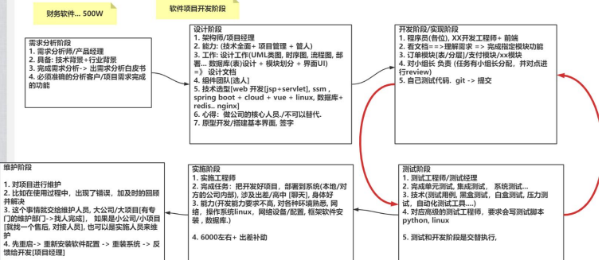

> **分层模式**：分层的目的是为了解耦，降低代码的耦合度，有利于项目的维护和升级

- 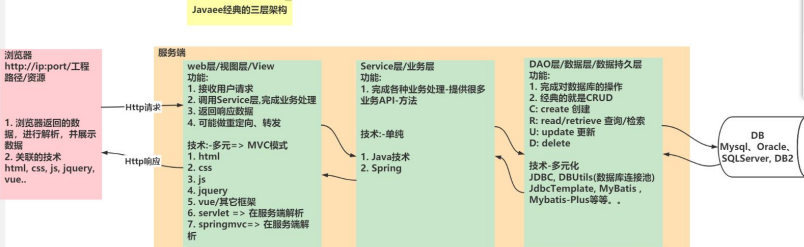
- 浏览器(`http://ip:port/工程路径/资源`)
  1. 浏览器返回的数据，进行解析，并展示数据
  2. 关联的技术(html,css,js,jquery,vue...)
- 服务器
  - `web层/视图层/view`
    1. 接收用户请求
    2. 调用service层，完成业务处理
    3. 返回响应数据
    4. 可能做重定向/请求转发
    - 技术多元=>MVC测试
      1. html,css,js,jquery,vue/其它架构
      2. servlet-在服务器端解析
      3. **springmvc**-在服务器端解析
  - `service层/业务层`
    1. 完成各种业务处理，提供多业务API方法
    - 技术单纯
      1. Java技术
      2. **Spring**
  - `DAO层/数据层/数据持久层`
    1. 完成对数据库的操作
    2. 经典的就是`C(create)R(read/retrieve)U(update)D(delete)`
    - 技术多元化
      - JDBC,DBUtils(数据库连接池),jdbcTemplate
      - MyBatis,MyBatis-Plus...

| 分层       | 对应包                                                | 说明               |
|----------|----------------------------------------------------|------------------|
| web层     | `com.charlie.furns.web/servlet/controller/handler` | 接受用户请求，调用service |
| service层 | `com.charlie.furns.service`                        | service接口包       |
|          | `com.charlie.furns.service.impl`                   | service接口实现类     |
| dao持久层   | `com.charlie.furns.dao`                            | dao接口包           |
|          | `com.charlie.furns.dao.impl`                       | dao接口实现类         |
| 实体bean对象 | `com.charlie.furns.pojo/entity/domain/bean`        | JavaBean类        |
| 工具类      | `com.charlie.furns.utils`                          | 工具类              |
| 测试包      | `com.charlie.furns.test`                           | 完成对dao/service测试 |

- 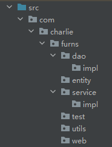

### MVC

1. 什么是MVC
   - MVC全称：Model模型、View视图、Controller控制器
   - MVC最早出现在JavaEE三层中的Web层，可以有效知道Web层的代码如何有效分离，单独工作
   - **View视图：只负责数据和界面的显示**，不接受任何与显示数据无关的代码，便于程序员和美工分工合作(Vue/JSP/Thymeleaf/Html)
   - **Controller控制器：只负责接收请求，调用业务层的代码处理请求，然后派发页面，是一个调度者的角色(servlet)**
   - **Model模型：将与业务逻辑相关的数据封装为具体的JavaBean类，其中不参杂任何与数据处理相关的代码(JavaBean/Domain/Pojo)**
2. MVC是一种思想
   - **MVC的思想是将软件代码拆分成为组件，单独开发，组合使用(目的还是为了解耦合)，也有很多落地的框架比如SpringMVC**
3. MVC示意图
   - 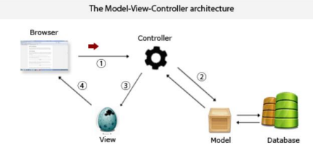
4. 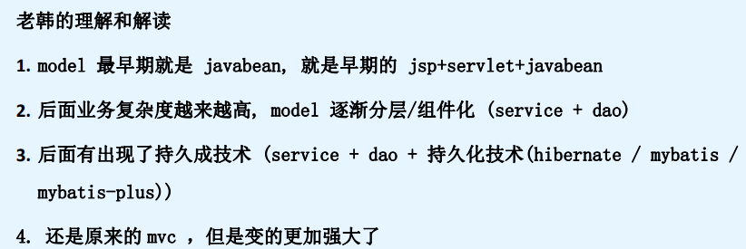
5. 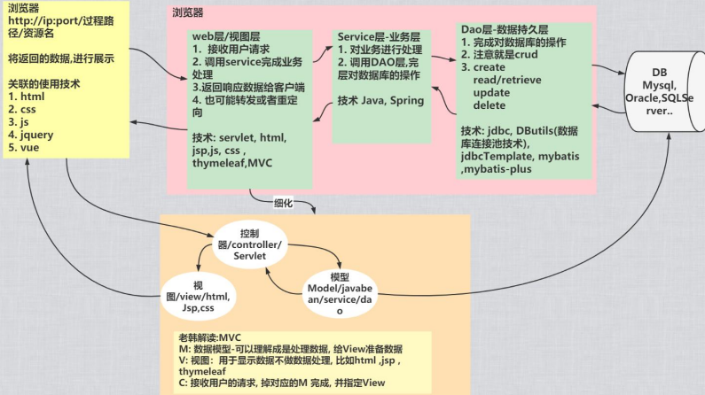

## 实现功能01-创建项目，正确运行静态页面

把前端人员给的静态页面拷贝到web路径下
- 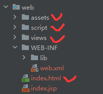

## 实现功能02-会员注册前端JS校验

| 需求分析                      | 思路分析                    |
|---------------------------|-------------------------|
|    | 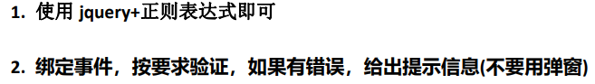 |
| 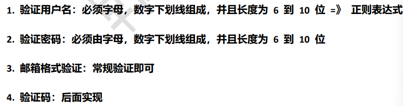   |                         |

```html
<!DOCTYPE html>
<html lang="en">
<head>
    <meta charset="UTF-8">
    <meta http-equiv="x-ua-compatible" content="ie=edge" />
    <title>韩顺平教育-家居网购</title>
    <meta name="viewport" content="width=device-width, initial-scale=1, shrink-to-fit=no" />
    <link rel="stylesheet" href="../../assets/css/vendor/vendor.min.css"/>
    <link rel="stylesheet" href="../../assets/css/plugins/plugins.min.css"/>
    <link rel="stylesheet" href="../../assets/css/style.min.css"/>
<!--    引入jquery，先使用-->
    <script type="text/javascript" src="../../script/jquery-3.6.0.min.js"></script>
    <script type="text/javascript">
        $(function () { // 页面加载完毕后执行function
            // 绑定点击事件
            $("#sub-btn").click(function () {

                // 1. 获取到输入的用户名
                var usernameVal = $("#username").val();
                // 编写正则表达式，进行验证
                var usernamePattern = /^\w{6,10}$/;
                // 验证
                if (!usernamePattern.test(usernameVal)) {
                    // 展示错误提示-属性过滤器
                    $("span[class='errorMsg']").text("用户名格式不对，需要6~10字符");
                    return false;   // 不提交，返回false
                }

                // 2. 完成对密码的校验
                var passwordVal = $("#password").val();
                var passwordPattern = /^\w{6,10}$/;
                if (!passwordPattern.test(passwordVal)) {
                    // 展示密码错误提示-基本过滤器
                    $("span.errorMsg").text("密码格式不对，需要6~10字符");
                    return false;
                }

                // 3. 两次密码相同验证
                // 得到第二次输入密码
                var repwdVal = $("#repwd").val();
                if (repwdVal !== passwordVal) {
                    $("span.errorMsg").text("输入的两次密码不同！");
                    return false;
                }

                // 4. 验证邮箱
                // 得到邮箱
                var emailVal = $("#email").val();
                // 说明：在java中正则表达式的转义是 \\，在js中正则表达式转义是 \
                var emailPattern = /^[\w-]+@([a-zA-Z]+\.)+[a-zA-Z]+$/;
                if (!emailPattern.test(emailVal)) {
                    $("span.errorMsg").text("电子邮件格式有误！");
                    return false;
                }

                $("span[class='errorMsg']").text("通过验证！");
                return false;
            })
        })
    </script>
</head>

<body>
<!--内容过多而省略...-->
</body>
</html>
```

## 实现功能03-会员注册后端

- 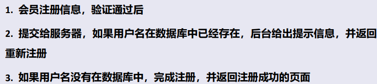
- 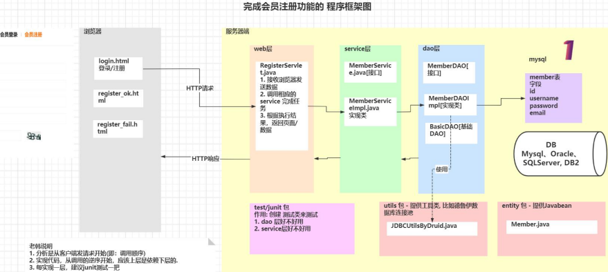
- 分析：从前端注册发出请求到后端处理
- 实现：从底层数据库到上层调用，上层依赖下层

### 1. 创建数据库和表

- 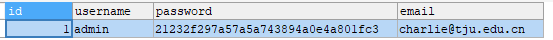

```mysql
# 创建家具网购需要的数据库和表
-- 创建 home_furnishing 数据库
CREATE DATABASE IF NOT EXISTS home_furnishing;
USE home_furnishing;
-- 创建会员表
CREATE TABLE member (
	id INT PRIMARY KEY AUTO_INCREMENT,
	`username` VARCHAR(32) NOT NULL UNIQUE,
	`password` VARCHAR(32) NOT NULL,
	`email` VARCHAR(64)
);
-- 测试数据
INSERT INTO member(username, `password`, `email`) VALUES
	('admin', md5('admin'), 'charlie@tju.edu.cn');
SELECT * FROM member;
```

### 2. 创建entity

```java
package com.charlie.furns.entity;

public class Member {
    // 在定义JavaBean属性时，一定要与表字段名一致
    private Integer id;
    private String username;
    private String password;
    private String email;

    public Member() {
    }

    public Member(Integer id, String username, String password, String email) {
        this.id = id;
        this.username = username;
        this.password = password;
        this.email = email;
    }

    @Override
    public String toString() {
        return "id=" + id + ", username=" + username +  ", email=" + email;
    }

    public Integer getId() {
        return id;
    }

    public void setId(Integer id) {
        this.id = id;
    }

    public String getUsername() {
        return username;
    }

    public void setUsername(String username) {
        this.username = username;
    }

    public String getPassword() {
        return password;
    }

    public void setPassword(String password) {
        this.password = password;
    }

    public String getEmail() {
        return email;
    }

    public void setEmail(String email) {
        this.email = email;
    }
}
```

### 3. 数据库工具类

```java
package com.charlie.furns.utils;

import com.alibaba.druid.pool.DruidDataSourceFactory;

import javax.sql.DataSource;
import java.io.FileInputStream;
import java.sql.Connection;
import java.sql.ResultSet;
import java.sql.SQLException;
import java.sql.Statement;
import java.util.Properties;

/**
 * 基于druid数据库连接池的工具类
 */
public class JDBCUtilsByDruid {

    private static DataSource ds;

    //在静态代码块完成 ds初始化
    static {
        Properties properties = new Properties();
        try {
            properties.load(new FileInputStream("src\\druid.properties"));
            ds = DruidDataSourceFactory.createDataSource(properties);
        } catch (Exception e) {
            e.printStackTrace();
        }

    }

    //编写getConnection方法
    public static Connection getConnection() throws SQLException {
        return ds.getConnection();
    }

    //关闭连接, 强调： 在数据库连接池技术中，close 不是真的断掉连接
    //而是把使用的Connection对象放回连接池
    public static void close(ResultSet resultSet, Statement statement, Connection connection) {
        try {
            if (resultSet != null) {
                resultSet.close();
            }
            if (statement != null) {
                statement.close();
            }
            if (connection != null) {
                connection.close();
            }
        } catch (SQLException e) {
            throw new RuntimeException(e);
        }
    }
}
```

```java
package com.charlie.furns.dao;


import com.charlie.furns.utils.JDBCUtilsByDruid;
import org.apache.commons.dbutils.QueryRunner;
import org.apache.commons.dbutils.handlers.BeanHandler;
import org.apache.commons.dbutils.handlers.BeanListHandler;
import org.apache.commons.dbutils.handlers.ScalarHandler;

import java.sql.Connection;
import java.sql.SQLException;
import java.util.List;

/**
 * 开发BasicDAO , 是其他DAO的父类
 */
public class BasicDAO<T> { //泛型指定具体类型

    private QueryRunner qr =  new QueryRunner();

    //开发通用的dml方法, 针对任意的表
    public int update(String sql, Object... parameters) {
        Connection connection = null;
        try {
            connection = JDBCUtilsByDruid.getConnection();
            int update = qr.update(connection, sql, parameters);
            return  update;
        } catch (SQLException e) {
           throw  new RuntimeException(e); //将编译异常->运行异常 ,抛出
        } finally {
            JDBCUtilsByDruid.close(null, null, connection);
        }
    }

    /**
     * 返回多个对象(即查询的结果是多行), 针对任意表
     * @param sql sql 语句，可以有 ?
     * @param clazz 传入一个类的Class对象 比如 Actor.class
     * @param parameters 传入 ? 的具体的值，可以是多个
     * @return 根据Actor.class 返回对应的 ArrayList 集合
     */
    public List<T> queryMulti(String sql, Class<T> clazz, Object... parameters) {
        Connection connection = null;
        try {
            connection = JDBCUtilsByDruid.getConnection();
            return qr.query(connection, sql, new BeanListHandler<T>(clazz), parameters);

        } catch (SQLException e) {
            throw  new RuntimeException(e); //将编译异常->运行异常 ,抛出
        } finally {
            JDBCUtilsByDruid.close(null, null, connection);
        }
    }

    //查询单行结果 的通用方法
    public T querySingle(String sql, Class<T> clazz, Object... parameters) {
        Connection connection = null;
        try {
            connection = JDBCUtilsByDruid.getConnection();
            return  qr.query(connection, sql, new BeanHandler<T>(clazz), parameters);
        } catch (SQLException e) {
            throw  new RuntimeException(e); //将编译异常->运行异常 ,抛出
        } finally {
            JDBCUtilsByDruid.close(null, null, connection);
        }
    }

    //查询单行单列的方法,即返回单值的方法
    public Object queryScalar(String sql, Object... parameters) {
        Connection connection = null;
        try {
            connection = JDBCUtilsByDruid.getConnection();
            return  qr.query(connection, sql, new ScalarHandler(), parameters);
        } catch (SQLException e) {
            throw  new RuntimeException(e); //将编译异常->运行异常 ,抛出
        } finally {
            JDBCUtilsByDruid.close(null, null, connection);
        }
    }
}
```

### 4. DAO

- [BasicDAO<T>](src/com/charlie/furns/dao/BasicDAO.java)

```java
package com.charlie.furns.dao;

import com.charlie.furns.entity.Member;

public interface MemberDAO {    // 需要自己分析，需要哪些方法
    // 提供一个通过用户名返回对应的Member
    public Member queryMemberByUsername(String username);
    // 提供一个保存Member对象到数据库/member表
    public int saveMember(Member member);
}
```

```java
package com.charlie.furns.dao.impl;

import com.charlie.furns.dao.BasicDAO;
import com.charlie.furns.dao.MemberDAO;
import com.charlie.furns.entity.Member;

public class MemberDAOImpl extends BasicDAO<Member> implements MemberDAO {

    /**
     * 通过用户名返回对应的Member
     * @param username 用户名
     * @return 对应的Member，如果没有该Member则返回null
     */
    @Override
    public Member queryMemberByUsername(String username) {
        // 提示：现在sqlyog测试，然后再拿到程序中
        String sql = "select * from member where username=?";
        return querySingle(sql, Member.class, username);
    }

    /**
     * 保存一个会员
     * @param member 传入的Member对象
     * @return 返回-1失败，返回其它的数字就是受影响的行数
     */
    @Override
    public int saveMember(Member member) {
        String sql = "INSERT INTO member(username, `password`, `email`)" +
                " VALUES (?, MD5(?), ?);";
        return update(sql, member.getUsername(), member.getPassword(), member.getEmail());
    }
}
```

### 5. service层

- [MemberService](src/com/charlie/furns/service/MemberService.java)
- [MemberServiceImpl](src/com/charlie/furns/service/impl/MemberServiceImpl.java)

> 小技巧：查看某个方法的具体实现类，快捷键 `ctrl+alt+b`
> 
> `ctrl+b`只可以定位到编译类型的方法

### 6. web层

- 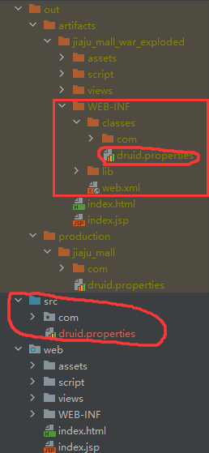

> 在web层配置文件路径时和普通项目不同，web项目的工作目录在out，而src时JavaSE application上使用的路径。
> 
> web项目中需要使用到类加载器来获取

```
JDBCUtilsByDruid.java
// 因为是web项目，工作目录在out，文件的加载需要使用类加载器
// 找到我们的工作目录
properties.load(JDBCUtilsByDruid.class.getClassLoader().getResourceAsStream("druid.properties"));
// properties.load(new FileInputStream("src\\druid.properties"));
```

```java
package com.charlie.furns.web;

import com.charlie.furns.entity.Member;
import com.charlie.furns.service.MemberService;
import com.charlie.furns.service.impl.MemberServiceImpl;

import javax.servlet.*;
import javax.servlet.http.*;
import java.io.IOException;

public class RegisterServlet extends HttpServlet {

    // 定义一个属性MemberService
    private MemberService memberService = new MemberServiceImpl();

    @Override
    protected void doGet(HttpServletRequest req, HttpServletResponse resp) throws ServletException, IOException {
//        System.out.println("RegisterServlet 被调用...");
        // 接收用户注册信息->一定要看前端代码
        String username = req.getParameter("username");
        String password = req.getParameter("password");
        String email = req.getParameter("email");
        // 判断用户名是否可用
        if (!memberService.isExistsUsername(username)) {
            // 用户名不存在-注册
            Member member = new Member(null, username, password, email);
            if (memberService.registerMember(member)) { // 注册成功
                // 请求转发
                req.getRequestDispatcher("/views/member/register_ok.html").forward(req, resp);
            } else {    // 注册失败
                req.getRequestDispatcher("/views/member/register_fail.html").forward(req, resp);
            }
        } else {
            // 用户名不可用
            req.getRequestDispatcher("/views/member/login.jsp").forward(req, resp);
        }
    }

    @Override
    protected void doPost(HttpServletRequest req, HttpServletResponse resp) throws ServletException, IOException {
        doGet(req, resp);
    }
}
```

## 实现功能04-会员登录

- 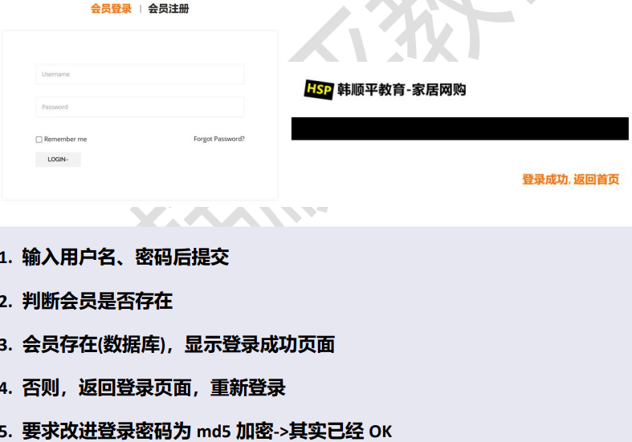
- 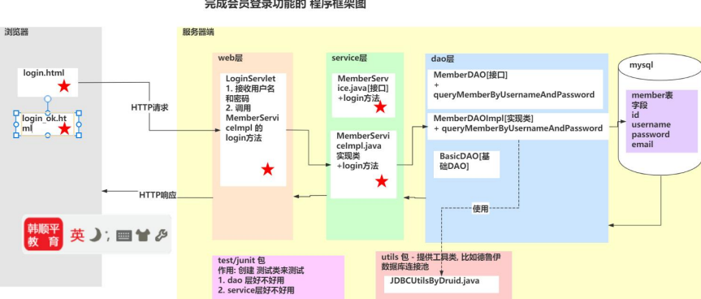

```java
package com.charlie.furns.web;

import com.charlie.furns.entity.Member;
import com.charlie.furns.service.MemberService;
import com.charlie.furns.service.impl.MemberServiceImpl;

import javax.servlet.*;
import javax.servlet.http.*;
import java.io.IOException;

public class LoginServlet extends HttpServlet {

    private MemberService memberService = new MemberServiceImpl();

    @Override
    protected void doGet(HttpServletRequest req, HttpServletResponse resp) throws ServletException, IOException {
        // 如果在登录界面，用户没有输入内容就直接提交，后台接收到的就是空串 ""
        String username = req.getParameter("username");
        String password = req.getParameter("password");
        Member member = new Member(null, username, password, null);
        if (memberService.login(member) == null) {
            // 页面转发-登录失败
            req.getRequestDispatcher("/views/member/login.jsp").forward(req, resp);
        } else {
            req.getRequestDispatcher("/views/member/login_ok.html").forward(req, resp);
        }
    }

    @Override
    protected void doPost(HttpServletRequest req, HttpServletResponse resp) throws ServletException, IOException {
        doGet(req, resp);
    }
}
```

## 实现功能05-登录错误提示，表单回显

- 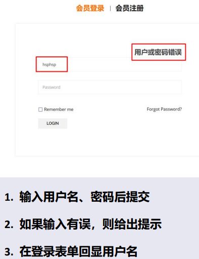
- 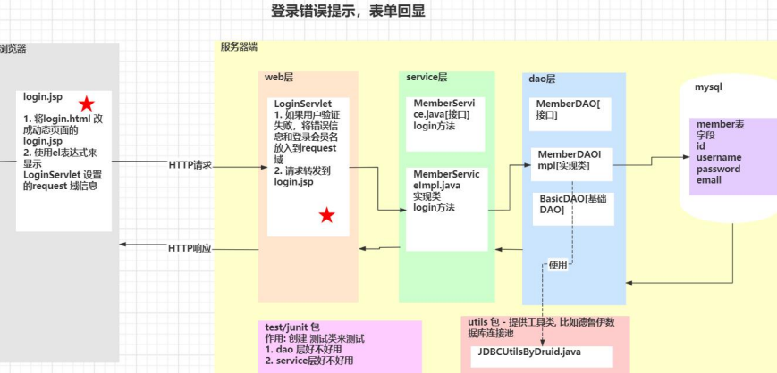

```java
package com.charlie.furns.web;

import com.charlie.furns.entity.Member;
import com.charlie.furns.service.MemberService;
import com.charlie.furns.service.impl.MemberServiceImpl;

import javax.servlet.*;
import javax.servlet.http.*;
import java.io.IOException;

public class LoginServlet extends HttpServlet {

    private MemberService memberService = new MemberServiceImpl();

    @Override
    protected void doGet(HttpServletRequest req, HttpServletResponse resp) throws ServletException, IOException {
        // 如果在登录界面，用户没有输入内容就直接提交，后台接收到的就是空串 ""
        String username = req.getParameter("username");
        String password = req.getParameter("password");
        Member member = new Member(null, username, password, null);
        if (memberService.login(member) == null) {
            // 把登录错误信息，放入到request域
            req.setAttribute("username", username);
            req.setAttribute("msg", "用户名或密码错误");
            // 页面转发-登录失败
            req.getRequestDispatcher("/views/member/login.jsp").forward(req, resp);
        } else {
            req.getRequestDispatcher("/views/member/login_ok.html").forward(req, resp);
        }
    }
}
```

```html
<div class="login-register-form">
    <%--提示错误信息-el表达式--%>
    <span style="font-size: 18pt;font-weight: bold;float: right;color: gainsboro">
        <!--回显返回的信息-->
        ${requestScope.msg}
    </span>
    <form action="loginServlet" method="post">
        <!--将用户名输入框内容设置为req返回数据的username-->
        <input type="text" name="username" value="${requestScope.username}" placeholder="Username"/>
        <input type="password" name="password" placeholder="Password"/>
        <div class="button-box">
            <div class="login-toggle-btn">
                <input type="checkbox"/>
                <a class="flote-none" href="javascript:void(0)">Remember me</a>
                <a href="#">Forgot Password?</a>
            </div>
            <button type="submit"><span>Login</span></button>
        </div>
    </form>
</div>
```

## 实现功能06-web层servlet减肥

方案1-if-else
- 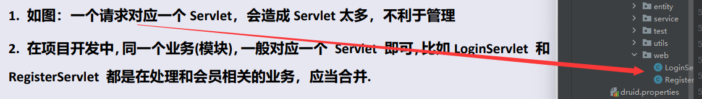
- 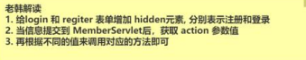
- [方案1-if-else](web/views/member/login2.jsp)

```html
<form action="memberServlet" method="post">
    <%--增加隐藏域表示login请求--%>
    <input type="hidden" name="action" value="login"/>
    <input type="text" name="username" value="${requestScope.username}" placeholder="Username"/>
    <input type="password" name="password" placeholder="Password"/>
    <div class="button-box">
        <div class="login-toggle-btn">
            <input type="checkbox"/>
            <a class="flote-none" href="javascript:void(0)">Remember me</a>
            <a href="#">Forgot Password?</a>
        </div>
        <button type="submit"><span>Login</span></button>
    </div>
</form>
```

```java
package com.charlie.furns.web;

import com.charlie.furns.entity.Member;
import com.charlie.furns.service.MemberService;
import com.charlie.furns.service.impl.MemberServiceImpl;

import javax.servlet.ServletException;
import javax.servlet.http.HttpServlet;
import javax.servlet.http.HttpServletRequest;
import javax.servlet.http.HttpServletResponse;
import java.io.IOException;

/**
 * 该servlet处理和Member相关的请求
 */
public class MemberServlet extends HttpServlet {

    private MemberService memberService = new MemberServiceImpl();

    @Override
    protected void doGet(HttpServletRequest request, HttpServletResponse response) throws ServletException, IOException {
        doPost(request, response);
    }

    @Override
    protected void doPost(HttpServletRequest request, HttpServletResponse response) throws ServletException, IOException {
        // 获取到action
        String action = request.getParameter("action");
        // 判断，调用不同的方法
        if ("login".equals(action)) {
            login(request, response);
        } else if ("register".equals(action)) {
            register(request, response);
        } else {
            response.getWriter().write("请求参数action有误！");
        }
    }

    /**
     * 处理会员注册
     */
    protected void register(HttpServletRequest req, HttpServletResponse resp) throws ServletException, IOException {
        // System.out.println("RegisterServlet 被调用...");
        // 接收用户注册信息->一定要看前端代码
        String username = req.getParameter("username");
        String password = req.getParameter("password");
        String email = req.getParameter("email");
        // 判断用户名是否可用
        if (!memberService.isExistsUsername(username)) {
            // 用户名不存在-注册
            Member member = new Member(null, username, password, email);
            if (memberService.registerMember(member)) { // 注册成功
                // 请求转发
                req.getRequestDispatcher("/views/member/register_ok.html").forward(req, resp);
            } else {    // 注册失败
                req.getRequestDispatcher("/views/member/register_fail.html").forward(req, resp);
            }
        } else {
            // 用户名不可用
            req.getRequestDispatcher("/views/member/login2.jsp").forward(req, resp);
        }
    }

    /**
     * 处理会员登录
     */
    protected void login(HttpServletRequest req, HttpServletResponse resp) throws ServletException, IOException {
        // 如果在登录界面，用户没有输入内容就直接提交，后台接收到的就是空串 ""
        String username = req.getParameter("username");
        String password = req.getParameter("password");
        Member member = new Member(null, username, password, null);
        if (memberService.login(member) == null) {
            // 把登录错误信息，放入到request域
            req.setAttribute("username", username);
            req.setAttribute("msg", "用户名或密码错误");
            // 页面转发-登录失败
            req.getRequestDispatcher("/views/member/login2.jsp").forward(req, resp);
        } else {
            req.getRequestDispatcher("/views/member/login_ok.html").forward(req, resp);
        }
    }
}
```

方案2-反射+模板设计模式+动态绑定
- 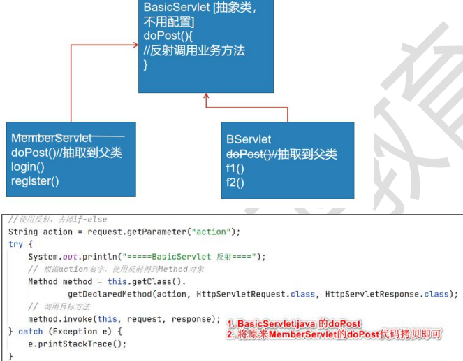
- 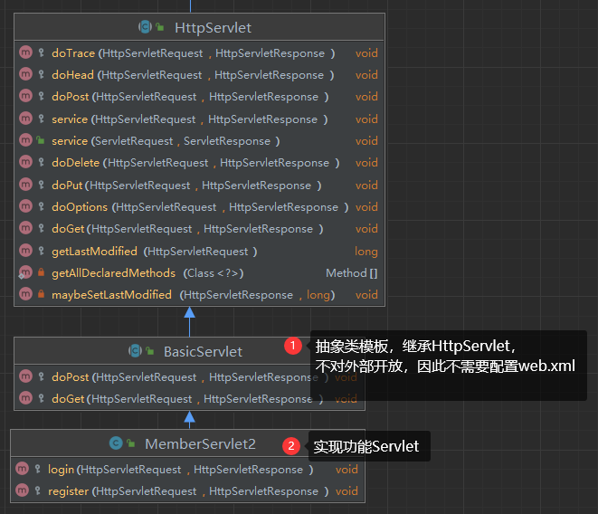
- 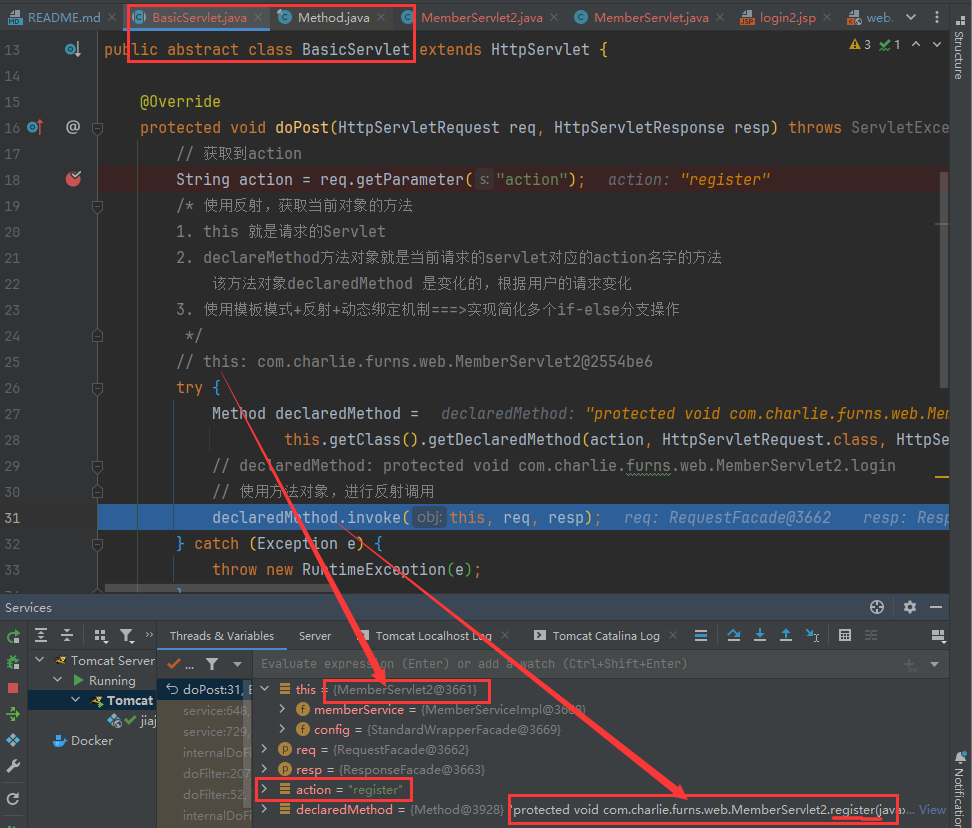

```java
package com.charlie.furns.web;

import javax.servlet.ServletException;
import javax.servlet.http.HttpServlet;
import javax.servlet.http.HttpServletRequest;
import javax.servlet.http.HttpServletResponse;
import java.io.IOException;
import java.lang.reflect.Method;

/**
 * BasicServlet不需要在web.xml上配置
 */
public abstract class BasicServlet extends HttpServlet {

    @Override
    protected void doPost(HttpServletRequest req, HttpServletResponse resp) throws ServletException, IOException {
        // 获取到action
        // 提示：如果使用了模板模式+反射+动态绑定，要满足action的value和方法名一致
        String action = req.getParameter("action");
        /* 使用反射，获取当前对象的方法
        1. this 就是请求的Servlet
        2. declareMethod方法对象就是当前请求的servlet对应的action名字的方法
            该方法对象declaredMethod 是变化的，根据用户的请求变化
        3. 使用模板模式+反射+动态绑定机制===>实现简化多个if-else分支操作
         */
        // this: com.charlie.furns.web.MemberServlet2@2554be6
        try {
            Method declaredMethod =
                    this.getClass().getDeclaredMethod(action, HttpServletRequest.class, HttpServletResponse.class);
            // declaredMethod: protected void com.charlie.furns.web.MemberServlet2.login
            // 使用方法对象，进行反射调用
            declaredMethod.invoke(this, req, resp);
        } catch (Exception e) {
            throw new RuntimeException(e);
        }
    }

    @Override
    protected void doGet(HttpServletRequest req, HttpServletResponse resp) throws ServletException, IOException {
        doPost(req, resp);
    }
}
```

```java
package com.charlie.furns.web;

import com.charlie.furns.entity.Member;
import com.charlie.furns.service.MemberService;
import com.charlie.furns.service.impl.MemberServiceImpl;

import javax.servlet.ServletException;
import javax.servlet.http.HttpServlet;
import javax.servlet.http.HttpServletRequest;
import javax.servlet.http.HttpServletResponse;
import java.io.IOException;

/**
 * 该servlet处理和Member相关的请求
 */
public class MemberServlet2 extends BasicServlet {

    private MemberService memberService = new MemberServiceImpl();

    /**
     * 处理会员注册
     */
    protected void register(HttpServletRequest req, HttpServletResponse resp) throws ServletException, IOException {
        // System.out.println("RegisterServlet 被调用...");
        // 接收用户注册信息->一定要看前端代码
        String username = req.getParameter("username");
        String password = req.getParameter("password");
        String email = req.getParameter("email");
        // 判断用户名是否可用
        if (!memberService.isExistsUsername(username)) {
            // 用户名不存在-注册
            Member member = new Member(null, username, password, email);
            if (memberService.registerMember(member)) { // 注册成功
                // 请求转发
                req.getRequestDispatcher("/views/member/register_ok.html").forward(req, resp);
            } else {    // 注册失败
                req.getRequestDispatcher("/views/member/register_fail.html").forward(req, resp);
            }
        } else {
            // 用户名不可用
            req.getRequestDispatcher("/views/member/login2.jsp").forward(req, resp);
        }
    }

    /**
     * 处理会员登录
     */
    protected void login(HttpServletRequest req, HttpServletResponse resp) throws ServletException, IOException {
        // 如果在登录界面，用户没有输入内容就直接提交，后台接收到的就是空串 ""
        String username = req.getParameter("username");
        String password = req.getParameter("password");
        Member member = new Member(null, username, password, null);
        if (memberService.login(member) == null) {
            // 把登录错误信息，放入到request域
            req.setAttribute("username", username);
            req.setAttribute("msg", "用户名或密码错误");
            // 页面转发-登录失败
            req.getRequestDispatcher("/views/member/login2.jsp").forward(req, resp);
        } else {
            req.getRequestDispatcher("/views/member/login_ok.html").forward(req, resp);
        }
    }
}
```

## 实现功能07-后台管理-显示家具

| 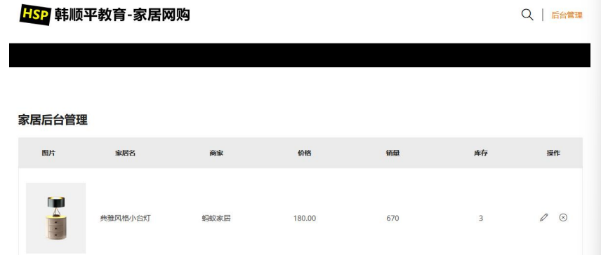 | 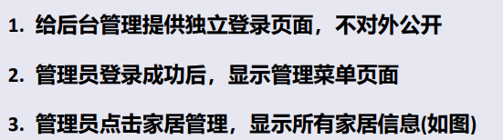 |
|---------------------------|---------------------------|

- 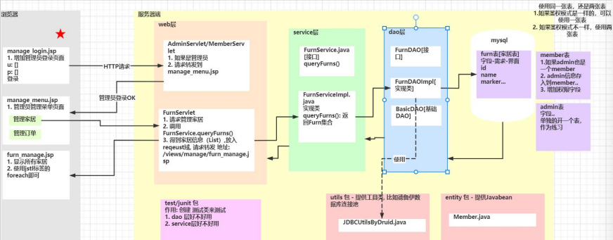

```mysql
### 设计furn表，家具表 需求-文档-界面
-- 有时会看到 id int(11) 其中11表示显示的宽度，配合zerofill，存放的数据范围是和int一致的
--	int(6) 123 ---> 000123
--	int的范围是-2^32~2^32-1 最大长度是11位(带上符号)
--	int(11)->有符号
--	int(10)->无符号
-- 对于数据库中的图片，可以存放其所在地址的url
DROP TABLE IF EXISTS furn;
CREATE TABLE IF NOT EXISTS furn (
	id INT UNSIGNED PRIMARY KEY AUTO_INCREMENT,	# id
	`name` VARCHAR(64) NOT NULL,			# 家具名
	`maker` VARCHAR(64) NOT NULL,			# 制造商
	price DECIMAL(11, 2) NOT NULL,			# 价格，定点数
	`sales` INT UNSIGNED NOT NULL,			# 销量
	`stock` INT UNSIGNED NOT NULL,			# 库存
	`img_path` VARCHAR(256) NOT NULL		# 存放图片的路径
)CHARSET utf8 ENGINE INNODB;
-- 增加测试数据
INSERT INTO furn(`id` , `name` , `maker` , `price` , `sales` , `stock` , `img_path`)
	VALUES(NULL, '北欧风格小桌子', '熊猫家居', 180, 666, 7, 'assets/images/product-image/6.jpg');
INSERT INTO furn(`id` , `name` , `maker` , `price` , `sales` , `stock` , `img_path`)
	VALUES(NULL, '简约风格小椅子', '熊猫家居', 180, 666, 7, 'assets/images/product-image/4.jpg');
INSERT INTO furn(`id` , `name` , `maker` , `price` , `sales` , `stock` , `img_path`)
	VALUES(NULL, '典雅风格小台灯', '蚂蚁家居', 180, 666, 7, 'assets/images/product-image/14.jpg');
SELECT * FROM furn;
```

> 设计的FurnServlet继承BasicServlet，要调用到FurnServlet的list方法，需要在浏览器地址栏输入
> `jiaju_mall/manage/furnServlet?action=list`

```html
<tbody>
<%--取出furns集合，循环显示--%>
<c:forEach items="${requestScope.furns}" var="furn">
<tr>
    <td class="product-thumbnail">
        <a href="#"></a>
    </td>
    <td class="product-name"><a href="#">${furn.name}</a></td>
    <td class="product-name"><a href="#">${furn.maker}</a></td>
    <td class="product-price-cart"><span class="amount">${furn.price}</span></td>
    <td class="product-quantity">
        ${furn.sales}
    </td>
    <td class="product-quantity">
        ${furn.stock}
    </td>
    <td class="product-remove">
        <a href="#"><i class="icon-pencil"></i></a>
        <a href="#"><i class="icon-close"></i></a>
    </td>
</tr>
</c:forEach>
</tbody>
```

```java
package com.charlie.furns.web;

import com.charlie.furns.entity.Furn;
import com.charlie.furns.service.FurnService;
import com.charlie.furns.service.impl.FurnServiceImpl;

import javax.servlet.ServletException;
import javax.servlet.http.HttpServletRequest;
import javax.servlet.http.HttpServletResponse;
import java.io.IOException;
import java.util.List;

public class FurnServlet extends BasicServlet {

    private FurnService furnService = new FurnServiceImpl();

    /**
     * 使用前面的模板设计模式+反射+动态绑定来调用list方法
     */
    protected void list(HttpServletRequest req, HttpServletResponse resp) throws ServletException, IOException {
        // 通过在地址栏输入 manage/furnServlet?action=list 能够调用该方法
        // System.out.println("FurnServlet 的list方法被调用...");
        List<Furn> furns = furnService.queryFurns();
        // 把furn集合放入到req域
        req.setAttribute("furns", furns);
        // 请求转发
        req.getRequestDispatcher("/views/manage/furn_manage.jsp").forward(req, resp);
    }
}
```

## 实现功能08-后台管理-添加家具

- 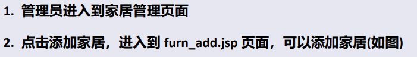
- 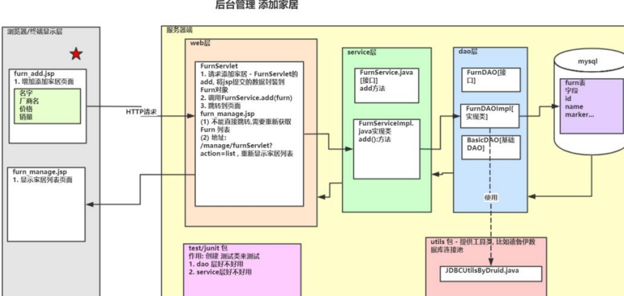

> 1. 解决中文乱码问题：在 `BasicServlet` 的 `doPos()` 方法中设置 `req.setCharacterEncoding("utf-8");`
> 2. 解决表单重复提交问题：当使用请求转发时，浏览器地址栏会停留在第一个servlet，如果刷新页面，会再次发出请求并提交数据，
> 所以在支付页面等情况下，不要使用请求转发，否则会造成重复支付。
> 3. 数据正确性校验：添加家具时提交的数据可能有问题，可以分别在前端和后端进行数据校验

```java
package com.charlie.furns.web;

import com.charlie.furns.entity.Furn;
import com.charlie.furns.service.FurnService;
import com.charlie.furns.service.impl.FurnServiceImpl;

import javax.servlet.ServletException;
import javax.servlet.http.HttpServletRequest;
import javax.servlet.http.HttpServletResponse;
import java.io.IOException;
import java.math.BigDecimal;
import java.util.List;

public class FurnServlet extends BasicServlet {

    private FurnService furnService = new FurnServiceImpl();
    
    protected void add(HttpServletRequest req, HttpServletResponse resp) throws ServletException, IOException {
        // 获取家具信息
        String name = req.getParameter("name");
        String maker = req.getParameter("maker");
        String price = req.getParameter("price");
        String sales = req.getParameter("sales");
        String stock = req.getParameter("stock");
        // 图片路径imgPath使用默认即可
        String imgPath = "assets/images/product-image/16.jpg";

        /*
        后端数据校验
        1. 逐个进行校验
        try {
            BigDecimal price = new BigDecimal(price);
        } catch (Exception e) {
            System.out.println("家具价格格式有误~");
            req.setAttribute("msg", "家具价格格式有误~");
            req.getRequestDispatcher("/views/manage/furn_add.jsp").forward(req, resp);
            return;
        }
        2. 在 new Furn() 处校验一次性验证
        3. SprintMVC有个专门用于数据校验的规则/框架 JSP303 Hibernate Validator
         */

        Furn furn = null;
        try {
            furn = new Furn(null, name, maker, new BigDecimal(price), Integer.parseInt(sales), Integer.parseInt(stock), imgPath);
        } catch (Exception e) {
            System.out.println("添加家具信息有误...");
            req.setAttribute("msg", "添加的家具数据有误，请仔细检验~");
            req.getRequestDispatcher("/views/manage/furn_add.jsp").forward(req, resp);
            return;
        }

        // 添加家具
        furnService.addFurn(furn);

        // 请求转发到家具显示页面，即需要重新走一遍furnServlet的list方法
        // 因为这里使用请求转发，当用户刷新页面时会重新发出一次添加请求，就会造成数据重复提交，解决方法->使用请求重定向
        // req.getRequestDispatcher("/manage/furnServlet?action=list").forward(req, resp);

        // 因为重定向实际是让浏览器重新发送请求，所以回送的url是一个完整的url
        String url = req.getContextPath() + "/manage/furnServlet?action=list";
        resp.sendRedirect(url);
        //System.out.println("url=" + url);   // url=/jiaju_mall/manage/furnServlet?action=list
    }
}
```

> 使用 `BeanUtils` 自动封装javabean

1. `BeanUtils`工具类，可以一次性地把所有请求的参数注入到JavaBean中
2. 经常用于把Map中的值注入到JavaBean中，或者是对象属性的拷贝操作
3. 需要导入jar包 `commons-beanutils-1.8.0.jar` 和 `commons-logging-1.1.1.jar`

- 老韩小技巧：Debug时选中某个方法，右键->`Evaluate Expression` 能够得到表达式的值
- 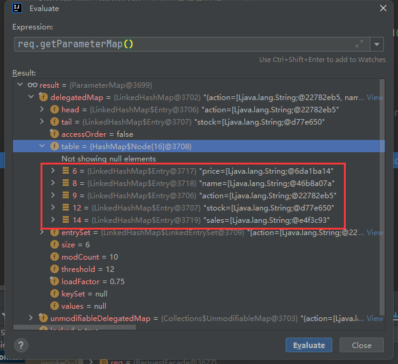

```java
package com.charlie.furns.utils;

import org.apache.commons.beanutils.BeanUtils;
import java.util.Map;

public class DataUtils {
    // 将使用BeanUtils工具自动封装javabean的方法放到静态方法中使用
    public static <T> T copyParamToBean(Map value, T bean) {
        try {
            BeanUtils.populate(bean, value);
        } catch (Exception e) {
            e.printStackTrace();
        }
        return bean;
    }
}
```

```java
package com.charlie.furns.web;

import com.charlie.furns.entity.Furn;
import com.charlie.furns.service.FurnService;
import com.charlie.furns.service.impl.FurnServiceImpl;
import com.charlie.furns.utils.DataUtils;

import javax.servlet.ServletException;
import javax.servlet.http.HttpServletRequest;
import javax.servlet.http.HttpServletResponse;
import java.io.IOException;
import java.util.List;

public class FurnServlet extends BasicServlet {

    private FurnService furnService = new FurnServiceImpl();

    protected void add(HttpServletRequest req, HttpServletResponse resp) throws ServletException, IOException {
        // 将上述自动封装的方法封装到utils中
        Furn furn = DataUtils.copyParamToBean(req.getParameterMap(), new Furn());

        // 添加家具
        furnService.addFurn(furn);

        // 请求转发到家具显示页面，即需要重新走一遍furnServlet的list方法
        // 因为这里使用请求转发，当用户刷新页面时会重新发出一次添加请求，就会造成数据重复提交，解决方法->使用请求重定向
        // req.getRequestDispatcher("/manage/furnServlet?action=list").forward(req, resp);

        // 因为重定向实际是让浏览器重新发送请求，所以回送的url是一个完整的url
        String url = req.getContextPath() + "/manage/furnServlet?action=list";
        resp.sendRedirect(url);
        //System.out.println("url=" + url);   // url=/jiaju_mall/manage/furnServlet?action=list
    }
}
```

- 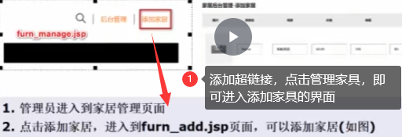

## 实现功能09-后台管理-删除家具

- 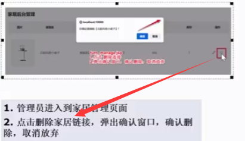
- 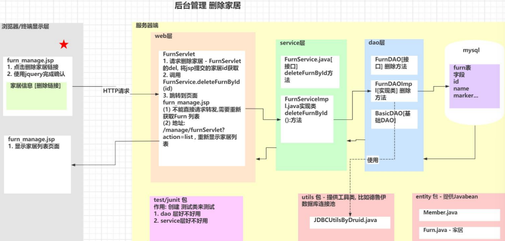

| DAO层                      | Service层                   | Servlet层                   |
|---------------------------|----------------------------|----------------------------|
| 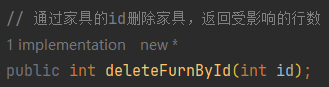 | 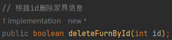  | 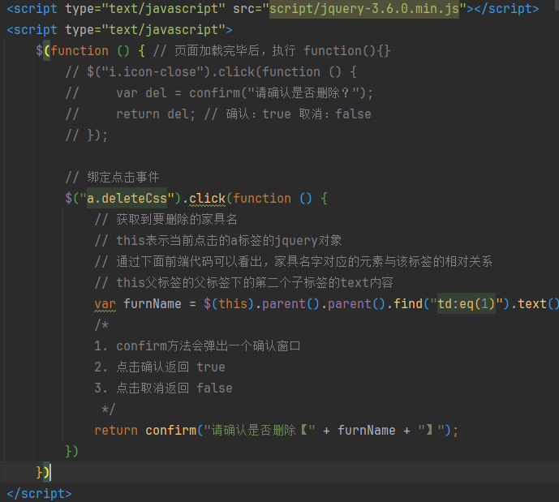  |
| 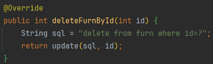 | 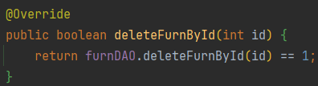  | 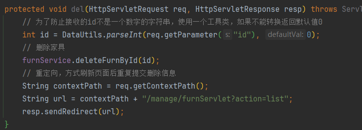  |

## 实现功能10-后台管理-修改家具

- 
- 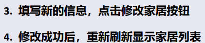
- 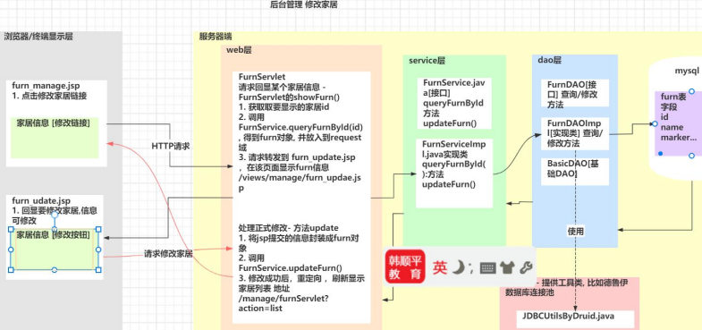

```html
<form action="manage/furnServlet" method="post">
    <%--因为是post方法，所以需要使用到隐藏域id和action--%>
    <input type="hidden" name="action" value="update">
    <input type="hidden" name="id" value="${requestScope.furn.id}">
            <a href="#"></a>
        <td class="product-name"><input name="name" style="width: 60%" type="text" value="${requestScope.furn.name}"/></td>
        <td class="product-name"><input name="maker" style="width: 90%" type="text" value="${requestScope.furn.maker}"/></td>
        <td class="product-price-cart"><input name="price" style="width: 90%" type="text" value="${requestScope.furn.price}"/></td>
            <input name="sales" style="width: 90%" type="text" value="${requestScope.furn.sales}"/>
            <input name="stock" style="width: 90%" type="text" value="${requestScope.furn.stock}"/>
            <input type="submit" style="width: 90%;background-color: silver;border: silver;border-radius: 20%;" value="修改家居"/>
</form>
```

```java
package com.charlie.furns.web;

import com.charlie.furns.entity.Furn;
import com.charlie.furns.service.FurnService;
import com.charlie.furns.service.impl.FurnServiceImpl;
import com.charlie.furns.utils.DataUtils;
import org.apache.commons.beanutils.BeanUtils;

import javax.servlet.ServletException;
import javax.servlet.http.HttpServletRequest;
import javax.servlet.http.HttpServletResponse;
import java.io.IOException;
import java.lang.reflect.InvocationTargetException;
import java.util.List;

public class FurnServlet extends BasicServlet {

    private FurnService furnService = new FurnServiceImpl();

    // 处理回显家具信息的请求
    protected void showFurn(HttpServletRequest req, HttpServletResponse resp) throws ServletException, IOException {
        int id = DataUtils.parseInt(req.getParameter("id"), 0);
        Furn furn = furnService.queryFurnById(id);
        // 将furn放入到req域中
        req.setAttribute("furn", furn);
        // 请求转发
        req.getRequestDispatcher("/views/manage/furn_update.jsp").forward(req, resp);
    }

    // 处理修改家具信息的请求
    protected void update(HttpServletRequest req, HttpServletResponse resp) throws ServletException, IOException {
        Furn furn = DataUtils.copyParamToBean(req.getParameterMap(), new Furn());
        // 修改家具信息
        furnService.updateFurn(furn);
        // 重定向
        String url = req.getContextPath() + "/manage/furnServlet?action=list";
        resp.sendRedirect(url);
    }
}
```

## 实现功能11-后台分页(分页显示家具)

- 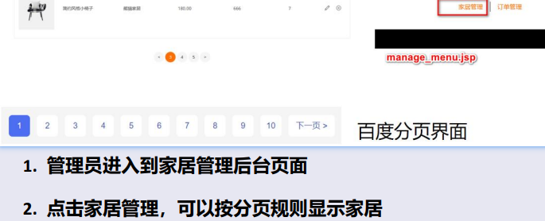
- 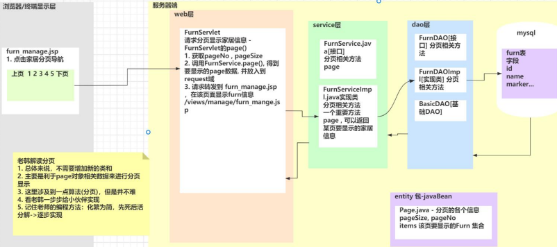

> 数据模型：设计一个Page的JavaBean，包含要显示的页数和该页内的数据。设置为泛型类型，方便扩展。
> 对于Page中不同的属性，其中能从数据库DB中直接获取的放大DAO中处理，从前端获取的放到service中处理

```java
package com.charlie.furns.entity;

import java.util.List;

/**
 * Page是一个JavaBean，是一个分页的数据模型，包含了分页的各种信息
 * T表示泛型，因为将来分页模型对应的数据类型是不确定的
 */
public class Page<T> {

    // 因为每页显示多少条记录，在其它地方有可能使用
    // ctrl+shift+u => 切换变量名大小写
    public static final Integer PAGE_SIZE = 3;

    // 表示显示当前页[显示第几页]
    private Integer pageNo;     // 前端页面获取
    // 表示每页显示几条记录
    private Integer pageSize = PAGE_SIZE;
    // 表示共有多少页
    private Integer pageTotalCount; // 通过计算而来
    // 表示的是共有多少条记录
    private Integer totalRow;   // 可以从数据库获得 -> DAO
    // 返回当前页要显示的数据
    private List<T> items;      // 从数据库中获取 -> DAO
    // 分页导航的字符串
    private String url;
    // getter and setter 方法省略
}
```

```java
package com.charlie.furns.dao.impl;

import com.charlie.furns.dao.BasicDAO;
import com.charlie.furns.dao.FurnDAO;
import com.charlie.furns.entity.Furn;
import com.charlie.furns.entity.Page;

import java.util.List;

public class FurnDAOImpl extends BasicDAO<Furn> implements FurnDAO {

    @Override
    public int getTotalRow() {
        String sql = "select count(*) from furn";
        //return (Integer) queryScalar(sql);    // Long cannot be cast to Integer
        return ((Number) queryScalar(sql)).intValue();
    }

    @Override
    public List<Furn> getPageItems(int begin, int pageSize) {
        String sql = "SELECT `id`, `name`, `maker`, `price`, `sales`, `stock`, `img_path` imgPath from `furn` limit ?, ?";
        return queryMulti(sql, Furn.class, begin, pageSize);
    }
}
```

```java
package com.charlie.furns.service.impl;

import com.charlie.furns.dao.FurnDAO;
import com.charlie.furns.dao.impl.FurnDAOImpl;
import com.charlie.furns.entity.Furn;
import com.charlie.furns.entity.Page;
import com.charlie.furns.service.FurnService;

import java.util.List;

public class FurnServiceImpl implements FurnService {

    private FurnDAO furnDAO = new FurnDAOImpl();

    @Override
    public Page<Furn> page(int pageNo, int pageSize) {
        // 先创建一个page对象，然后根据实际情况填充属性
        Page<Furn> page = new Page<>();
        page.setPageNo(pageNo);                     // 要显示第几页
        page.setPageSize(pageSize);                 // 每页显示的数据量
        int totalRow = furnDAO.getTotalRow();
        page.setTotalRow(totalRow);                 // 一共有多少行数据记录

        // pageTotalCount 要显示的页数
        int pageTotalCount = totalRow / pageSize;
        if (totalRow % pageNo != 0) {
            pageTotalCount += 1;
        }
        page.setPageTotalCount(pageTotalCount);     // 一共可以显示多少页

        // begin = (第几页 - 1) * 每页显示的数据
        int begin = (pageNo - 1) * pageSize;
        page.setItems(furnDAO.getPageItems(begin, pageSize));
        // url分页导航，后续实现
        return page;
    }
}
```

```java
package com.charlie.furns.web;

import com.charlie.furns.entity.Furn;
import com.charlie.furns.entity.Page;
import com.charlie.furns.service.FurnService;
import com.charlie.furns.service.impl.FurnServiceImpl;
import com.charlie.furns.utils.DataUtils;
import org.apache.commons.beanutils.BeanUtils;

import javax.servlet.ServletException;
import javax.servlet.http.HttpServletRequest;
import javax.servlet.http.HttpServletResponse;
import java.io.IOException;
import java.lang.reflect.InvocationTargetException;
import java.util.List;

public class FurnServlet extends BasicServlet {

    private FurnService furnService = new FurnServiceImpl();

    // 处理分页显示请求
    protected void page(HttpServletRequest req, HttpServletResponse resp) throws ServletException, IOException {
        int pageNo = DataUtils.parseInt(req.getParameter("pageNo"), 1);
        int pageSize = DataUtils.parseInt(req.getParameter("pageSize"), Page.PAGE_SIZE);
        // 调用service方法，获取Page对象
        Page<Furn> page = furnService.page(pageNo, pageSize);
        // 将page放入到req域
        req.setAttribute("page", page);
        // 请求转发到furn_manage.jsp页面
        req.getRequestDispatcher("/views/manage/furn_manage.jsp").forward(req, resp);
    }
}
```

## 实现功能12-后台分页(分页导航)

- 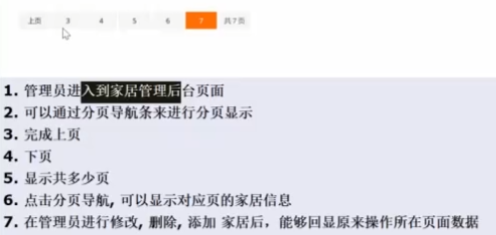

```html
<!--  Pagination Area Start -->
<div class="pro-pagination-style text-center mb-md-30px mb-lm-30px mt-6" data-aos="fade-up">
    <ul>
        <%--首页--%>
        <li><a href="manage/furnServlet?action=page&pageNo=1">首页</a></li>
        <%--上一页:如果当前页大于1，就显示上一页--%>
        <c:if test="${requestScope.page.pageNo > 1}">
            <li><a href="manage/furnServlet?action=page&pageNo=${requestScope.page.pageNo-1}">上页</a></li>
        </c:if>

        <%--显示所有的分页数，先易后难
        先确定开始页数 begin 第1页
        再确定结束页数 end 末页
        问题：如果页数很多，如何处理？ => 通过算法最多显示5页
        --%>
        <c:set var="begin" value="1"/>
        <c:set var="end" value="${requestScope.page.pageTotalCount}"/>
        <c:forEach begin="${begin}" end="${end}" var="i">
            <%--如果i是当前页，就使用class="active"修饰--%>
            <c:if test="${i == requestScope.page.pageNo}">
                <li><a class="active" href="manage/furnServlet?action=page&pageNo=${i}">${i}</a></li>
            </c:if>
            <c:if test="${i != requestScope.page.pageNo}">
                <li><a href="manage/furnServlet?action=page&pageNo=${i}">${i}</a></li>
            </c:if>
        </c:forEach>

        <%--下一页--%>
        <c:if test="${requestScope.page.pageNo < requestScope.page.pageTotalCount}">
            <li><a href="manage/furnServlet?action=page&pageNo=${requestScope.page.pageNo+1}">下页</a></li>
        </c:if>
        <%--末页--%>
        <li><a href="manage/furnServlet?action=page&pageNo=${requestScope.page.pageTotalCount}">末页</a></li>
        <li><a>共 ${requestScope.page.pageTotalCount} 页</a></li>
        <li><a>共 ${requestScope.page.totalRow} 记录</a></li>
    </ul>
</div>
<!--  Pagination Area End -->
```

- 如下处理修改/删除后返回对应的分页上
- 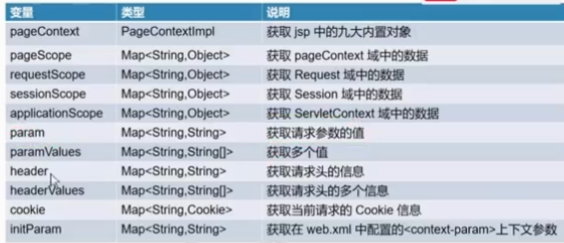

> 注意:
> - 在jsp中使用 `${requestScope.pageNo}` 获取的是 `Request`域中的数据,即通过 `req.setAttribute("pageNo", pageNo)` 添加的域数据
> - 而通过 `${param.pageNo}` 可以获取请求参数的值,如通过请求 `furnServlet?action=page&pageNo=1`

```
// 处理回显家具信息的请求
protected void showFurn(HttpServletRequest req, HttpServletResponse resp) throws ServletException, IOException {
    int id = DataUtils.parseInt(req.getParameter("id"), 0);
    Furn furn = furnService.queryFurnById(id);
    // 将furn放入到req域中
    req.setAttribute("furn", furn);

    // 1. 将从请求中获取的参数信息pageNo保存到req的域中,则可以在jsp中使用 ${requestScope.pageNo} 获取域数据
    // 2. 如果是请求带来的参数如 pageNo=1,而且通过请求转发到下一个页面,
    //      在下一个页面可以通过 ${param.pageNo} 获取,此时不需要设置域数据,直接请求转发req即可
    //req.setAttribute("pageNo", req.getParameter("pageNo"));
    //req.setAttribute("pageSize", req.getParameter("pageSize"));

    // 请求转发
    req.getRequestDispatcher("/views/manage/furn_update.jsp").forward(req, resp);
}
```
