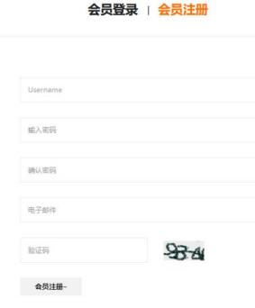

# 家具网购项目

## 分层思想

- 

> **分层模式**：分层的目的是为了解耦，降低代码的耦合度，有利于项目的维护和升级

- 
- 浏览器(`http://ip:port/工程路径/资源`)
  1. 浏览器返回的数据，进行解析，并展示数据
  2. 关联的技术(html,css,js,jquery,vue...)
- 服务器
  - `web层/视图层/view`
    1. 接收用户请求
    2. 调用service层，完成业务处理
    3. 返回响应数据
    4. 可能做重定向/请求转发
    - 技术多元=>MVC测试
      1. html,css,js,jquery,vue/其它架构
      2. servlet-在服务器端解析
      3. **springmvc**-在服务器端解析
  - `service层/业务层`
    1. 完成各种业务处理，提供多业务API方法
    - 技术单纯
      1. Java技术
      2. **Spring**
  - `DAO层/数据层/数据持久层`
    1. 完成对数据库的操作
    2. 经典的就是`C(create)R(read/retrieve)U(update)D(delete)`
    - 技术多元化
      - JDBC,DBUtils(数据库连接池),jdbcTemplate
      - MyBatis,MyBatis-Plus...

| 分层       | 对应包                                                | 说明               |
|----------|----------------------------------------------------|------------------|
| web层     | `com.charlie.furns.web/servlet/controller/handler` | 接受用户请求，调用service |
| service层 | `com.charlie.furns.service`                        | service接口包       |
|          | `com.charlie.furns.service.impl`                   | service接口实现类     |
| dao持久层   | `com.charlie.furns.dao`                            | dao接口包           |
|          | `com.charlie.furns.dao.impl`                       | dao接口实现类         |
| 实体bean对象 | `com.charlie.furns.pojo/entity/domain/bean`        | JavaBean类        |
| 工具类      | `com.charlie.furns.utils`                          | 工具类              |
| 测试包      | `com.charlie.furns.test`                           | 完成对dao/service测试 |

- 

### MVC

1. 什么是MVC
   - MVC全称：Model模型、View视图、Controller控制器
   - MVC最早出现在JavaEE三层中的Web层，可以有效知道Web层的代码如何有效分离，单独工作
   - **View视图：只负责数据和界面的显示**，不接受任何与显示数据无关的代码，便于程序员和美工分工合作(Vue/JSP/Thymeleaf/Html)
   - **Controller控制器：只负责接收请求，调用业务层的代码处理请求，然后派发页面，是一个调度者的角色(servlet)**
   - **Model模型：将与业务逻辑相关的数据封装为具体的JavaBean类，其中不参杂任何与数据处理相关的代码(JavaBean/Domain/Pojo)**
2. MVC是一种思想
   - **MVC的思想是将软件代码拆分成为组件，单独开发，组合使用(目的还是为了解耦合)，也有很多落地的框架比如SpringMVC**
3. MVC示意图
   - 
4. 
5. 

## 实现功能01-创建项目，正确运行静态页面

把前端人员给的静态页面拷贝到web路径下
- 

## 实现功能02-会员注册前端JS校验

| 需求分析                      | 思路分析                    |
|---------------------------|-------------------------|
|    |  |
|    |                         |

