# jQuery

- [jQuery官方文档](https://www.w3school.com.cn/jquery/index.asp)
- [jQuery API](https://jquery.cuishifeng.cn/)

## jQuery基本介绍

1. `JQuery` 是一个快速的、简洁的 `JavaScript` 库，使用户能更方便地处理HTML、CSS、DOM等
2. 提供方法、events、选择器，并且方便地为网站提供 `AJAX` 交互
3. 其宗旨是 `WRITE LESS, DO MORE`
4. jQuery实现了浏览器的兼容问题
5. 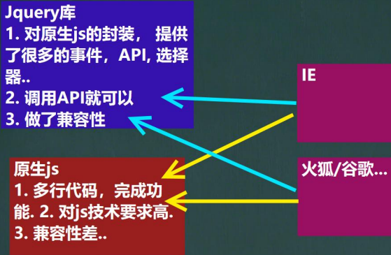

使用 `script` 引入 `jQuery` 库文件即可使用
1. 使用 `<script type="text/javascript" src="./script/jquery-3.6.0.min.js"></script>` 引入jQuery库文件
2. 即可使用jQuery相关的函数和对象

```html
<!DOCTYPE html>
<html lang="en">
<head>
    <meta charset="UTF-8">
    <title>快速入门</title>
<!--    引入 jquery-->
    <script type="text/javascript" src="./script/jquery-3.6.0.min.js"></script>
    <script type="text/javascript">
        // window.onload = function () {
        //     // 1. 得到 button 的dom对象
        //     var btn01 = document.getElementById("btn01");
        //     btn01.onclick = function () {
        //         alert("hello, jquery~");
        //     }
        // }

        // 使用 jquery
        /*
        1. 引入 jquery库
        2. $(function(){}) 等价原生的js的，当页面加载完毕就执行 function(){}
         */
        $(function (){
            // 1. 得到 btn01 这个对象的 jquery对象
            // $btn01 是一个jquery对象，其实就是对dom对象的包装，
            // 这是就可以使用jquery对象的方法、事件等
            // 通过debug 防线jquery对象是数组对象
            // 2. jquery中，获取对象的方法是 $("#id")，必须在id前有#
            // 3. 编程中，规定 jquery对象的命名以 $ 开头 (非必须，但是约定)
            var $btn01 = $("#btn01");
            // 2. 绑定事件
            $btn01.click(function (){
                alert("hello, jquery.");
            });
        });
    </script>
</head>
<body>
<!--
1. 内容处理: <input> 是一个空元素，其内容由 value 属性定义，
    而 <button> 是一个容器元素，可以包含丰富的内容。
2. 默认类型: <input> 元素的默认类型是 "text"，
    而 <button> 元素的默认类型是 "submit"（在没有明确指定的情况下）。
3. 使用场景: <input> 元素更常用于简单的按钮，而 <button> 元素更适合需要包含复杂内容的按钮。
-->
<input type="button" id="btn01" value="按钮1"/>
<!--<button id="btn01">按钮1</button>-->
</body>
</html>
```

## jQuery对象和DOM对象

### jQuery对象

1. `jQuery`对象就是对DOM对象进行包装后产生的对象
   - 比如：`$("#test").html()` 意思是指，获取ID为test的元素内的html代码，其中 `html()`是jQuery里的方法
   - 上代码等价于用DOM实现的代码：`document.getElementById("id").innerHTML;`
2. jQuery对象是jquery独有的。如果一个对象是jquery对象，那么它就可以使用jquery里的方法，如 `$("#id").html()`
3. 约定：如果获取的是jQuery对象，那么要在变量前面加上 `$`
   - `var $variable` jQuery对象
   - `var variable`  DOM对象

### DOM对象转成jQuery对象

1. 对于一个DOM对象，只需要用 `$()` 把DOM对象包装起来，就可以获得一个jQuery对象
2. DOM对象转换成JQuery对象后，就可以使用jQuery方法了

```html
<!DOCTYPE html>
<html lang="en">
<head>
    <meta charset="UTF-8">
    <title>DOM对象转成jQuery对象</title>
    <script type="text/javascript" src="./script/jquery-3.6.0.min.js"></script>
    <script type="text/javascript">
        window.onload = function () {
            // 演示通过dom对象来获取输入框的value
            // username是dom对象
            var username = document.getElementById("username");
            alert("username: " + username.value);  // 李自成
            // 通过jquery对象来获取
            // 把username dom对象转成jquery对象
            // var $username = $(username);
            // 使用jquery对象来获取value
            alert($(username).val());   // 李自成
        }
    </script>
</head>
<body>
用户名：<input id="username" name="username" value="李自成"/>
</body>
</html>
```

### jQuery对象转成DOM对象

1. 两种方式将一个jQuery对象转换成DOM对象：`[index]`和`.get(index);`
2. jquery对象是一个数组对象，封装了dom对象，可以通过[index]的方法，来得到相应的DOM对象
3. jQuery 本身提供，通过.get(index)方法，得到相应的DOM对象

```html
<!DOCTYPE html>
<html lang="en">
<head>
    <meta charset="UTF-8">
    <title>jQuery对象转成DOM对象</title>
    <script type="text/javascript" src="./script/jquery-3.6.0.min.js"></script>
    <script type="text/javascript">
        window.onload = function () {
            // 得到jquery对象
            var $username = $("#username");
            alert("$username.val(): " + $username.val());
            // 把jquery对象 -> dom对象
            /*
            1. jquery对象是一个数组对象，封装了dom对象
            2. 可以通过 [index] 或者 get(index) 来获取
            3. 一般来说 index 是0
             */
            // 方式1
            // var username = $username[0];
            // 方式2
            var username = $username.get(0);
            alert("username.value: " + username.value);
        }
    </script>
</head>
<body>
用户名：<input id="username" name="username" value="李自成"/>
</body>
</html>
```

## jQuery选择器

### jQuery选择器介绍

1. 选择器是jQuery的核心，在jQuery中，对事件处理、遍历DOM和Ajax操作都依赖于选择器
2. jQuery选择器的优点
   - 简洁的写法
      - `$("#id")` 等价于 `document.getElementById("id");`
      - `$("tagName")` 等价于 `document.getElementsByTagName("tagName");`
   - [完善的事件处理机制](jQuery-selector-notice.html)

### 基本选择器

- 基本选择器是 `jQuery` 中最常用的选择器，也是最简单的选择器，它通过元素 **id,class和标签名** 来查找DOM元素
- 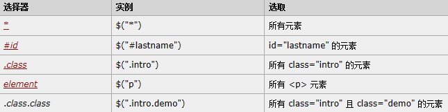

|                          | 用法                          | 返回值       | 说明                                                                                            |
|--------------------------|-----------------------------|-----------|-----------------------------------------------------------------------------------------------|
| `#id`                    | `$("#myDiv")`               | 单个元素组成的集合 | 直接选择html中的`id="myDiv"`                                                                        |
| `Element`                | `$("div")`                  | 集合元素      | element就是html已经定义的标签元素，例如div,input,a等                                                         |
| `class`                  | `$(".myClass")`             | 集合元素      | 直接选择html代码中class="myClass"的元素或元素组                                                             |
| `*`                      | `$("*")`                    | 集合元素      | 匹配所有元素，多用于结合上下文来搜索                                                                            |
| `selector1,selector2,sN` | `$("div,span,p,p.myClass")` | 集合元素      | 将每一个选择器匹配到的元素合并后一起返回，可以指定任意多个选择器，</br>将匹配到的元素合并到一个结果内。其中 `p.myClass` 表示匹配元素 p class="myClass" |

- 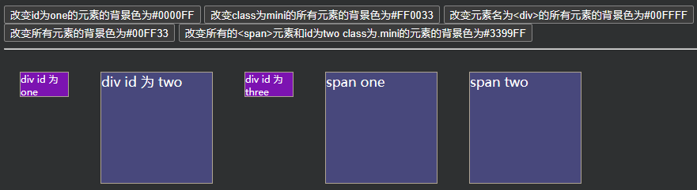
```html
<!DOCTYPE html>
<html lang="en">
<head>
    <meta charset="UTF-8">
    <title>基本选择器应用实例</title>
    <style type="text/css">
        div, span {
            width: 140px;
            height: 140px;
            margin: 20px;
            background: #9999CC;
            border: #000 1px solid;
            float: left;
            font-size: 17px;
            font-family: Roman;
        }
        div.mini {
            width: 60px;
            height: 30px;
            background: #CC66FF;
            border: #000 1px solid;
            font-size: 12px;
            font-family: Roman;
        }
    </style>
    <script type="text/javascript" src="./script/jquery-3.6.0.min.js"></script>
    <script type="text/javascript">
        $(function (){
            // 1. 改变 id 为 one 的元素的背景色为 #0000FF
            $("#b1").click(function () {
                $("#one").css("background", "#0000FF");
            })
            // 2. 改变 class 为 mini 的所有元素的背景色为 #FF0033
            $("#b2").click(function () {
                $(".mini").css("background", "#FF0033");
            })

            // 3. 改变元素名为<div>的所有元素的背景色为#00FFFF
            $("#b3").click(function () {
                $("div").css("background", "#00FFFF");
            });

            // 4. 改变所有元素的背景色为#00FF33
            $("#b4").click(function () {
                $("*").css("background", "#00FF33");
            })

            // 5. 改变所有的 <span>元素 和 id为two class为.mini 的元素的背景色为#3399FF
            $("#b5").click(function () {
                $("span,#two,.mini").css("background", "#3399FF");
            })
        });
    </script>
</head>
<body>
<input type="button" value="改变id为one的元素的背景色为#0000FF" id="b1"/>
<input type="button" value="改变class为mini的所有元素的背景色为#FF0033" id="b2"/>
<input type="button" value="改变元素名为<div>的所有元素的背景色为#00FFFF" id="b3"/>
<input type="button" value="改变所有元素的背景色为#00FF33" id="b4"/>
<input type="button" value="改变所有的<span>元素和id为two class为.mini的元素的背景色为#3399FF" id="b5"/>
<hr/>
<div id="one" class="mini">div id 为 one</div>
<div id="two">div id 为 two</div>
<div id="three" class="mini">div id 为 three</div>
<span id="s_one" class="mini">span one</span>
<span id="s_two">span two</span>
</body>
</html>
```

### 层次选择器

- 如果想通过DOM元素之间的层次关系来获取特定元素, 例如后代元素,子元素,相邻元素,兄弟元素等,则需要使用层次选择器.
- 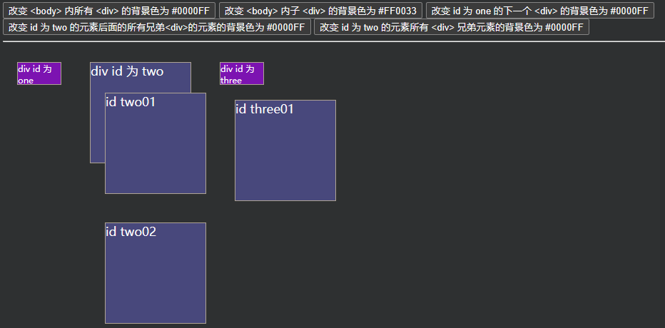

|                       | 用法                   | 说明                                                                                  |
|-----------------------|----------------------|-------------------------------------------------------------------------------------|
| `ancestor descendant` | `$("form input")`    | 在给定的祖元素下匹配所有后代元素                                                                    |
| `parent > child`      | `$("form > input")`  | 在给定的父元素下匹配所有子元素                                                                     |
| `prev + next`         | `$("label + input")` | 匹配所有紧接着prev元素后的next元素                                                               |
| `prev ~ silings`      | `$("form ~ input")`  | 匹配prev元素之后的所有siblings元素</br>说明：是匹配之后的元素，不包含该元素在内，并且siblings匹配的是和prev同辈的元素，其后背元素不被匹配 |

```html
<!DOCTYPE html>
<html lang="en">
<head>
    <meta charset="UTF-8">
    <title>层次选择器</title>
    <style type="text/css">
        div, span {
            width: 140px;
            height: 140px;
            margin: 20px;
            background: #9999CC;
            border: #000 1px solid;
            float: left;
            font-size: 17px;
            font-family: Roman;
        }
        div.mini {
            width: 60px;
            height: 30px;
            background: #CC66FF;
            border: #000 1px solid;
            font-size: 12px;
            font-family: Roman;
        }
    </style>
    <script type="text/javascript" src="./script/jquery-3.6.0.min.js"></script>
    <script type="text/javascript">
        $(function () {
            // 1. 改变 <body> 内所有 <div> 的背景色为 #0000FF
            $("#b1").click(function () {
                $("div").css("background", "#0000FF");
            });

            // 2. 改变 <body> 内子 <div>[第一层div] 的背景色为 #FF0033
            $("#b2").click(function () {
                $("body > div").css("background", "#FF0033");

                // 此时仅 body的div标签下的div会改变
                // $("body > div > div").css("background", "#FF0033");
            });

            // 3. 改变 id 为 one 的下一个 <div> 的背景色为 #0000FF
            $("#b3").click(function () {    // 即 <div id="two">
                $("#one + div").css("background", "#0000FF");
            });

            // 4. 改变 id 为 two 的元素后面的所有兄弟<div>的元素的背景色为 #0000FF
            $("#b4").click(function () {
                $("#two ~ div").css("background", "#0000FF");
            });

            // 5.改变 id 为 two 的元素所有 <div> 兄弟元素的背景色为 #0000FF
            $("#b5").click(function () {
                $("#two").siblings("div").css("background", "#0000FF");
            });
        })
    </script>
</head>
<body>
<input type="button" value="改变 <body> 内所有 <div> 的背景色为 #0000FF" id="b1"/>
<input type="button" value="改变 <body> 内子 <div> 的背景色为 #FF0033" id="b2"/>
<input type="button" value="改变 id 为 one 的下一个 <div> 的背景色为 #0000FF" id="b3"/>
<input type="button" value="改变 id 为 two 的元素后面的所有兄弟<div>的元素的背景色为 #0000FF" id="b4"/>
<input type="button" value="改变 id 为 two 的元素所有 <div> 兄弟元素的背景色为 #0000FF" id="b5"/>
<hr/>
<div id="one" class="mini">
    div id 为 one
</div>
<div id="two">
    div id 为 two
    <div id="two01">
        id two01
    </div>
    <div id="two02">
        id two02
    </div>
</div>

<div id="three" class="mini">
    div id 为 three
    <div id="three01">
        id three01
    </div>
</div>
</body>
</html>
```

### 基础过滤选择器

| 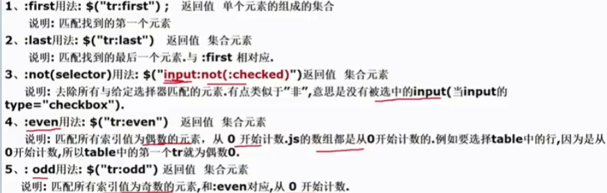 | 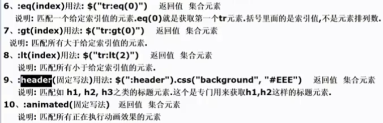 |
|----------------------|----------------------|

- 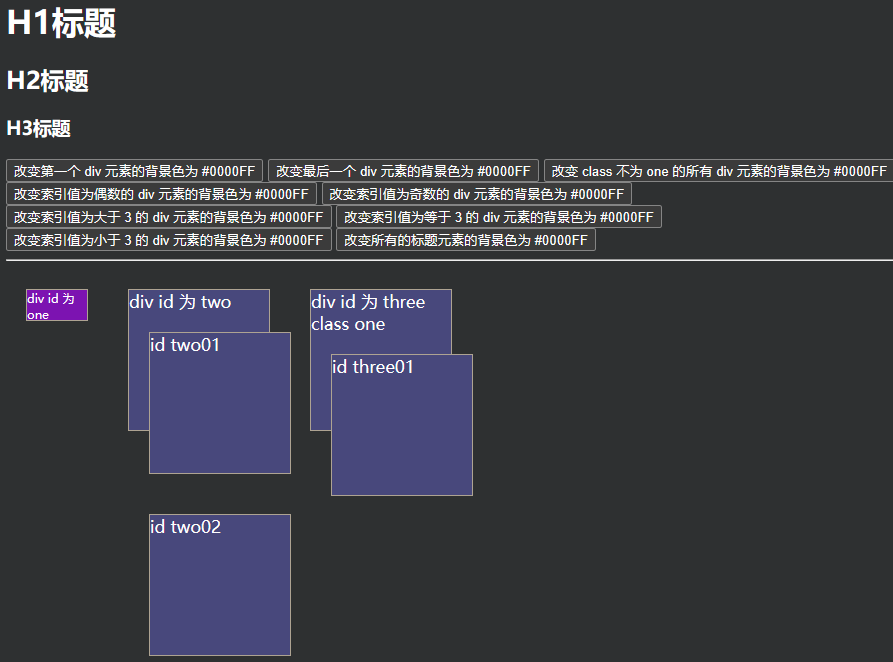
```html
<!DOCTYPE html>
<html lang="en">
<head>
    <meta charset="UTF-8">
    <title>基础过滤器实例</title>
    <style type="text/css">
        div, span {
            width: 140px;
            height: 140px;
            margin: 20px;
            background: #9999CC;
            border: #000 1px solid;
            float: left;
            font-size: 17px;
            font-family: Roman;
        }
        div.mini {
            width: 60px;
            height: 30px;
            background: #CC66FF;
            border: #000 1px solid;
            font-size: 12px;
            font-family: Roman;
        }
    </style>
    <script type="text/javascript" src="./script/jquery-3.6.0.min.js"></script>
    <script type="text/javascript">
        $(function (){
            // 1. 改变第一个 div 元素的背景色为 #0000FF
            $("#b1").click(function () {
                // $("div:first").css("background", "#0000FF");
                $("div:eq(0)").css("background", "#0000CA");    // 效果同上
            });

            // 2. 改变最后一个 div 元素的背景色为 #0000FF
            $("#b2").click(function () {
                $("div:last").css("background", "#0000FF");
            });

            // 3. 改变 class 不为 one 的所有 div 元素的背景色为 #0000FF
            $("#b3").click(function () {
                $("div:not(.one)").css("background", "#0000FF");
            });

            // 4. 改变索引值为偶数的 div 元素的背景色为 #0000FF
            $("#b4").click(function () {
                $("div:even").css("background", "#0000FF");
            });

            // 5. 改变索引值为奇数的 div 元素的背景色为 #0000FF
            $("#b5").click(function () {
                $("div:odd").css("background", "#0000FF");
            });

            // 6.改变索引值为大于 3 的 div 元素的背景色为 #0000FF
            $("#b6").click(function () {
                $("div:gt(3)").css("background", "#0000FF");
            });

            // 7. 改变索引值为等于 3 的 div 元素的背景色为 #0000FF
            $("#b7").click(function () {
                $("div:eq(3)").css("background", "#0000FF");
            });

            // 8. 改变索引值为小于 3 的 div 元素的背景色为 #0000FF
            $("#b8").click(function () {
                $("div:lt(3)").css("background", "#0000FF");
            });

            // 9. 改变所有的标题元素的背景色为 #0000FF
            $("#b9").click(function () {
                $(":header").css("background", "#0000FF");
            });
        })
    </script>
</head>
<body>
<h1>H1标题</h1>
<h2>H2标题</h2>
<h3>H3标题</h3>
<input type="button" value="改变第一个 div 元素的背景色为 #0000FF" id="b1"/>
<input type="button" value="改变最后一个 div 元素的背景色为 #0000FF" id="b2"/>
<input type="button" value="改变 class 不为 one 的所有 div 元素的背景色为 #0000FF" id="b3"/>
<input type="button" value="改变索引值为偶数的 div 元素的背景色为 #0000FF" id="b4"/>
<input type="button" value="改变索引值为奇数的 div 元素的背景色为 #0000FF" id="b5"/>
<input type="button" value="改变索引值为大于 3 的 div 元素的背景色为 #0000FF" id="b6"/>
<input type="button" value="改变索引值为等于 3 的 div 元素的背景色为 #0000FF" id="b7"/>
<input type="button" value="改变索引值为小于 3 的 div 元素的背景色为 #0000FF" id="b8"/>
<input type="button" value="改变所有的标题元素的背景色为 #0000FF" id="b9"/>
<hr/>
<div id="one" class="mini">
    div id 为 one
</div>
<div id="two">
    div id 为 two
    <div id="two01">
        id two01
    </div>
    <div id="two02">
        id two02
    </div>
</div>
<div id="three" class="one">
    div id 为 three class one
    <div id="three01">
        id three01
    </div>
</div>
</body>
</html>
```

### 可见度过滤选择器

- 根据元素的可见和不可见状态来选择相应的元素
- `each()`方法，取数组值
- 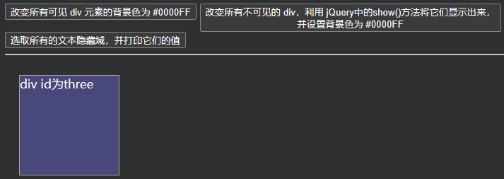

| `:hidden`  | `$("tr:hidden")`  | 匹配所有不可见元素，input元素的type属性为hidden；</br>或者css中`display:none` |
|------------|-------------------|-----------------------------------------------------------|
| `:visible` | `$("tr:visible")` | 匹配所有可见元素                                                  |

```html
<!DOCTYPE html>
<html lang="en">
<head>
  <meta charset="UTF-8">
  <title>可见度过滤器实例</title>
  <style type="text/css">
    div, span {
      width: 140px;
      height: 140px;
      margin: 20px;
      background: #9999CC;
      border: #000 1px solid;
      float: left;
      font-size: 17px;
      font-family: Roman;
    }
    div.mini {
      width: 60px;
      height: 30px;
      background: #CC66FF;
      border: #000 1px solid;
      font-size: 12px;
      font-family: Roman;
    }
    div.visible {
      display: none;
    }
  </style>
  <script type="text/javascript" src="./script/jquery-3.6.0.min.js"></script>
  <script type="text/javascript">
    $(function (){
      // 1. 改变所有可见 div 元素的背景色为 #0000FF
      $("#b1").click(function () {
        $("div:visible").css("background", "#0000FF");
      });

      // 2. 改变所有不可见的 div，利用 jQuery中的show()方法将它们显示出来，并设置背景色为 #0000FF
      $("#b2").click(function () {
        $("div:hidden").css("background", "#0000FF");
        $("div:hidden").show();
      });

      // 3. 选取所有的文本隐藏域，并打印它们的值
      $("#b3").click(function () {
        // $inputs 是 jQuery对象，而且是数组对象
        var $inputs = $("input:hidden");
        // alert($inputs); // Object
        // alert($inputs.length); // 4
        // 遍历
        // 方式1-for
        // for (var i = 0; i < $inputs.length; ++i) {
        //   console.log($inputs[i].value);
        // }
        // 方式2- jQuery each() 可以对数组遍历
        // each()方法遍历时，会将 $inputs 数组的元素取出，传给 function(){} -> this
        $inputs.each(function () {
          // this对象是dom对象
          // alert(this.value);
          // 也可以将 this -> jQuery对象 使用jQuery方法取值
          alert($(this).val());
        })
      });
    })
  </script>
</head>
<body>
<input type="button" value="改变所有可见 div 元素的背景色为 #0000FF" id="b1"/>
<input type="button" value="改变所有不可见的 div，利用 jQuery中的show()方法将它们显示出来，
并设置背景色为 #0000FF" id="b2"/>
<input type="button" value="选取所有的文本隐藏域，并打印它们的值" id="b3"/>
<hr/>
<input type="hidden" value="hidden1"/>
<input type="hidden" value="hidden2"/>
<input type="hidden" value="hidden3"/>
<input type="hidden" value="hidden4"/>
<div id="one" class="visible">
  div id为one
</div>
<div id="two" class="visible">
  div id为two
</div>
<div id="three" class="one">
  div id为three
</div>
</body>
</html>
```

### 属性过滤器

- 通过元素属性来获取相应的元素

| 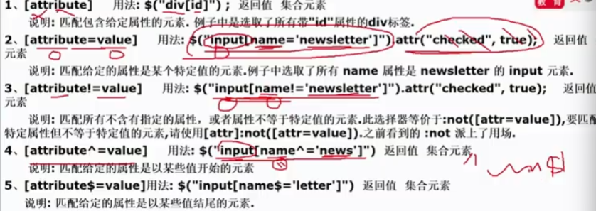 | 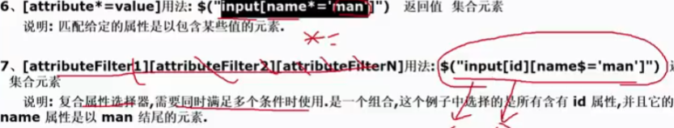  |
|-------------------------|----------------------------|

```html
<!DOCTYPE html>
<html lang="en">
<head>
    <meta charset="UTF-8">
    <title>属性过滤选择器-应用实例</title>
    <style type="text/css">
        div, span {
            width: 140px;
            height: 140px;
            margin: 20px;
            background: #9999CC;
            border: #000 1px solid;
            float: left;
            font-size: 17px;
            font-family: Roman;
        }

        div.mini {
            width: 30px;
            height: 30px;
            background: #CC66FF;
            border: #000 1px solid;
            font-size: 12px;
            font-family: Roman;
        }


        div.visible {
            display: none;
        }
    </style>
    <script type="text/javascript" src="./script/jquery-3.6.0.min.js"></script>
    <script type="text/javascript">
        $(function () {
            //*****含有属性title 的div元素.
            $("#b1").click(
                function () {
                    $("div[title]").css("background", "green");
                }
            )

            //****属性title值等于test的div元素
            $("#b2").click(
                function () {
                    $("div[title='test']").css("background", "green");
                }
            )

            //属性title值不等于test的div元素(没有属性title的也将被选中)
            $("#b3").click(
                function () {
                    $("div[title!='test']").css("background", "green");
                }
            )

            //属性title值 以te开始的div元素
            $("#b4").click(
                function () {
                    $("div[title^='te']").css("background", "green");
                }
            )

            //属性title值 以est结束的div元素
            $("#b5").click(
                function () {
                    $("div[title$='est']").css("background", "green");
                }
            )

            //属性title值含有es的div元素
            $("#b6").click(
                function () {
                    $("div[title*='es']").css("background", "green");
                }
            )

            //选取有属性id的div元素，然后在结果中选取属性title值含有“es”的 div 元素
            $("#b7").click(
                function () {
                    $("div[id][title*='es']").css("background", "green");
                }
            )

        });
    </script>
</head>
<body>
<input type="button" value="含有属性title 的div元素." id="b1"/><br/><br/>
<input type="button" value="属性title值等于test的div元素" id="b2"/><br/><br/>
<input type="button" value="属性title值不等于test的div元素(没有属性title的也将被选中)" id="b3"/><br/><br/>
<input type="button" value="属性title值 以te开始 的div元素" id="b4"/><br/><br/>
<input type="button" value="属性title值 以est结束 的div元素" id="b5"/><br/><br/>
<input type="button" value="属性title值 含有es的div元素" id="b6"/><br/><br/>
<input type="button" value="选取有属性id的div元素，然后在结果中选取属性title值含有“es”的 div 元素" id="b7"/><br/><br/>
<div id="one" title="test">
    div id为one test
</div>

<div id="one-1" title="texxx">
    div id为one-1 texxx
</div>

<div id="one-2" title="xxxest">
    div id为one-2 xxxest
</div>

<div id="one-3" title="xxxesxxxxxt">
    div id为one-3 xxxesxxxxxt
</div>

<div id="two" title="ate">
    div id为two
</div>

<div id="three" class="one">
    div id为three
</div>
</body>
</html>
```

### 子元素过滤选择器

| 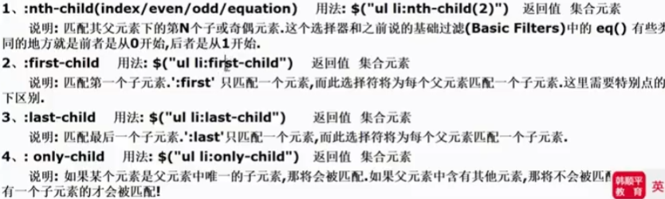 | 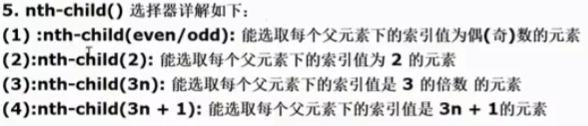 |
|--------------------------|--------------------------|

```html
<!DOCTYPE html>
<html lang="en">
<head>
    <meta charset="UTF-8">
    <title>子元素过滤选择器示例-应用实例</title>
    <style type="text/css">
        div, span {
            width: 140px;
            height: 70px;
            margin: 20px;
            background: #9999CC;
            border: #000 1px solid;
            float: left;
            font-size: 17px;
            font-family: Roman;
        }
        div.visible {
            display: none;
        }
    </style>
    <script type="text/javascript" src="./script/jquery-3.6.0.min.js"></script>
    <script type="text/javascript">
        $(function () {
            //****每个class为one的div父元素下的第2个子元素
            $("#b1").click(
                function () {
                    $("div .one:nth-child(2)").css("background", "yellow");
                }
            )

            //*****每个class为one的div父元素下的第一个子元素
            $("#b2").click(
                function () {
                    $("div .one:first-child").css("background", "green");
                    //$("div .one:nth-child(1)").css("background", "green");
                }
            )


            //*****每个class为one的div父元素下的最后一个子元素
            $("#b3").click(
                function () {
                    $("div .one:last-child").css("background", "red");
                }
            )


            //**如果class为one的div父元素下的仅仅只有一个子元素，那么选中这个子元素
            $("#b4").click(
                function () {
                    $("div .one:only-child").css("background", "pink");
                }
            )

        });
    </script>
</head>
<body>

<input type="button" value="每个class为one的div父元素下的第2个子元素" id="b1"/><br/><br/>
<input type="button" value="每个class为one的div父元素下的第一个子元素" id="b2"/><br/><br/>
<input type="button" value="每个class为one的div父元素下的最后一个子元素" id="b3"/><br/><br/>
<input type="button" value="如果class为one的div父元素下的仅仅只有一个子元素，那么选中这个子元素" id="b4"/><br/><br/>


<div class="one">
    <span class="one">hello</span>
    <div id="one" class="one">
        XXXXXXXXX id=one
    </div>
    <div id="two" class="one">
        XXXXXXXXX id=two
    </div>
    <div id="three" class="one">
        XXXXXXXXX id=three
    </div>
    <div id="four" class="one">
        XXXXXXXXX id=four
    </div>
</div>

<div class="one">
    <div id="five" class="one">
        XXXXXXXXX id=five
    </div>
</div>
</body>
</html>
```

### 表单属性过滤选择器

- 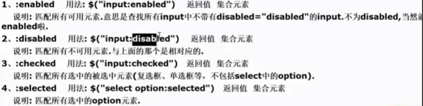

```html
<!DOCTYPE html>
<html lang="en">
<head>
    <meta charset="UTF-8">
    <title>表单对象属性过滤选择器-应用实例</title>
    <style type="text/css">
        div, span {
            width: 140px;
            height: 140px;
            margin: 20px;
            background: #9999CC;
            border: #000 1px solid;
            float: left;
            font-size: 17px;
            font-family: Roman;
        }

    </style>
    <script type="text/javascript" src="./script/jquery-3.6.0.min.js"></script>
    <script type="text/javascript">
        $(function (){
            //*利用 jQuery 对象的 val() 方法改变表单内 type=text 可用 <input> 元素的值
            $("#b1").click(
                function () {
                    //$jquery对象.val() , 如果() 是空的，就表示返回value
                    //$jquery对象.val('值') , 就表示给该对象value设置值
                    $("input[type='text']:enabled").val("台球");
                }
            )

            //利用 jQuery 对象的 val() 方法改变表单内 type=text 不可用 <input> 元素的值
            $("#b2").click(
                function () {
                    //老师解读
                    //$jquery对象.val() , 如果() 是空的，就表示返回value
                    //$jquery对象.val('值') , 就表示给该对象value设置值
                    $("input[type='text']:disabled").val("足球");
                }
            )

            //利用 jQuery 对象的 length 属性获取复选框选中的个数
            $("#b3").click(
                function () {
                    alert($("input[type='checkbox']:checked").length);
                }
            )

            //****利用 jQuery 对象的 text() 方法获取下拉框选中的内容
            $("#b4").click(
                function () {
                    //如果我们希望选择指定的select , 可以加入属性过滤选择器
                    //var $selects = $("select[属性='值'] option:selected");
                    var $selects = $("select option:selected");
                    $selects.each(function () {
                        alert("你选择了：" + $(this).text());
                    })
                }
            )
        });
    </script>
</head>
<body>
<input type="button" value="利用 jQuery 对象的 val() 方法改变表单内 type=text 可用 <input> 元素的值" id="b1"/><br/><br/>
<input type="button" value="利用 jQuery 对象的 val() 方法改变表单内 type=text 不可用 <input> 元素的值" id="b2"/><br/><br/>
<input type="button" value="利用 jQuery 对象的 length 属性获取多选框选中的个数" id="b3"/><br/><br/>
<input type="button" value="利用 jQuery 对象的 text() 方法获取下拉框选中的内容" id="b4"/><br/><br/>
<input type="text" value="篮球1"/>
<input type="text" value="篮球2"/>
<input type="text" value="篮球3" disabled="true"/>
<input type="text" value="篮球4" disabled="true"/>
<br>
<h1>选择你的爱好</h1>
<input type="checkbox" value="爱好1"/>爱好1
<input type="checkbox" value="爱好2"/>爱好2
<input type="checkbox" value="爱好3"/>爱好3
<input type="checkbox" value="爱好4"/>爱好4
<br>
<h1>选项如下:</h1>
<!--多选下拉框-->
<select name="job" size=9 multiple="multiple">
    <option value="选项1">选项1^^</option>
    <option value="选项2">选项2^^</option>
    <option value="选项3">选项3^^</option>
    <option value="选项4">选项4^^</option>
    <option value="选项5">选项5^^</option>
    <option value="选项6">选项6^^</option>
</select>
<!--单选下拉框-->
<select id="hsp" name="edu">
    <option value="博士">博士^^</option>
    <option value="硕士">硕士^^</option>
    <option value="本科">本科^^</option>
    <option value="小学">小学^^</option>
</select>
</body>
</html>
```

### 表单选择器

| 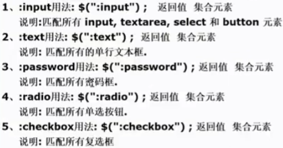 | 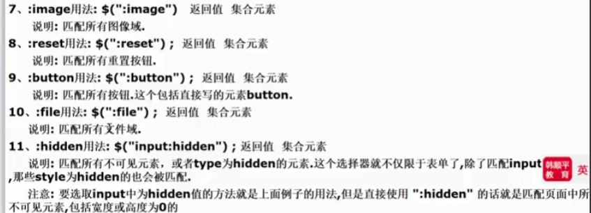 |
|-----------------------|-----------------------|

```html
<!DOCTYPE html>
<html lang="en">
<head>
    <meta charset="UTF-8">
    <title>表单选择器-应用实例</title>
    <script type="text/javascript" src="./script/jquery-3.6.0.min.js"></script>
    <script type="text/javascript">
        $(function () {
            //选择所有的button
            //这里我们就不绑定事件，直接演示
            //$(":button") 会选择<input type="button" value="按钮1"/><br/>
            //还会选择  <button>按钮2</button>
            var $button = $(":button");
            alert("$button 大小=" + $button.length)//3

            //得到type="button" 的元素
            //老韩解读 $("input[type='button']") 只会得到 <input type="button" value="按钮1"/>
            var $button2 = $("input[type='button']");
            alert("$button2 大小=" + $button2.length)//1

            //得到<button />按照元素标签取值
            //老韩解读 $("button") 只会按照元素标签获取 <button>按钮2</button>
            var $button3 = $("button");
            alert("$button3 大小=" + $button3.length)//2
        });
    </script>
</head>
<body>
<form>
    <input type="text"/><br/>
    <input type="checkbox"/><br/>
    <input type="radio"/><br/>
    <input type="image" src="../image/2.png" height="100"/><br/>
    <input type="file"/><br/>
    <input type="submit"/><br/>
    <input type="reset"/><br/>
    <input type="password"/><br/>
    <input type="button" value="按钮1"/><br/>
    <select>
        <option/>
    </select><br/>
    <textarea></textarea><br/>
    <button>按钮2</button>
    <button>按钮3</button>
    <br/>
</form>
</body>
</html>
```

### 练习

1. 为网页中所有 `<p>` 元素添加 `onclick` 事件。[homework1](homework01.html)
2. 使一个特定的表格隔行变色。[homework2](homework02.html)

## jQuery节点操作

### 创建节点

- 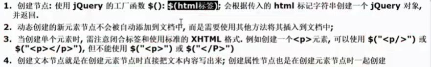
- 创建节点举例：
  - `$("<li id=\"cq\" name=\"chongqing\">重庆</li>")`

| 内部插入法                          | 外部插入法                                                                              |
|--------------------------------|------------------------------------------------------------------------------------|
| 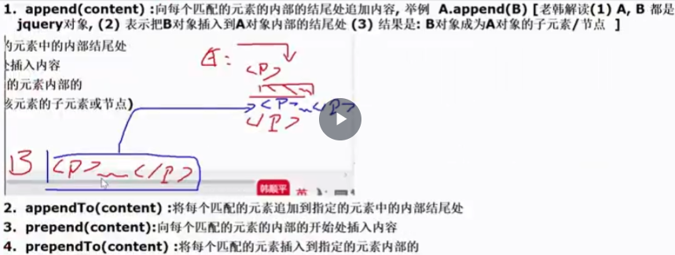           | 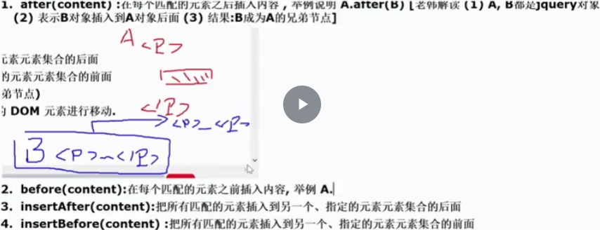                                                               |
| 内部插入法是在元素内插入内容(该内容成该元素的子元素或节点) | 外部插入法就是在元素的外面插入内容(其内容变成元素的兄弟节点)<br/>以上方法**不但能将新的DOM元素插入到文档中，也能对原有的DOM元素进行移动**      |

```html
<!DOCTYPE html>
<html lang="en">
<head>
    <meta charset="UTF-8">
    <title>创建节点-应用实例</title>
    <style type="text/css">
        div, span {
            width: 140px;
            height: 140px;
            margin: 20px;
            background: #9999CC;
            border: #000 1px solid;
            float: left;
            font-size: 17px;
            font-family: Roman;
        }

        div.mini {
            width: 30px;
            height: 30px;
            background: #CC66FF;
            border: #000 1px solid;
            font-size: 12px;
            font-family: Roman;
        }
    </style>
    <script type="text/javascript" src="../script/jquery-3.6.0.min.js"></script>
    <script type="text/javascript">

        $(function () {
            //添加重庆li到上海下(使用dom的传统方法)
            $("#b1").click(function () {
                // 1. 创建重庆li
                var cq_li = document.createElement("li");
                // 2. 设置属性和内容
                cq_li.setAttribute("id", "cq");
                cq_li.setAttribute("name", "chongqing");
                cq_li.innerText = "重庆";
                // 3. 添加到指定元素后面
                document.getElementById("sh").append(cq_li);
            })

            //*****添加重庆li到 上海下-jquery完成添加节点
            $("#b2").click(function () {
                // 1. 使用 jquery 创建节点
                var $cq_li = $("<li id=\"cq\" name=\"chongqing\">重庆</li>");
                // 2. 添加
                // 内部插入法，此时 $cq_li 是 #sh 的子元素
                // $("#sh").append($cq_li);
                // 外部插入法
                $("#sh").after($cq_li);
            })


            //*** 添加成都li到 北京前
            $("#b3").click(function () {
                //创建成都li
                var $cd_li = $("<li id=\"cd\" name=\"chengdou\">成都</li>");
                //添加到北京li前面-老韩玩一把[感受外部插入和内部插入区别]
                //$("#bj").prepend($cd_li);//内部插入，其效果如下
                // <li id="sh" name="shanghai">上海<li id="cq" name="chongqing">重庆</li></li>
                $("#bj").before($cd_li);//外部插入
            })

            //*** 添加成都li到 北京和上海之间
            $("#b4").click(function () {
                //创建成都li
                var $cd_li = $("<li id=\"cd\" name=\"chengdou\">成都~~~~</li>");
                //外部插入
                //$("#bj").after($cd_li);
                $("#sh").before($cd_li);
            })

            //*** 添加成都li到 吉林前面
            $("#b5").click(function () {
                //创建成都li
                var $cd_li = $("<li id=\"cd\" name=\"chengdou\">成都@@@###</li>");
                //外部插入
                $("#jl").before($cd_li);
                //$cd_li.insertBefore($("#jl"));
            })

        })
    </script>
</head>
<body>
<ul id="city">
    <li id="bj" name="beijing">北京</li>
    <li id="sh" name="shanghai">上海</li>
    <li id="jl" name="jilin">吉林</li>
    <li id="my" name="mianyang">绵阳</li>
</ul>

<input type="button" id="b1" value="添加重庆li到 上海下(使用dom的传统方法)"/><br/><br/>
<input type="button" id="b2" value="添加重庆li到 上海下"/><br/><br/>
<input type="button" id="b3" value="添加成都li到 北京前"/><br/><br/>
<input type="button" id="b4" value="添加成都li到 北京和上海之间"/><br/><br/>
<input type="button" id="b5" value="添加成都li到 吉林前面"/><br/>

</body>
</html>
```

### 删除节点

1. `remove()`：从DOM中删除所有匹配的元素，传入的参数用于根据jQuery表达式来筛选元素。
    当某个节点用该方法删除后，该节点所包含的所有后代节点将被同时删除，这个方法的返回值是一个指向已被删除的节点的引用。
2. `empty()`：清空节点-清空元素中的所有的后代节点(不包含属性节点)

```html
<!DOCTYPE html>
<html lang="en">
<head>
    <meta charset="UTF-8">
    <title>删除节点-应用实例</title>
    <script type="text/javascript" src="../script/jquery-3.6.0.min.js"></script>
    <script type="text/javascript">
        $(function () {
            // 删除所有p
            $("#b1").click(function () {
                $("p").remove();
            })
            // 清空p
            $("#b2").click(function () {
                $("p").empty();
            })
            // 删除上海这个 li
            $("#b3").click(function () {
                $("#sh").remove();
            })
        })
    </script>
</head>
<body>
您喜欢的城市:<br>
<ul id="city">
    <li id="bj" name="beijing">北京</li>
    <li id="sh" name="shanghai">上海</li>
    <li id="tj" name="tianjin">天津</li>
</ul>

您爱好的游戏:<br>
<ul id="game">
    <li id="fk" name="fakong">反恐</li>
    <li id="cq" name="chuangqi">传奇</li>
</ul>

<p>Hello</p> how are <p>you?</p>


<p name="test">Hello, <span>Person</span> <a href="#">and person</a></p>

<input type="button" value="删除所有p" id="b1"/>
<input type="button" value="所有p清空" id="b2"/>
<input type="button" value="删除上海这个li" id="b3"/>
</body>
</html>
```

### 复制节点

1. `clone()`：克隆匹配的DOM元素，返回值为克隆的符本，但此时复制的新节点不具有任何行为
2. `clone(true)`：复制元素的同时也复制元素中的事件

```html
<!DOCTYPE html>
<html lang="en">
<head>
    <meta charset="UTF-8">
    <title>复制节点-应用实例</title>
    <script type="text/javascript" src="../script/jquery-3.6.0.min.js"></script>
    <script>
        $(function () {
            // 点击p显示文本内容
            $("p").click(function () {
                alert($(this).text());
            })

            // 克隆p，插入后按钮后面
            // 1. $("p").clone() 表示克隆p元素，但是没有事件
            // $("p").clone().insertAfter($("button"));
            // 2. $("p").clone(true) 表示克隆p元素，同时属性、绑定的事件都会被克隆
            $("p").clone(true).insertAfter($("button"));
        })
    </script>
</head>
<body>
<button>保存</button>
<br><br><br><br><br>
///////////////////////////////////////////////<br>
<p>段落1</p>
<p>段落2</p>
<p>段落3</p>
<p>段落4</p>
<p>段落5</p>
</body>
</html>
```

### 替换节点

1. `replaceWith()`：将所有匹配的元素都替换为指定的**HTML或DOM/jQuery对象**
   - `A.replaceWirh(B)` 用B替换A
2. `replaceAll`：A替换B
3. 若在替换之前，已经在元素上绑定了事件，替换后原先绑定的事件会与原先的元素一起消失

```html
<!DOCTYPE html>
<html lang="en">
<head>
    <meta charset="UTF-8">
    <title>替换节点-应用实例</title>
    <script type="text/javascript" src="../script/jquery-3.6.0.min.js"></script>
    <script type="text/javascript">
        $(function () {
            // 1. 将p替换成button
            // $("p").replaceWith("<input type='button' id='my' value='我的按钮'/>");

            // 2. 将p替换成超链接
            // $("p").replaceWith("<a href='http://www.baidu.com'>百度</a><br/>");

            // 3. 使用对象来进行替换
            var $button = $("<input type='button' id='my' value='我的按钮'/>");
            $("p").replaceWith($button);
        });
    </script>
</head>
<body>
<h1>节点替换</h1>
<p>Hello</p>
<p>jquery</p>
<p>World</p>
</body>
</html>
```

### 属性操作

- `attr()`：传入一个参数，则获取该参数值；传入两个参数，则设置该参数为指定值
- `html()`：不传入参数则，获取元素内嵌入的html内容；传入参数则设置html内容为指定内容
- 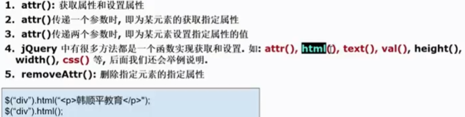

### 样式操作

1. 获取 `class` 和设置 `class`：class是元素的一个属性，所以获取class和设置都可以使用 `attr()` 方法来完成
2. 追加样式 `addClass()`
3. 移除样式：`removeClass()`--从匹配的元素中删除全部或指定的class
4. 切换样式：`toggleClass()`--控制样式上的重复切换。如果类名存在则删除它，如果类名不存在则添加它
5. 判断时候含有某个样式：`hasClass()`--判断元素中是否含有某个class，如果有，则返回true，否则返回false

```html
<!DOCTYPE html>
<html lang="en">
<head>
    <meta charset="UTF-8">
    <title>查找节点</title>
    <style type="text/css">
        div {
            width: 140px;
            height: 140px;
            margin: 20px;
            float: left;
            border: #000 1px solid;
        }

        .one {
            width: 140px;
            height: 140px;
            margin: 20px;
            background: #9999CC;
            border: #000 1px solid;
            float: left;
            font-size: 17px;
            font-family: Roman;
        }
    </style>
    <script type="text/javascript" src="../script/jquery-3.6.0.min.js"></script>
    <script type="text/javascript">
        $(function () {
            //获取 class 和设置 class 都可以使用 attr() 方法来完成.(给id 为first添加 .one 样式)
            $("#b1").click(function (){
                $("#first").attr("class", "one");
            })
            //追加样式: addClass()
            $("#b2").click(function (){
                $("#first").addClass("one");
            })

            //移除样式: removeClass() --- 从匹配的元素中删除全部或指定的 class
            $("#b3").click(function (){
                // 一个元素可以有多个 class
                $("#first").removeClass("one");
            })

            //切换样式: toggleClass()
            // 控制样式上的重复切换.如果类名存在则删除它, 如果类名不存在则添加它
            $("#b4").click(function (){
                $("#first").toggleClass("one");
            })

            //判断是否含有某个样式: hasClass() --- 判断元素中是否含有某个 class, 如果有, 则返回 true; 否则返回 false
            $("#b5").click(function (){
                alert($("#first").hasClass("one"))
            })
        });
    </script>
</head>
<body>
<input type="button" value="获取 class 和设置 class 都可以使用 attr() 方法来完成(给id 为first添加 .one 样式)" id="b1"/><br/><br/>
<input type="button" value="追加样式: addClass() (给id 为first添加 .one 样式)" id="b2"/><br/><br/>
<input type="button" value="移除样式: removeClass() --- 从匹配的元素中删除全部或指定的 class(给id 为first删除 .one 样式) " id="b3"/><br/><br/>
<input type="button"
       value="切换样式: toggleClass() (给id 为first切换 .one 样式) --- 控制样式上的重复切换.如果类名存在则删除它, 如果类名不存在则添加它"
       id="b4"/><br/><br/>
<input type="button"
       value="判断是否含有某个样式: hasClass() --- 判断元素中是否含有某个 class, 如果有, 则返回 true; 否则返回 false"
       id="b5"/><br/><br/>
<div id="first">first</div>
<div id="second">second</div>
</body>
</html>
```

### 获取html文本和值

- 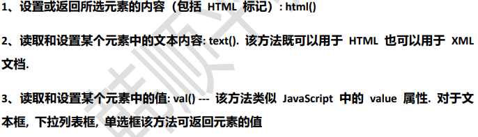

```html
<!DOCTYPE html>
<html lang="en">
<head>
    <meta charset="UTF-8">
    <title>val()课堂练习</title>
    <script type="text/javascript" src="../script/jquery-3.6.0.min.js"></script>
    <script type="text/javascript">
        $(function () {

            // 用户邮箱/手机号/用户名
            // alert(document.getElementById("b1").defaultValue);

            // 1. 给 b1 绑定一个获取焦点事件
            // 2. 当用户把光标定位到输入框 b1，该事件就会被触发
            $("#b1").focus(function () {
                // 获取-判断
                var curVal = $(this).val();
                // defaultValue 是文本框属性 value 的值
                // 如果档期那之就是默认值，就清空，让用户输入自己的值
                if (curVal === this.defaultValue) {
                    $(this).val("");    // 有参数，即表示赋新值
                }
            })

            // 1. 给b1绑定一个失去焦点事件 blur
            // 2. 当用户的光标离开这个输入框，就会触发
            $("#b1").blur(function () {
                // 获取当前值
                var curVal = $(this).val();
                // 如果判断当前值为 ""，即光标聚焦后的值，表示用户没有输入内容
                // 就恢复提示默认信息
                if (curVal === "") {
                    // this.defaultValue 不会因为设置value值而改变的
                    $(this).val(this.defaultValue);
                }
            })
        })
    </script>
</head>
<body>
<input type="text" value="用户邮箱/手机号/用户名" id="b1"/><br>
<input type="password" value="" id="b2"/><br>
<input type="button" value="登陆" id="b3"/>
</body>
</html>
```

### 常用遍历节点方法

- 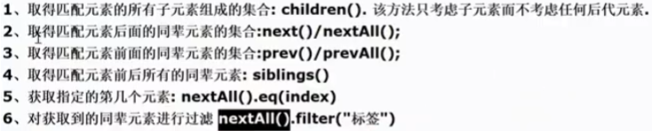
- 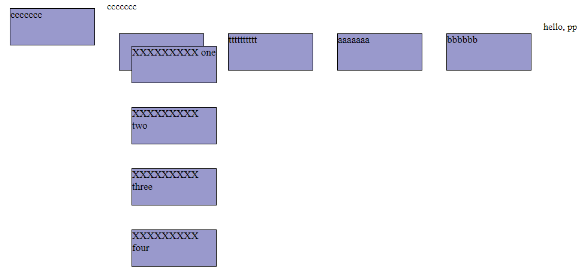

```html
<!DOCTYPE html>
<html lang="en">
<head>
    <meta charset="UTF-8">
    <title>常用遍历节点方法-应用实例</title>
    <style type="text/css">
        div, span {
            width: 140px;
            height: 60px;
            margin: 20px;
            background: #9999CC;
            border: #000 1px solid;
            float: left;
            font-size: 17px;
            font-family: Roman;
        }

    </style>
    <script type="text/javascript" src="../script/jquery-3.6.0.min.js"></script>
    <script type="text/javascript">
        $(function () {

            //**查找所有子元素（class 为 one 的div的子元素)
            $("#b1").click(function () {

                // 通过 $("div[class='one']") 来选择class 为 one 的div
                $("div[class='one']").children().each(function () {
                    alert("子div的内容是~~~ " + $(this).text());
                })

                // class为one的div 的子元素
                // $("div.one").children().each(function (){
                //     alert("子div的内容是= " + $(this).text());
                // })

                //指定获取到第几个子元素, eq(1) 表示得到第2个子元素
                // alert($("div.one").children().eq(1).text());
            })

            //***获取后面的同辈div元素（class 为 one 的div的)
            $("#b2").click(function () {
                //老师解读
                //1. $("div.one") 选择到 class = one 的 div
                //2. nextAll() 获取到后面所有的同辈元素
                //3. filter("div"), 获取到后面所有的同辈元素, 进行过滤，只得到div
                //4. each 遍历
                $("div.one").nextAll().filter("div").each(function () {
                    alert("后面同辈div的内容是= " + $(this).text());
                })

                //如果我们希望得到后面同辈元素的第几个，可以eq
                //获取到后面同辈div元素的第2个
                alert("后面同辈div元素的第2个的内容=" +
                    $("div.one").nextAll().filter("div").eq(1).text());//aaaa..

                //如果我们希望得到的是紧邻的面同辈元素
                alert("紧邻的面同辈元素=" +
                    $("div.one").next().text());//ttt...
            })

            //**获取前面的同辈div元素（class 为 one 的div的)
            $("#b3").click(function () {
                //遍历
                // $("div.one").prevAll().filter("div").each(function (){
                //     alert("div的内容= " + $(this).text());
                // })

                //得到前面的同辈元素第4个
                //$("div.one").prevAll().eq(3);
                //得到前面的紧邻同辈元素
                alert($("div.one").prev().text())//ccccc
            })
            //**获取所有的同辈div元素（class 为 one 的div的)
            $("#b4").click(function () {
                $("div.one").siblings().filter("div").each(function () {
                    alert("同辈div text= " + $(this).text())
                })
            })

        })
    </script>
</head>
<body>
<input type="button" value="查找所有子元素 (class 为 one 的div的)" id="b1"/><br/><br/>
<input type="button" value="获取后面的同辈元素 (class 为 one 的div的)" id="b2"/><br/><br/>
<input type="button" value="获取前面的同辈元素 (class 为 one 的div的)" id="b3"/><br/><br/>
<input type="button" value="获取所有的同辈元素 (class 为 one 的div的)" id="b4"/>
<hr/>
<div>
    ccccccc
</div>

<p class="one">
    ccccccc
</p>

<div class="one">
    <div id="one">
        XXXXXXXXX one
    </div>

    <div id="two">
        XXXXXXXXX two
    </div>

    <div id="three">
        XXXXXXXXX three
    </div>

    <div id="four">
        XXXXXXXXX four
    </div>
</div>
<div>
    tttttttttt
</div>
<div>
    aaaaaaa
</div>
<div>bbbbbb</div>
<p>hello, pp</p>
</body>
</html>
```

### CSS-DOM操作

| 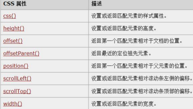 | 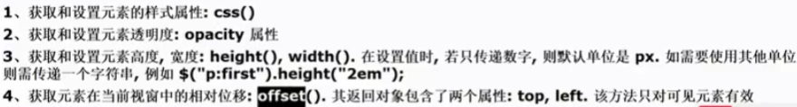 |
|-----------------------|-----------------------|

```html
<!DOCTYPE html>
<html lang="en">
<head>
    <meta charset="UTF-8">
    <title>css-dom操作</title>
    <script type="text/javascript" src="../script/jquery-3.6.0.min.js"></script>
    <script type="text/javascript">
        $(function (){
            $("#b1").click(function (){
                var width = $("img").width();
                alert("width= " + width);
                // offset (left, top) 表示图片左上角距离坐标原点的横向/纵向距离
                var offset = $("img").offset();
                alert("top= " + offset.top);
                alert("left= " + offset.left);
            })
        })
    </script>
</head>
<body>
<br/><br/><br/>
hello,world~
<button id="b1" type="button">获取图片信息</button>
</body>
</html>

```

## 多选框应用

- 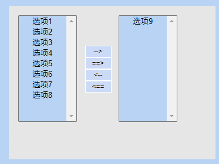

```html
<!DOCTYPE html>
<html lang="en">
<head>
    <meta charset="UTF-8">
    <title>多选框应用</title>
    <style type="text/css">

        BODY {
            font-size: 12px;
            margin: 0px 0px 0px 0px;
            overflow-x: auto;
            overflow-y: auto;
            background-color: #B8D3F4;
        }

        .default_input {
            border: 1px solid #666666;
            height: 18px;
            font-size: 12px;
        }

        .default_input2 {
            border: 1px solid #666666;
            height: 18px;
            font-size: 12px;
        }

        .nowrite_input {
            border: 1px solid #849EB5;
            height: 18px;
            font-size: 12px;
            background-color: #EBEAE7;
            color: #9E9A9E;
        }

        .default_list {
            font-size: 12px;
            border: 1px solid #849EB5;
        }

        .default_textarea {
            font-size: 12px;
            border: 1px solid #849EB5;
        }

        .nowrite_textarea {
            border: 1px solid #849EB5;
            font-size: 12px;
            background-color: #EBEAE7;
            color: #9E9A9E;
        }

        .wordtd5 {
            font-size: 12px;
            text-align: center;
            vertical-align: top;
            padding-top: 6px;
            padding-right: 5px;
            padding-bottom: 3px;
            padding-left: 5px;
            background-color: #b8c4f4;
        }

        .wordtd {
            font-size: 12px;
            text-align: left;
            vertical-align: top;
            padding-top: 6px;
            padding-right: 5px;
            padding-bottom: 3px;
            padding-left: 5px;
            background-color: #b8c4f4;
        }

        .wordtd_1 {
            font-size: 12px;
            vertical-align: top;
            padding-top: 6px;
            padding-right: 5px;
            padding-bottom: 3px;
            padding-left: 5px;
            background-color: #516CD6;
            color: #fff;
        }

        .wordtd_2 {
            font-size: 12px;
            text-align: right;
            vertical-align: top;
            padding-top: 6px;
            padding-right: 5px;
            padding-bottom: 3px;
            padding-left: 5px;
            background-color: #64BDF9;
        }

        .wordtd_3 {
            font-size: 12px;
            text-align: right;
            vertical-align: top;
            padding-top: 6px;
            padding-right: 5px;
            padding-bottom: 3px;
            padding-left: 5px;
            background-color: #F1DD34;
        }

        .inputtd {
            font-size: 12px;
            vertical-align: top;
            padding-top: 3px;
            padding-right: 3px;
            padding-bottom: 3px;
            padding-left: 3px;
        }

        .inputtd2 {
            text-align: center;
            font-size: 12px;
            vertical-align: top;
            padding-top: 3px;
            padding-right: 3px;
            padding-bottom: 3px;
            padding-left: 3px;
        }

        .tablebg {
            font-size: 12px;
        }

        .tb {
            border-collapse: collapse;
            border: 1px outset #999999;
            background-color: #FFFFFF;
        }

        .td2 {
            line-height: 22px;
            text-align: center;
            background-color: #F6F6F6;
        }

        .td3 {
            background-color: #B8D3F4;
            text-align: center;
            line-height: 20px;
            width: 100px;
        }

        .td4 {
            background-color: #F6F6F6;
            line-height: 20px;
        }

        .td5 {
            border: #000000 solid;
            border-right-width: 0px;
            border-left-width: 0px;
            border-top-width: 0px;
            border-bottom-width: 1px;
        }

        .tb td {
            font-size: 12px;
            border: 2px groove #ffffff;
        }


        .noborder {
            border: none;
        }

        .button {
            border: 1px ridge #ffffff;
            line-height: 18px;
            height: 20px;
            width: 45px;
            padding-top: 0px;
            background: #CBDAF7;
            color: #000000;
            font-size: 9pt;
        }

        .textarea {
            font-family: Arial, Helvetica, sans-serif, "??";
            font-size: 9pt;
            color: #000000;
            border-bottom-width: 1px;
            border-top-style: none;
            border-right-style: none;
            border-bottom-style: solid;
            border-left-style: none;
            border-bottom-color: #000000;
            background-color: transparent;
            text-align: left
        }
    </style>
    <script type="text/javascript" src="../script/jquery-3.6.0.min.js"></script>
    <script type="text/javascript">
        $(function () {
            // 全部移动到右边
            /*
            1. 绑定事件
            2. 选择对应的对象
            3. 插入[内部插入/外部插入]
             */
            $("#add_all").click(function () {
                // alert("add_all");
                // 层级选择器，#first 选择框 下的 option 选项
                // 层级选择器中的 > 可以省略
                $("#first > option").appendTo($("#second"));
            })

            // 选中的移动到右边
            $("#add").click(function () {
                // alert("add");
                $("#first > option:selected").appendTo($("#second"));
            })

            // 双击移动到右边
            $("#first").dblclick(function () {
                // alert("dblclick");
                // 先择对象 -> 隐式传入 this(dom) -> $(this) jQuery对象
                $("#first > option:selected").appendTo($("#second"));
            })

            // 全部移动到左边
            $("#remove_all").click(function () {
                // alert("remove_all");
                $("#second option").appendTo($("#first"));
            })

            // 选中的移动到左边
            $("#remove").click(function () {
                // alert("remove");
                $("#second option:selected").appendTo($("#first"));
            })

            // 双击移动到左边
            // 给second多选框添加双击事件，将选中的选项移动到左边
            $("#second").dblclick(function () {
                $("#second > option:selected").appendTo($("#first"));
            })
        })
    </script>
</head>
<body>
<div style="border:1px dashed #E6E6E6;margin:50px 0px 0px 50px; width:350px; height:260px; background-color:#E6E6E6;">
    <table width="285" height="169" border="0" align="left" cellpadding="0" cellspacing="0"
           style="margin:15px 0px 0px 15px;">
        <tr>
            <td width="126">
                <!--multiple="multiple" 能同时选择多个   size="10"  确定下拉选的长度-->
                <select name="first" size="10" multiple="multiple" class="td3" id="first">
                    <option value="选项1">选项1</option>
                    <option value="选项2">选项2</option>
                    <option value="选项3">选项3</option>
                    <option value="选项4">选项4</option>
                    <option value="选项5">选项5</option>
                    <option value="选项6">选项6</option>
                    <option value="选项7">选项7</option>
                    <option value="选项8">选项8</option>
                </select>
            </td>
            <td width="69" valign="middle">
                <input name="add" id="add" type="button" class="button" value="-->"/>
                <input name="add_all" id="add_all" type="button" class="button" value="==>"/>
                <input name="remove" id="remove" type="button" class="button" value="&lt;--"/>
                <input name="remove_all" id="remove_all" type="button" class="button" value="&lt;=="/>
            </td>
            <td width="127" align="left">
                <select name="second" size="10" multiple="multiple" class="td3" id="second">
                    <option value="选项9">选项9</option>
                </select>
            </td>
        </tr>
    </table>
</div>
</body>
</html>
```

## 加载DOM

关于页面加载完毕后触发方法的几种写法
1. js原生方法
   - `document.onload = function()`
2. jQuery方法
   - `$(document).ready(function(){})`
3. jQuery方法可以简化为
   - `$(function(){})`

## 作业练习

- `prop()`：用于获取或设置被选元素的属性值，如checked,disabled等
  - `$("#example").prop("checked", true);`
  - `var isChecked = $("#example").prop("checked");`
  - 在处理布尔属性时，使用 `prop()` 方法更为合适，因为它处理的是属性的状态

| 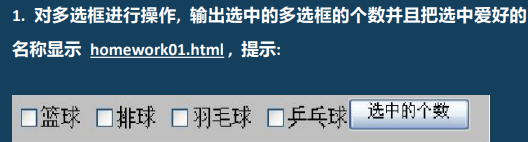      | [对多选框进行操作](homework03.html) |
|------------------------------|-----------------------------|
| 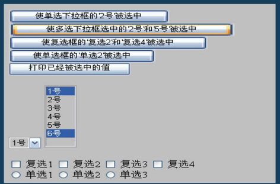      | [练习2](homework04.html)      |
| 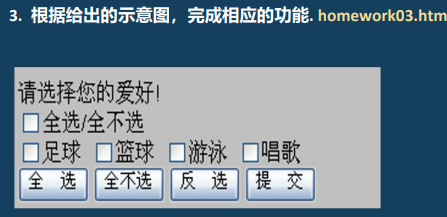      | [练习3](homework05.html)      |
| 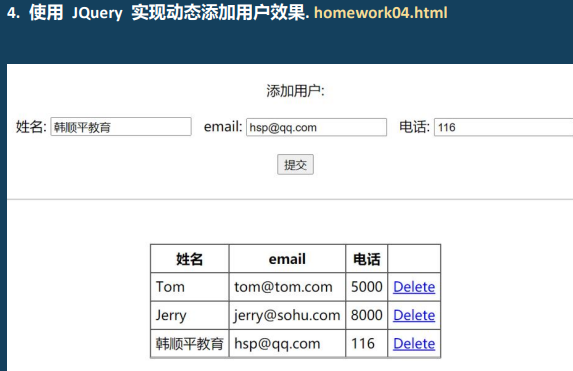      | [动态添加删除用户](homework06.html) |

```html
<!DOCTYPE html>
<html lang="en">
<head>
    <meta charset="UTF-8">
    <title>使用 JQuery 实现动态添加用户效果</title>
    <script type="text/javascript" src="../script/jquery-3.6.0.min.js"></script>
    <script type="text/javascript">

        // 点击删除超链接，完成删除某个用户的任务操作
        function deleteUser($a) {
            // 弹出一个确认的对话框
            var b = window.confirm("确认删除 " + $a.attr("id") + " 用户信息");
            if (!b) {
                return false;
            }
            // 继续处理删除操作
            /*
            1. 通过 $a 找到父 tr
             */
            $a.parent().parent().remove();
            return false;
        }

        $(function () {
            $("a").click(function () {
                // 隐式传入this
                // 调用deleteUser时候，需要对this包装为 $(this)
                return deleteUser($(this));
            });

            // 添加操作
            $("#addUser").click(function () {
                // 添加用户
                /*
                1. 使用 jquery dom 相关技术
                2. 添加的内容/对象 到 table > tbody
                <tr>
                    <td>Tom</td>
                    <td>tom@tom.com</td>
                    <td>5000</td>
                    <td><a id="Tom" href="deleteEmp?id=Tom">Delete</a></td>
                </tr>
                3. 构建 TR
                    1) nameTD 名字从输入得到
                    2) emailTD, telTD, deteleTD
                    3) 构建 TD，把前面的td 加入
                4. 将TR加入到 tbody
                 */
                var $nameTD = $("<td/>");   // $("<td></td>")
                var nameVal = $("#name").val();
                $nameTD.append(nameVal)

                var $emailTD = $("<td/>")
                var emailVal = $("#email").val();
                $emailTD.append(emailVal)

                var $telTD = $("<td/>");
                var telVal = $("#tel").val();
                $telTD.append(telVal)

                // 构建 deleteTD
                var $deleteTD = $("<td/>");
                var $a = $("<a/>");
                $a.attr("id", nameVal);
                $a.attr("href", "deleteEmp?id=" + nameVal);
                $a.html("Delete");

                // 完成点击删除的功能
                $a.click(function () {
                    // 专门写一个函数，完成删除任务
                    // 注意：如果返回的false，表示放弃提交，页面就会停留在原页面
                    return deleteUser($a);
                })

                $deleteTD.append($a);   // 超链接绑定的点击事件会被保留

                var $tr = $("<tr/>");
                $tr.append($nameTD);
                $tr.append($emailTD);
                $tr.append($telTD);
                $tr.append($deleteTD);

                // 将tr加入到 table > tdbody
                // 当且仅当所有输入内容都非空时才加入
                if (nameVal && emailVal && telVal) {
                    $("#usertable tbody").append($tr);
                }

                // $("#addUser").click(function () {
                //     var $name = $("#name");
                //     var $email = $("#email");
                //     var $tel = $("#tel");
                //     // 三者都非空时
                //     if ($name.val() && $email.val() && $tel.val()) {
                //         $("table").append("<tr><td>" + $name.val() +
                //             "</td><td>" + $email.val() + "</td><td>" + $tel.val() + "</tr></td>");
                //     }
                // })
            })
        })
    </script>
</head>
<body>
<center>
    <br><br>
    添加用户:<br><br>
    姓名: <input type="text" name="name" id="name"/>&nbsp;&nbsp;
    email: <input type="text" name="email" id="email"/>&nbsp;&nbsp;
    电话: <input type="text" name="tel" id="tel"/><br><br>
    <button id="addUser">提交</button>
    <br><br>
    <hr>
    <br><br>
    <table id="usertable" border="1" cellpadding="5" cellspacing=0>
        <tbody>
        <tr>
            <th>姓名</th>
            <th>email</th>
            <th>电话</th>
            <th>&nbsp;</th>
        </tr>
        <tr>
            <td>Tom</td>
            <td>tom@tom.com</td>
            <td>5000</td>
            <td><a id="Tom" href="deleteEmp?id=Tom">Delete</a></td>
        </tr>
        <tr>
            <td>Jerry</td>
            <td>jerry@sohu.com</td>
            <td>8000</td>
            <td><a id="Jerry" href="deleteEmp?id=Jerry">Delete</a></td>
        </tr>
        </tbody>
    </table>
</center>
</body>
</html>
```
