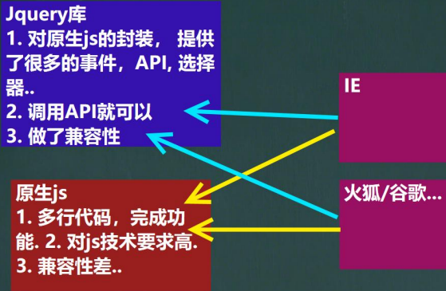
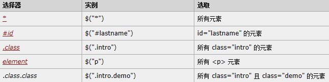
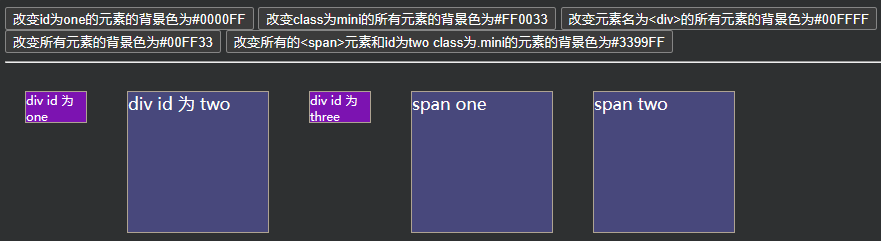
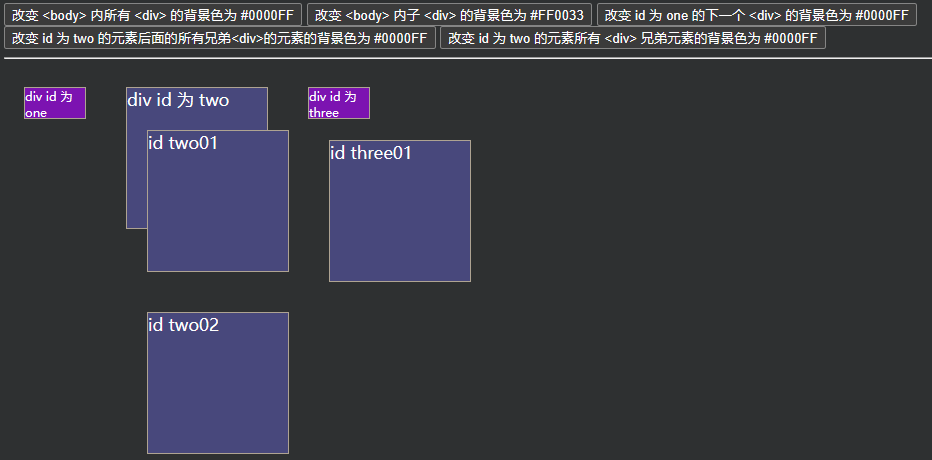
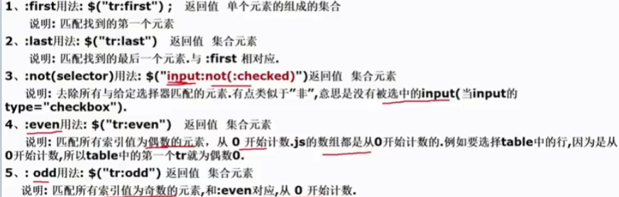
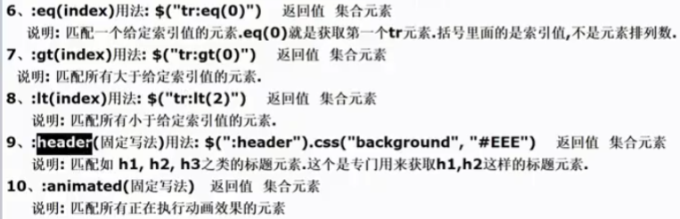
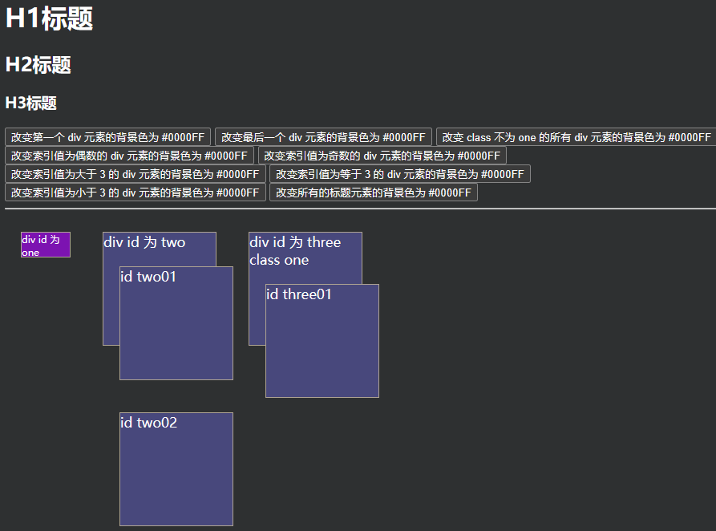

# jQuery

- [jQuery官方文档](https://www.w3school.com.cn/jquery/index.asp)
- [jQuery API](https://jquery.cuishifeng.cn/)

## jQuery基本介绍

1. `JQuery` 是一个快速的、简洁的 `JavaScript` 库，使用户能更方便地处理HTML、CSS、DOM等
2. 提供方法、events、选择器，并且方便地为网站提供 `AJAX` 交互
3. 其宗旨是 `WRITE LESS, DO MORE`
4. jQuery实现了浏览器的兼容问题
5. 

使用 `script` 引入 `jQuery` 库文件即可使用
1. 使用 `<script type="text/javascript" src="./script/jquery-3.6.0.min.js"></script>` 引入jQuery库文件
2. 即可使用jQuery相关的函数和对象

```html
<!DOCTYPE html>
<html lang="en">
<head>
    <meta charset="UTF-8">
    <title>快速入门</title>
<!--    引入 jquery-->
    <script type="text/javascript" src="./script/jquery-3.6.0.min.js"></script>
    <script type="text/javascript">
        // window.onload = function () {
        //     // 1. 得到 button 的dom对象
        //     var btn01 = document.getElementById("btn01");
        //     btn01.onclick = function () {
        //         alert("hello, jquery~");
        //     }
        // }

        // 使用 jquery
        /*
        1. 引入 jquery库
        2. $(function(){}) 等价原生的js的，当页面加载完毕就执行 function(){}
         */
        $(function (){
            // 1. 得到 btn01 这个对象的 jquery对象
            // $btn01 是一个jquery对象，其实就是对dom对象的包装，
            // 这是就可以使用jquery对象的方法、事件等
            // 通过debug 防线jquery对象是数组对象
            // 2. jquery中，获取对象的方法是 $("#id")，必须在id前有#
            // 3. 编程中，规定 jquery对象的命名以 $ 开头 (非必须，但是约定)
            var $btn01 = $("#btn01");
            // 2. 绑定事件
            $btn01.click(function (){
                alert("hello, jquery.");
            });
        });
    </script>
</head>
<body>
<!--
1. 内容处理: <input> 是一个空元素，其内容由 value 属性定义，
    而 <button> 是一个容器元素，可以包含丰富的内容。
2. 默认类型: <input> 元素的默认类型是 "text"，
    而 <button> 元素的默认类型是 "submit"（在没有明确指定的情况下）。
3. 使用场景: <input> 元素更常用于简单的按钮，而 <button> 元素更适合需要包含复杂内容的按钮。
-->
<input type="button" id="btn01" value="按钮1"/>
<!--<button id="btn01">按钮1</button>-->
</body>
</html>
```

## jQuery对象和DOM对象

### jQuery对象

1. `jQuery`对象就是对DOM对象进行包装后产生的对象
   - 比如：`$("#test").html()` 意思是指，获取ID为test的元素内的html代码，其中 `html()`是jQuery里的方法
   - 上代码等价于用DOM实现的代码：`document.getElementById("id").innerHTML;`
2. jQuery对象是jquery独有的。如果一个对象是jquery对象，那么它就可以使用jquery里的方法，如 `$("#id").html()`
3. 约定：如果获取的是jQuery对象，那么要在变量前面加上 `$`
   - `var $variable` jQuery对象
   - `var variable`  DOM对象

### DOM对象转成jQuery对象

1. 对于一个DOM对象，只需要用 `$()` 把DOM对象包装起来，就可以获得一个jQuery对象
2. DOM对象转换成JQuery对象后，就可以使用jQuery方法了

```html
<!DOCTYPE html>
<html lang="en">
<head>
    <meta charset="UTF-8">
    <title>DOM对象转成jQuery对象</title>
    <script type="text/javascript" src="./script/jquery-3.6.0.min.js"></script>
    <script type="text/javascript">
        window.onload = function () {
            // 演示通过dom对象来获取输入框的value
            // username是dom对象
            var username = document.getElementById("username");
            alert("username: " + username.value);  // 李自成
            // 通过jquery对象来获取
            // 把username dom对象转成jquery对象
            // var $username = $(username);
            // 使用jquery对象来获取value
            alert($(username).val());   // 李自成
        }
    </script>
</head>
<body>
用户名：<input id="username" name="username" value="李自成"/>
</body>
</html>
```

### jQuery对象转成DOM对象

1. 两种方式将一个jQuery对象转换成DOM对象：`[index]`和`.get(index);`
2. jquery对象是一个数组对象，封装了dom对象，可以通过[index]的方法，来得到相应的DOM对象
3. jQuery 本身提供，通过.get(index)方法，得到相应的DOM对象

```html
<!DOCTYPE html>
<html lang="en">
<head>
    <meta charset="UTF-8">
    <title>jQuery对象转成DOM对象</title>
    <script type="text/javascript" src="./script/jquery-3.6.0.min.js"></script>
    <script type="text/javascript">
        window.onload = function () {
            // 得到jquery对象
            var $username = $("#username");
            alert("$username.val(): " + $username.val());
            // 把jquery对象 -> dom对象
            /*
            1. jquery对象是一个数组对象，封装了dom对象
            2. 可以通过 [index] 或者 get(index) 来获取
            3. 一般来说 index 是0
             */
            // 方式1
            // var username = $username[0];
            // 方式2
            var username = $username.get(0);
            alert("username.value: " + username.value);
        }
    </script>
</head>
<body>
用户名：<input id="username" name="username" value="李自成"/>
</body>
</html>
```

## jQuery选择器

### jQuery选择器介绍

1. 选择器是jQuery的核心，在jQuery中，对事件处理、遍历DOM和Ajax操作都依赖于选择器
2. jQuery选择器的优点
   - 简洁的写法
      - `$("#id")` 等价于 `document.getElementById("id");`
      - `$("tagName")` 等价于 `document.getElementsByTagName("tagName");`
   - [完善的事件处理机制](jQuery-selector-notice.html)

### 基本选择器

- 基本选择器是 `jQuery` 中最常用的选择器，也是最简单的选择器，它通过元素 **id,class和标签名** 来查找DOM元素
- 

|                          | 用法                          | 返回值       | 说明                                                                                            |
|--------------------------|-----------------------------|-----------|-----------------------------------------------------------------------------------------------|
| `#id`                    | `$("#myDiv")`               | 单个元素组成的集合 | 直接选择html中的`id="myDiv"`                                                                        |
| `Element`                | `$("div")`                  | 集合元素      | element就是html已经定义的标签元素，例如div,input,a等                                                         |
| `class`                  | `$(".myClass")`             | 集合元素      | 直接选择html代码中class="myClass"的元素或元素组                                                             |
| `*`                      | `$("*")`                    | 集合元素      | 匹配所有元素，多用于结合上下文来搜索                                                                            |
| `selector1,selector2,sN` | `$("div,span,p,p.myClass")` | 集合元素      | 将每一个选择器匹配到的元素合并后一起返回，可以指定任意多个选择器，</br>将匹配到的元素合并到一个结果内。其中 `p.myClass` 表示匹配元素 p class="myClass" |

- 
```html
<!DOCTYPE html>
<html lang="en">
<head>
    <meta charset="UTF-8">
    <title>基本选择器应用实例</title>
    <style type="text/css">
        div, span {
            width: 140px;
            height: 140px;
            margin: 20px;
            background: #9999CC;
            border: #000 1px solid;
            float: left;
            font-size: 17px;
            font-family: Roman;
        }
        div.mini {
            width: 60px;
            height: 30px;
            background: #CC66FF;
            border: #000 1px solid;
            font-size: 12px;
            font-family: Roman;
        }
    </style>
    <script type="text/javascript" src="./script/jquery-3.6.0.min.js"></script>
    <script type="text/javascript">
        $(function (){
            // 1. 改变 id 为 one 的元素的背景色为 #0000FF
            $("#b1").click(function () {
                $("#one").css("background", "#0000FF");
            })
            // 2. 改变 class 为 mini 的所有元素的背景色为 #FF0033
            $("#b2").click(function () {
                $(".mini").css("background", "#FF0033");
            })

            // 3. 改变元素名为<div>的所有元素的背景色为#00FFFF
            $("#b3").click(function () {
                $("div").css("background", "#00FFFF");
            });

            // 4. 改变所有元素的背景色为#00FF33
            $("#b4").click(function () {
                $("*").css("background", "#00FF33");
            })

            // 5. 改变所有的 <span>元素 和 id为two class为.mini 的元素的背景色为#3399FF
            $("#b5").click(function () {
                $("span,#two,.mini").css("background", "#3399FF");
            })
        });
    </script>
</head>
<body>
<input type="button" value="改变id为one的元素的背景色为#0000FF" id="b1"/>
<input type="button" value="改变class为mini的所有元素的背景色为#FF0033" id="b2"/>
<input type="button" value="改变元素名为<div>的所有元素的背景色为#00FFFF" id="b3"/>
<input type="button" value="改变所有元素的背景色为#00FF33" id="b4"/>
<input type="button" value="改变所有的<span>元素和id为two class为.mini的元素的背景色为#3399FF" id="b5"/>
<hr/>
<div id="one" class="mini">div id 为 one</div>
<div id="two">div id 为 two</div>
<div id="three" class="mini">div id 为 three</div>
<span id="s_one" class="mini">span one</span>
<span id="s_two">span two</span>
</body>
</html>
```

### 层次选择器

- 如果想通过DOM元素之间的层次关系来获取特定元素, 例如后代元素,子元素,相邻元素,兄弟元素等,则需要使用层次选择器.
- 

|                       | 用法                   | 说明                                                                                  |
|-----------------------|----------------------|-------------------------------------------------------------------------------------|
| `ancestor descendant` | `$("form input")`    | 在给定的祖元素下匹配所有后代元素                                                                    |
| `parent > child`      | `$("form > input")`  | 在给定的父元素下匹配所有子元素                                                                     |
| `prev + next`         | `$("label + input")` | 匹配所有紧接着prev元素后的next元素                                                               |
| `prev ~ silings`      | `$("form ~ input")`  | 匹配prev元素之后的所有siblings元素</br>说明：是匹配之后的元素，不包含该元素在内，并且siblings匹配的是和prev同辈的元素，其后背元素不被匹配 |

```html
<!DOCTYPE html>
<html lang="en">
<head>
    <meta charset="UTF-8">
    <title>层次选择器</title>
    <style type="text/css">
        div, span {
            width: 140px;
            height: 140px;
            margin: 20px;
            background: #9999CC;
            border: #000 1px solid;
            float: left;
            font-size: 17px;
            font-family: Roman;
        }
        div.mini {
            width: 60px;
            height: 30px;
            background: #CC66FF;
            border: #000 1px solid;
            font-size: 12px;
            font-family: Roman;
        }
    </style>
    <script type="text/javascript" src="./script/jquery-3.6.0.min.js"></script>
    <script type="text/javascript">
        $(function () {
            // 1. 改变 <body> 内所有 <div> 的背景色为 #0000FF
            $("#b1").click(function () {
                $("div").css("background", "#0000FF");
            });

            // 2. 改变 <body> 内子 <div>[第一层div] 的背景色为 #FF0033
            $("#b2").click(function () {
                $("body > div").css("background", "#FF0033");

                // 此时仅 body的div标签下的div会改变
                // $("body > div > div").css("background", "#FF0033");
            });

            // 3. 改变 id 为 one 的下一个 <div> 的背景色为 #0000FF
            $("#b3").click(function () {    // 即 <div id="two">
                $("#one + div").css("background", "#0000FF");
            });

            // 4. 改变 id 为 two 的元素后面的所有兄弟<div>的元素的背景色为 #0000FF
            $("#b4").click(function () {
                $("#two ~ div").css("background", "#0000FF");
            });

            // 5.改变 id 为 two 的元素所有 <div> 兄弟元素的背景色为 #0000FF
            $("#b5").click(function () {
                $("#two").siblings("div").css("background", "#0000FF");
            });
        })
    </script>
</head>
<body>
<input type="button" value="改变 <body> 内所有 <div> 的背景色为 #0000FF" id="b1"/>
<input type="button" value="改变 <body> 内子 <div> 的背景色为 #FF0033" id="b2"/>
<input type="button" value="改变 id 为 one 的下一个 <div> 的背景色为 #0000FF" id="b3"/>
<input type="button" value="改变 id 为 two 的元素后面的所有兄弟<div>的元素的背景色为 #0000FF" id="b4"/>
<input type="button" value="改变 id 为 two 的元素所有 <div> 兄弟元素的背景色为 #0000FF" id="b5"/>
<hr/>
<div id="one" class="mini">
    div id 为 one
</div>
<div id="two">
    div id 为 two
    <div id="two01">
        id two01
    </div>
    <div id="two02">
        id two02
    </div>
</div>

<div id="three" class="mini">
    div id 为 three
    <div id="three01">
        id three01
    </div>
</div>
</body>
</html>
```

### 基础过滤选择器

|  |  |
|----------------------|----------------------|

- 
```html
<!DOCTYPE html>
<html lang="en">
<head>
    <meta charset="UTF-8">
    <title>基础过滤器实例</title>
    <style type="text/css">
        div, span {
            width: 140px;
            height: 140px;
            margin: 20px;
            background: #9999CC;
            border: #000 1px solid;
            float: left;
            font-size: 17px;
            font-family: Roman;
        }
        div.mini {
            width: 60px;
            height: 30px;
            background: #CC66FF;
            border: #000 1px solid;
            font-size: 12px;
            font-family: Roman;
        }
    </style>
    <script type="text/javascript" src="./script/jquery-3.6.0.min.js"></script>
    <script type="text/javascript">
        $(function (){
            // 1. 改变第一个 div 元素的背景色为 #0000FF
            $("#b1").click(function () {
                // $("div:first").css("background", "#0000FF");
                $("div:eq(0)").css("background", "#0000CA");    // 效果同上
            });

            // 2. 改变最后一个 div 元素的背景色为 #0000FF
            $("#b2").click(function () {
                $("div:last").css("background", "#0000FF");
            });

            // 3. 改变 class 不为 one 的所有 div 元素的背景色为 #0000FF
            $("#b3").click(function () {
                $("div:not(.one)").css("background", "#0000FF");
            });

            // 4. 改变索引值为偶数的 div 元素的背景色为 #0000FF
            $("#b4").click(function () {
                $("div:even").css("background", "#0000FF");
            });

            // 5. 改变索引值为奇数的 div 元素的背景色为 #0000FF
            $("#b5").click(function () {
                $("div:odd").css("background", "#0000FF");
            });

            // 6.改变索引值为大于 3 的 div 元素的背景色为 #0000FF
            $("#b6").click(function () {
                $("div:gt(3)").css("background", "#0000FF");
            });

            // 7. 改变索引值为等于 3 的 div 元素的背景色为 #0000FF
            $("#b7").click(function () {
                $("div:eq(3)").css("background", "#0000FF");
            });

            // 8. 改变索引值为小于 3 的 div 元素的背景色为 #0000FF
            $("#b8").click(function () {
                $("div:lt(3)").css("background", "#0000FF");
            });

            // 9. 改变所有的标题元素的背景色为 #0000FF
            $("#b9").click(function () {
                $(":header").css("background", "#0000FF");
            });
        })
    </script>
</head>
<body>
<h1>H1标题</h1>
<h2>H2标题</h2>
<h3>H3标题</h3>
<input type="button" value="改变第一个 div 元素的背景色为 #0000FF" id="b1"/>
<input type="button" value="改变最后一个 div 元素的背景色为 #0000FF" id="b2"/>
<input type="button" value="改变 class 不为 one 的所有 div 元素的背景色为 #0000FF" id="b3"/>
<input type="button" value="改变索引值为偶数的 div 元素的背景色为 #0000FF" id="b4"/>
<input type="button" value="改变索引值为奇数的 div 元素的背景色为 #0000FF" id="b5"/>
<input type="button" value="改变索引值为大于 3 的 div 元素的背景色为 #0000FF" id="b6"/>
<input type="button" value="改变索引值为等于 3 的 div 元素的背景色为 #0000FF" id="b7"/>
<input type="button" value="改变索引值为小于 3 的 div 元素的背景色为 #0000FF" id="b8"/>
<input type="button" value="改变所有的标题元素的背景色为 #0000FF" id="b9"/>
<hr/>
<div id="one" class="mini">
    div id 为 one
</div>
<div id="two">
    div id 为 two
    <div id="two01">
        id two01
    </div>
    <div id="two02">
        id two02
    </div>
</div>
<div id="three" class="one">
    div id 为 three class one
    <div id="three01">
        id three01
    </div>
</div>
</body>
</html>
```
