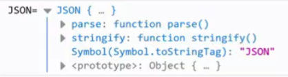
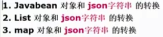
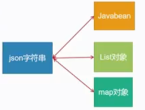

# JSON-Ajax

## JSON

[JSON官方文档](https://www.w3school.com.cn/js/js_json_intro.asp)

### JSON介绍

1. `JSON`指的是 `javascript` 对象标识法(JavaScript Object Notation)
2. `JSON` 是轻量级的文本数据交换格式
3. JSON独立于语言
4. JSON具有自我描述性，更容易理解

```html
<!DOCTYPE html>
<html lang="en">
<head>
    <meta charset="UTF-8">
    <title>json 快速入门案例</title>
    <script type="text/javascript">
        window.onload = function () {
            /*
            1. myJson 就是一个json对象
            2. 演示如何获取到json对象的各个属性/key
             */
            var myJson = {
                "key1": "你好",   // 字符串
                "key2": 123,     // number
                "key3": [1, "hello", 2.3],  // 数组
                "key4": {"age": 12, "name": "jack"},    // json对象
                "key5": [       // json数组
                    {"k1": 10, "k2": "milan"},
                    {"k3": 30, "k4": "john"},
                    "hello",
                    100
                ]
            }

            // 1. 取出 key1
            console.log("key1= " + myJson.key1);    // 你好
            // 可以对key3取出的值(Array)遍历
            for (var i = 0; i < myJson.key3.length; ++i) {
                console.log("第%i个元素的值为", i+1, myJson.key3[i]);
            }
        }
    </script>
</head>
<body>

</body>
</html>
```

JSON规则
1. 映射(元素/属性)用冒号 `:` 表示，"名称":值 , 注意名称是字符串，因此要用双引号括起来
2. 并列的数据之间用逗号 `,` 分隔。"名称2":值,"名称2":值
3. 映射的集合(对象)用大括号 `{}` 表示。{"名称 1":值,"名称2":值}
4. 并列数据的集合（数组）用方括号 `[]` 表示。`[{"名称 1":值,"名称2":值},{"名称 1":值,"名称2":值}]`
5. 元素值类型：string, number, object, array, true, false, null

### JSON对象和字符串对象转换

1. `JSON.stringify(json)`：将一个json对象转换成json字符串
2. `JSON.parse(jsonString)`：将一个json字符串转换成为json对象
3. `JSON`是一个js的内置对象(build-in)，可以直接使用
   - 

```html
<!DOCTYPE html>
<html lang="en">
<head>
    <meta charset="UTF-8">
    <title>JSON对象和字符串对象转换</title>
    <script type="text/javascript">
        window.onload = function () {
            // 1. JSON 是一个js的内置对象(build-in)，可以直接使用
            console.log("JSON= ", JSON);

            // 演示如何将json对象 -> string
            var jsonPerson = {
                "name": "Tom",
                "age": 21
            }
            console.log("jsonPerson=", jsonPerson);
            var strPerson = JSON.stringify(jsonPerson);
            console.log("strPerson=", strPerson, "\nstrPerson类型：", typeof strPerson);
            // {"name":"Tom","age":21}  string
        
            // string -> JSON
            // 字符串要转成json，格式必须满足json格式
            var strDog = '{"name":"Tom","age":21}';
            var jsonDog = JSON.parse(strDog);
            console.log("jsonDog=", jsonDog);

        }
    </script>
</head>
<body>

</body>
</html>
```

### 注意事项和细节

1. JSON.stringify(json对象)会返回对应的string，但并不会要想原来json对象
2. JSON.parse(string) 会返回对应的json对象，但并会影响原来的string
3. 在定义Json对象时，可以使用 `''` 也可以使用 `""`
4. 但是在原生字符串转成 json对象时，必须使用 "" ，否则会报错
5. JSON.stringify(json对象) 返回的字符串，都是 `""` 表示的字符串，可以直接再转为JSON对象

```html
<!DOCTYPE html>
<html lang="en">
<head>
    <meta charset="UTF-8">
    <title>JSON和字符串对象转换注意事项和细节</title>
    <script type="text/javascript">
        window.onload = function () {
            var jsonPerson = {
                "name": "Tom",
                "age": 21
            }
            // 1. JSON.stringify(json对象)会返回对应的string，但并不会要想原来json对象
            var strPerson = JSON.stringify(jsonPerson);
            console.log("jsonPerson=", jsonPerson);

            // 2. JSON.parse(string) 会返回对应的json对象，但并会影响原来的string
            var strDog = '{"name":"Tom","age":21}';
            var jsonDog = JSON.parse(strDog);
            console.log("strDog=", strDog);

            // 3. 在定义Json对象时，可以使用 `''` 也可以使用 `""`
            var jsonPerson2 = {
                'name': 'tim',
                'age': 25
            }
            console.log('jsonPerson2= ', jsonPerson2);

            // 4. 但是在原生字符串转成 json对象时，必须使用 "" ，否则会报错
            var strDog3 = "{'name': 'kiki', 'age': 2}"  // 报错！
            var strDog4 = "{name: 'kiki', age: 2}"      // 报错！
            var strDog5 = "{\"name\": \"kiki\", \"age\": 2}"    // 正确
            JSON.parse(strDog5);    // uncaught SyntaxError: Expected property name or '}' in JSON at position 1

            // 5. JSON.stringify(json对象) 返回的字符串，都是 "" 表示的字符串，可以直接再转为JSON对象
            var strPerson2 = JSON.stringify(jsonPerson2);
            console.log(JSON.parse(strPerson2)) // 正确
        }
    </script>
</head>
<body>

</body>
</html>
```

### JSON再Java中使用

1. 在java中使用json，需要引入第3方包 `gson.jar`
2. GSON是Google提供的原来在Java对象和JSON数据之间进行映射的Java类库
3. 可以对JSON字符串和Java对象相互转换

JSON在Java中应用场景
- 
- 

```java
package com.charlie.json;

import com.google.gson.Gson;
import com.google.gson.reflect.TypeToken;

import java.lang.reflect.Type;
import java.util.ArrayList;
import java.util.HashMap;
import java.util.List;

public class JavaJson {
    public static void main(String[] args) {

        // 创建一个gson对象，作为一个工具对象使用
        Gson gson = new Gson();

        // 演示javabean和json字符串的转换
        Book book = new Book(100, "十三经注疏");

        // 1. 演示把 javabean -> json字符串
        String strBook = gson.toJson(book);
        // strBook={"id":100,"name":"十三经注疏"}
        System.out.println("strBook=" + strBook);
        // 2. string -> javabean
        /*
        1. strBook 是一个 string字符串
        2. Book.class 指定将 JSON 字符串转成 Book对象
        3. 底层是反射机制
         */
        Book book2 = gson.fromJson(strBook, Book.class);
        // book2=Book{id=100, name='十三经注疏'}
        System.out.println("book2=" + book2);

        // 3. 演示把 list对象 -> json字符串
        ArrayList<Book> bookList = new ArrayList<>();
        bookList.add(new Book(200, "倚天屠龙记"));
        bookList.add(new Book(260, "易经"));

        // 因为把对象、集合转成字符串，相对简单
        // 底层只需要遍历，按照json格式拼接返回即可
        String strBookList = gson.toJson(bookList);
        // [{"id":200,"name":"倚天屠龙记"},{"id":260,"name":"易经"}]
        System.out.println(strBookList);

        // 4. json字符串 -> list对象
        /*
        1) 如果需要把json字符串转成 集合这样复杂的类型，需要使用 gson 提供一个类
        2) TypeToken ，是一个自定义泛型类，需要通过 TypeToken来指定需要转换成的类型

        package com.google.gson.reflect;

        public class TypeToken<T> {
            final Class<? super T> rawType;
            final Type type;
            final int hashCode;

            protected TypeToken() {
                this.type = getSuperclassTypeParameter(this.getClass());
                this.rawType = Types.getRawType(this.type);
                this.hashCode = this.type.hashCode();
            }
        }
        */
        // 1) 返回类型的完整路径 java.util.List<com.charlie.json.Book>
        // 2) gson设计者，需要得到类型的完整路径，然后进行底层反射

        /*
        1. 如果使用 new TypeToken<List<Book>>() 提示
                TypeToken()' has protected access in 'com.google.gson.reflect.TypeToken
        2. 因为 TypeToken 的无参构造器是 protected，上述方式就是调用其无参构造器
        3. 因为在java中，如果一个方法是 protected 而且不再同一个包，是不能直接访问的，因此报错
        4. 为什么这样可以？ ： 涉及匿名内部类的知识
            new TypeToken<List<Book>>() {}
        5. 上述方法类型不是 TypeToken 而是一个匿名内部类(可以理解为子类)
        6. 而且这个匿名内部类是有自己的无参构造器(隐式)，根据java基础，当执行子类的无参构造器时，默认有super()
         */
        Type type = new TypeToken<List<Book>>() {}.getType();
        System.out.println("type= " + type);    // type= java.util.List<com.charlie.json.Book>
        List<Book> bookList2 = gson.fromJson(strBookList, type);
        System.out.println("bookList2= " + bookList2);  // bookList2= [Book{id=200, name='倚天屠龙记'}, Book{id=260, name='易经'}]

        // 5. 把map对象->json字符串
        HashMap<String, Book> bookMap = new HashMap<>();
        bookMap.put("k1", new Book(400, "易经"));
        bookMap.put("k2", new Book(400, "尚书"));
        String strBookMap = gson.toJson(bookMap);
        // strBookMap: {"k1":{"id":400,"name":"易经"},"k2":{"id":400,"name":"尚书"}}
        System.out.println("strBookMap: " + strBookMap);

        // 6. 把json字符串 -> map对象
        //      java.util.HashMap<java.lang.String, com.charlie.json.Book>
        HashMap<String, Book> bookMap2 = gson.fromJson(strBookMap, new TypeToken<HashMap<String, Book>>() {}.getType());
        // bookMap2: {k1=Book{id=400, name='易经'}, k2=Book{id=400, name='尚书'}}
        System.out.println("bookMap2: " + bookMap2);
    }
}
```

> `Type type = new TypeToken<List<Book>>() {}.getType();` 中为什么要加 `{}`
> 
> 因为 TypeToken类的无参构造器 是 `protected` 修饰，在外包无法调用其无参构造器，使用 `{}` 构造了匿名内部类
> 通过调用匿名内部类的无参构造器，其内部隐式地调用 `super()` 即其父类 `TypeToken` 的无参构造器


