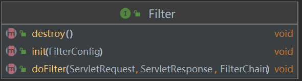
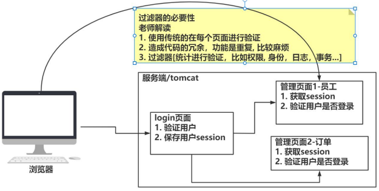
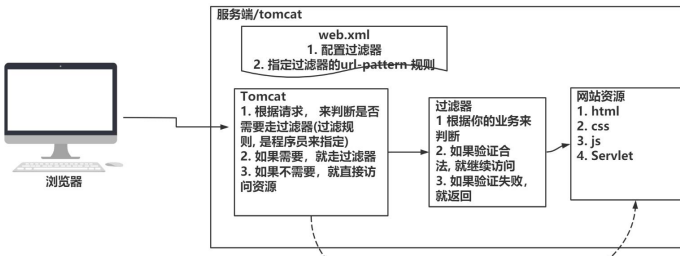
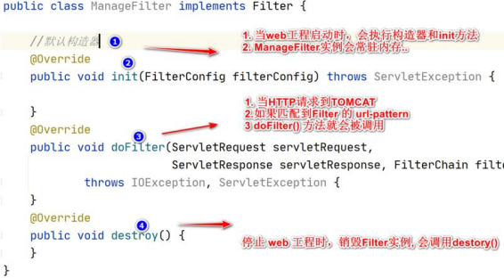
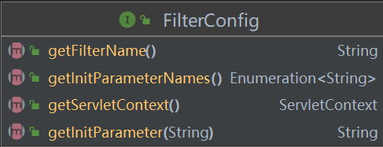
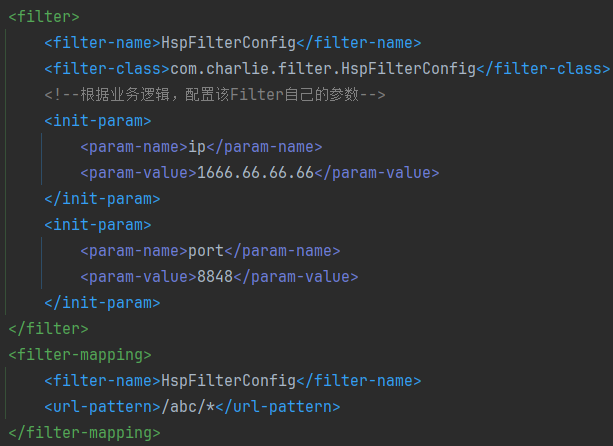
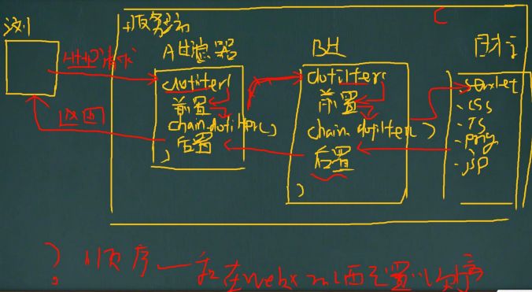
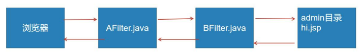

# JavaWeb组件

## 监听器Listener

### Listener监听器介绍

1. `Listener`监听器是JavaWeb的三大组件之一。JavaWeb的三大组件分别是：
   - `Servlet` 程序
   - `Listener` 监听器
   - `Filter` 过滤器
2. `Listener`是`JavaEE`的规范，就是接口
3. **监听器**的作用是，监听某种变化(一般就是**对象创建/销毁，属性变化**)，触发对应方法完成相应的任务
4. JavaWeb中的监听器(共八个)，目前最常用的是 `ServletContextListener`。

### JavaWeb的监听器

#### ServletContextListener监听器

1. 作用：监听 ServletContext 创建或销毁(当Web应用启动时，就会创建ServletContext)， 即**生命周期监听**
2. 应用场景：
   1) 加载初始化的配置文件，比如sprint的配置文件
   2) 任务调度(配合定时器Timer/TimerTask)
3. 相关方法
    - `void contextInitialized(ServletContextEvent servletContextEvent)` 创建ServletContext时触发
    - `void contextDestroyed(ServletContextEvent servletContextEvent)` 销毁时触发
4. 配置 `web.xml`
    ```xml
    <!--配置监听器-->
    <listener>
        <listener-class>com.charlie.listener.HspServletContextListener</listener-class>
    </listener>
    ```

```java
package com.charlie.listener;

import javax.servlet.ServletContextEvent;
import javax.servlet.ServletContextListener;

/**
 * 1. 当一个类实现了接口 ServletContextListener
 * 2. 该类就是一个监听器
 * 3. 该类可以监听的事件，由该类实现的监听接口决定，比如实现 ServletContextListener
 *      该类就可以监听 ServletContext对象的创建和销毁，以此类推
 * 4. HspServletContextListener 就是一个监听者
 * 5. 当web应用启动时，就会产生 ServletContextEvent事件，会调用监听器的对应事件处理方法 contextInitialized
 *      同时会传递事件对象
 * 6. 程序员可以通过 ServletContextEvent事件对象，来获取需要的信息，然后再进行业务处理
 * 7. tomcat如何直到这个监听器的存在？
 *      因为需要在 web.xml 中配置
 */
public class HspServletContextListener implements ServletContextListener {

    @Override
    public void contextInitialized(ServletContextEvent servletContextEvent) {
        System.out.println("HspServletContextListener 监听到 " +
                servletContextEvent.getServletContext() + " 被创建...");
        // 可以获取ServletContext对象，进行业务处理
    }

    @Override
    public void contextDestroyed(ServletContextEvent servletContextEvent) {
        System.out.println("HspServletContextListener 监听到 " +
                servletContextEvent.getServletContext() + " 被销毁...");
        // 可以对servletContext数据进行处理
        System.out.println("进行处理工作...");
    }
}
```

#### ServletContextAttributeListener监听器

1. 作用：监听 `ServletContext` 属性变化
2. 相关方法
   - `void attributeAdded(ServletContextAttributeEvent servletContextAttributeEvent)` 添加属性时调用
   - `void attributeRemoved(ServletContextAttributeEvent servletContextAttributeEvent)` 替换属性时调用
   - `void attributeReplaced(ServletContextAttributeEvent servletContextAttributeEvent)` 移除属性时调用

```java
package com.charlie.listener;

import javax.servlet.ServletContextAttributeEvent;
import javax.servlet.ServletContextAttributeListener;

/**
 * 操作顺序分别如下，对应输出如方法内注释
 * 1. 添加属性 name:Bruce
 * 2. 修改属性 name:Leslie
 * 3. 删除属性
 */
public class HspServletContextAttributeListener implements ServletContextAttributeListener {

    @Override
    public void attributeAdded(ServletContextAttributeEvent servletContextAttributeEvent) {
        System.out.println("HspServletContextAttributeListener 监听到添加属性..." +
                servletContextAttributeEvent.getName() + " = " + servletContextAttributeEvent.getValue());
        // 1. 添加属性 name:Bruce
    }

    @Override
    public void attributeRemoved(ServletContextAttributeEvent servletContextAttributeEvent) {
        System.out.println("HspServletContextAttributeListener 监听到删除属性..." +
                servletContextAttributeEvent.getName() + " = " + servletContextAttributeEvent.getValue());
        // 2. 修改属性 name:Bruce
    }

    @Override
    public void attributeReplaced(ServletContextAttributeEvent servletContextAttributeEvent) {
        System.out.println("HspServletContextAttributeListener 监听到修改属性..." +
                servletContextAttributeEvent.getName() + " = " + servletContextAttributeEvent.getValue());
        // 3. 删除属性 name:Leslie
    }
}
```

#### 其它监听器(使用较少)

##### HttpSessionListener监听器

1. 作用：监听Session创建或销毁，即生命周期监听
2. 相关方法
    - `void sessionCreated(HttpSessionEvent httpSessionEvent)` 创建session时调用
    - `void sessionDestroyed(HttpSessionEvent httpSessionEvent)` 销毁session时调用
3. 使用方法和前面一样，可以用于**监控用户上线/离线**

```java
package com.charlie.listener;

import javax.servlet.http.HttpSession;
import javax.servlet.http.HttpSessionEvent;
import javax.servlet.http.HttpSessionListener;

public class HspHttpSessionListener implements HttpSessionListener {

    @Override
    public void sessionCreated(HttpSessionEvent httpSessionEvent) {
        HttpSession session = httpSessionEvent.getSession();
        // 当session创建时，设置一个生命周期，30s
        session.setMaxInactiveInterval(30);
        System.out.println("HspHttpSessionListener 监听到 session创建= " +
                session.getId());
        System.out.println("监听到用户：" + session.getId() + " 上线...");
    }

    @Override
    public void sessionDestroyed(HttpSessionEvent httpSessionEvent) {
        HttpSession session = httpSessionEvent.getSession();
        System.out.println("HspHttpSessionListener 监听到 session销毁= " +
                session.getId());
        System.out.println("监听到用户：" + session.getId() + " 下线...");
    }
}
```

##### HttpSessionAttributeListener监听器

1. 作用：监听session属性的变化
2. 相关方法
    - `void attributeAdded(ServletRequestAttributeEvent srae)` 添加属性时
    - `void attributeReplaced(ServletRequestAttributeEvent srae)` 替换属性时
    - `void attributeRemoved(ServletRequestAttributeEvent srae)` 移除属性时
3. 使用少，使用方法同上

```java
package com.charlie.listener;

import javax.servlet.http.HttpSessionAttributeListener;
import javax.servlet.http.HttpSessionBindingEvent;

public class HspHttpSessionAttributeListener implements HttpSessionAttributeListener {

    @Override
    public void attributeAdded(HttpSessionBindingEvent httpSessionBindingEvent) {
        System.out.println("HspHttpSessionAttribute 监听到session添加属性 " +
                httpSessionBindingEvent.getName() + " = " + httpSessionBindingEvent.getValue());
    }

    @Override
    public void attributeRemoved(HttpSessionBindingEvent httpSessionBindingEvent) {
        System.out.println("HspHttpSessionAttribute 监听到session删除属性 " +
                httpSessionBindingEvent.getName() + " = " + httpSessionBindingEvent.getValue());
    }

    @Override
    public void attributeReplaced(HttpSessionBindingEvent httpSessionBindingEvent) {
        System.out.println("HspHttpSessionAttribute 监听到session修改属性 " +
                httpSessionBindingEvent.getName() + " = " + httpSessionBindingEvent.getValue());
    }
}
```

##### ServletRequestListener监听器

1. 作用：监听Request创建或销毁，即Request生命周期监听
2. 相关方法
    - `void attributeAdded(ServletRequestAttributeEvent srae)` 添加属性时
    - `void attributeReplaced(ServletRequestAttributeEvent srae)` 替换属性时
    - `void attributeRemoved(ServletRequestAttributeEvent srae)` 移除属性时
3. 可以用来**监控，某个IP访问网站的频率，日志记录，访问资源等情况**

```java
package com.charlie.listener;

import javax.servlet.ServletRequest;
import javax.servlet.ServletRequestEvent;
import javax.servlet.ServletRequestListener;
import javax.servlet.http.HttpServletRequest;

public class HspRequestListener implements ServletRequestListener {

    @Override
    public void requestDestroyed(ServletRequestEvent servletRequestEvent) {
        System.out.println("HspRequestListener 监听到request对象被销毁...");
    }

    @Override
    public void requestInitialized(ServletRequestEvent servletRequestEvent) {
        System.out.println("HspRequestListener 监听到 request对象创建...");    // 优先级较高，tomcat将http请求封装为req对象
        ServletRequest servletRequest = servletRequestEvent.getServletRequest();
        System.out.println("记录访问日志...");
        System.out.println("访问IP= " + servletRequest.getRemoteAddr());
        System.out.println("访问的资源= " + ((HttpServletRequest) servletRequest).getRequestURL());
    }
}
```

##### ServletRequestAttributeListener监听器

1. 作用：监听Request属性变化
2. 相关方法
    - `void attributeAdded(ServletRequestAttributeEvent srae)` 添加属性时
    - `void attributeReplaced(ServletRequestAttributeEvent srae)` 替换属性时
    - `void attributeRemoved(ServletRequestAttributeEvent srae)` 移除属性时
3. 使用方法同上

##### HttpSessionBingListener感知监听器

##### HttpSessionActivationListener感知监听器

## 过滤器Filter

### 过滤器介绍

1. Filter过滤器是JavaWeb三大组件之一(Servlet程序、Listener监听器、Filter过滤器)
2. `Filter`过滤器是`JavaEE`的规范，是接口
   
3. Filter过滤器的作用：**拦截请求，过滤相应**
4. 应用场景：
   - 权限检查
   - 日记操作
   - 事务管理

|  |  |
|-------------------------|------------------------|

### 过滤器入门案例

```xml
    <!--filter配置一般写在其它servlet最前面
        1. filter配置和servlet非常相似，filter也是被tomcat管理和维护
        2. url-pattern：就是当请求的url匹配的时候，就会调用filter
        3. /manage/* ：其中第一个 / 解析为 http://ip:port/工程路径/
        4. 完整路径就是 http://ip:port/工程路径/manage/*
            当请求的资源url满足该条件时，都会调用filter
    -->
   <filter>
      <filter-name>ManageFilter</filter-name>
      <filter-class>com.charlie.filter.ManageFilter</filter-class>
   </filter>
   <filter-mapping>
   <filter-name>ManageFilter</filter-name>
   <url-pattern>/manage/*</url-pattern>
   </filter-mapping>
```

- [登陆页面](web/login.html)
- [登录管理Servlet](src/com/charlie/servlet/LoginCheckServlet.java)
- [Filter管理](src/com/charlie/filter/ManageFilter.java)
- [目标资源](web/manage/admin.html)

```java
package com.charlie.servlet;

import javax.servlet.ServletException;
import javax.servlet.http.HttpServlet;
import javax.servlet.http.HttpServletRequest;
import javax.servlet.http.HttpServletResponse;
import java.io.IOException;

public class LoginCheckServlet extends HttpServlet {
    @Override
    protected void doGet(HttpServletRequest req, HttpServletResponse resp) throws ServletException, IOException {
        System.out.println("LoginCheckServlet 被调用...");
        // 获取用户名和密码，假设密码为123456就可以通过
        String username = req.getParameter("username");
        String pwd = req.getParameter("pwd");
        if ("123456".equals(pwd)) {
            // 合法，将用户名加入session
            req.getSession().setAttribute("username", username);
            // 请求转发到 admin.html
            // 请求转发，不收过滤器的影响
            req.getRequestDispatcher("/manage/admin.html").forward(req, resp);
        } else {
            // 不合法，返回登录界面
            req.getRequestDispatcher("/login.html").forward(req, resp);
        }
    }

    @Override
    protected void doPost(HttpServletRequest req, HttpServletResponse resp) throws ServletException, IOException {
        doGet(req, resp);
    }
}
```

```java
package com.charlie.filter;

import javax.servlet.*;
import javax.servlet.http.HttpServletRequest;
import javax.servlet.http.HttpSession;
import java.io.IOException;

/**
 * 1. filter在web项目启动时，由tomcat来创建filter实例，只会创建一个
 * 2. 会调用filter默认的无参构造器，同时会调用init方法，只会调用一次
 * 3. 在创建filter实例时，同时会创建一个FilterConfig对象，并通过init方法传入
 * 4. 通过FilterConfig对象，程序员可以获取该filter的相关配置信息
 * 5. 当一个http请求和该filter的url-pattern匹配时，就会调用doFilter房啊
 * 6. 在调用doFilter方法时，tomcat会同时创建servletRequest和servletResponse和FilterChain对象，
 *      并通过doFilter传入
 * 7. 如果后面的请求目标资源(jsp,servlet...)会使用到req和resp，那么会继续传递使用
 * 8. javaweb - ssm - sprintboot 有浏览器和web服务器(tomcat)参与
 */
public class ManageFilter implements Filter {

    private int count = 0;

    @Override
    public void init(FilterConfig filterConfig) throws ServletException {
        // 当Tomcat创建Filter后，会调用该方法进行初始化
        // 有了filter机制，可以理解在调用servlet之前，先匹配filter
        /*
        1. 根据req对象封装的uri
        2. 到filterUrlMapping去匹配
        3. 如果匹配上就调用 filterMapping 对应的 filter对象的 doFilter
        4. 如果没有匹配上，就直接走后续的servlet/jsp/html
         */
        System.out.println("ManageFilter init 被调用...");
    }

    @Override
    public void doFilter(ServletRequest servletRequest,
                         ServletResponse servletResponse,
                         FilterChain filterChain) throws IOException, ServletException {
        // 当每次调用该filter时，doFilter方法就会被调用
        System.out.println("ManageFilter doFilter 被调用 " + (++count));
        // 如果这里，没有调用继续请求的方法，则就停止
        // 在调用过滤器前，req对象已经被创建并封装
        // 所以在这里可以通过servletRequest获取很多信息，比如访问url，session，访问参数等等...
        // 就可以做事务管理、数据获取、日志管理等

        // 获取session
        HttpServletRequest httpServletRequest = (HttpServletRequest) servletRequest;
        HttpSession session = httpServletRequest.getSession();
        Object username = session.getAttribute("username");
        if (username != null) {
            // 用户登录成功，直接放行
            /*
            1. doFilter() 表示继续访问目标资源url
            2. servletRequest和servletResponse对象会传递给目标资源/文件
            3. 一定要理解filter传递的两个对象，在后面的 servlet/jsp 是同一个对象(指的是同一次http请求)
             */
            System.out.println("======日志信息======");
            System.out.println("访问的用户名= " + username.toString());
            System.out.println("访问的url= " + httpServletRequest.getRequestURL());
            System.out.println("访问的IP= " + httpServletRequest.getRemoteAddr());
            filterChain.doFilter(servletRequest, servletResponse);
        } else {    // 说明没有登录过，回到登录界面
            servletRequest.getRequestDispatcher("/login.html").forward(servletRequest, servletResponse);
        }
    }

    @Override
    public void destroy() {
        // 当filter对象被销毁时，该方法被调用
        System.out.println("ManageFilter destroy 被调用...");
    }
}
```

### Filter过滤器url-pattern

1. `url-pattern`：**Filter的拦截路径，即浏览器在请求什么位置的资源时，过滤器会进行拦截过滤**
2. **精确匹配** `<url-pattern>/login.html</url-pattern>` 对应的请求地址 `http://ip:port/application_context/login.html`
   会被拦截
3. **目录匹配** `<url-pattern>/manage/*</url-pattern>` 请求地址 `http://ip:port/工程路径/manage/xx` ，
   即web工程manage目录下所有资源都会被拦截
4. **后缀名匹配** `<url-pattern>*.png</url-pattern>` 后缀名可变，如 `*.html, *.jsp` 等。对应的请求地址
   `http://ip:port/工程路径/xx.png` ，后缀名为 `.png` 的请求都会被拦截
5. **Filter过滤器只关心请求的地址是否匹配，不关心请求的资源是否存在**。

### Filter过滤器生命周期



```java
package com.charlie.filter;

import javax.servlet.*;
import javax.servlet.http.HttpServletRequest;
import javax.servlet.http.HttpSession;
import java.io.IOException;

/**
 * 1. filter在web项目启动时，由tomcat来创建filter实例，只会创建一个
 * 2. 会调用filter默认的无参构造器，同时会调用init方法，只会调用一次
 * 3. 在创建filter实例时，同时会创建一个FilterConfig对象，并通过init方法传入
 * 4. 通过FilterConfig对象，程序员可以获取该filter的相关配置信息
 * 5. 当一个http请求和该filter的url-pattern匹配时，就会调用doFilter房啊
 * 6. 在调用doFilter方法时，tomcat会同时创建servletRequest和servletResponse和FilterChain对象，
 *      并通过doFilter传入
 * 7. 如果后面的请求目标资源(jsp,servlet...)会使用到req和resp，那么会继续传递使用
 * 8. javaweb - ssm - sprintboot 有浏览器和web服务器(tomcat)参与
 */
public class ManageFilter implements Filter {

    private int count = 0;

    @Override
    public void init(FilterConfig filterConfig) throws ServletException {
        // 当Tomcat创建Filter后，会调用该方法进行初始化
        // 有了filter机制，可以理解在调用servlet之前，先匹配filter
        /*
        1. 根据req对象封装的uri
        2. 到filterUrlMapping去匹配
        3. 如果匹配上就调用 filterMapping 对应的 filter对象的 doFilter
        4. 如果没有匹配上，就直接走后续的servlet/jsp/html
         */
        System.out.println("ManageFilter init 被调用...");
    }

    @Override
    public void doFilter(ServletRequest servletRequest,
                         ServletResponse servletResponse,
                         FilterChain filterChain) throws IOException, ServletException {
        // 当每次调用该filter时，doFilter方法就会被调用
        System.out.println("ManageFilter doFilter 被调用 " + (++count));
        // 如果这里，没有调用继续请求的方法，则就停止
        // 在调用过滤器前，req对象已经被创建并封装
        // 所以在这里可以通过servletRequest获取很多信息，比如访问url，session，访问参数等等...
        // 就可以做事务管理、数据获取、日志管理等

        // 获取session
        HttpServletRequest httpServletRequest = (HttpServletRequest) servletRequest;
        HttpSession session = httpServletRequest.getSession();
        Object username = session.getAttribute("username");
        if (username != null) {
            // 用户登录成功，直接放行
            /*
            1. doFilter() 表示继续访问目标资源url
            2. servletRequest和servletResponse对象会传递给目标资源/文件
            3. 一定要理解filter传递的两个对象，在后面的 servlet/jsp 是同一个对象(指的是同一次http请求)
             */
            System.out.println("======日志信息======");
            System.out.println("访问的用户名= " + username.toString());
            System.out.println("访问的url= " + httpServletRequest.getRequestURL());
            System.out.println("访问的IP= " + httpServletRequest.getRemoteAddr());
            filterChain.doFilter(servletRequest, servletResponse);
        } else {    // 说明没有登录过，回到登录界面
            servletRequest.getRequestDispatcher("/login.html").forward(servletRequest, servletResponse);
        }
    }

    @Override
    public void destroy() {
        // 当filter对象被销毁时，该方法被调用
        System.out.println("ManageFilter destroy 被调用...");
    }
}
```

### FilterConfig

|  |  |
|------------------------------|------------------------------|

1. `FilterConfig`是Filter过滤器的配置类
2. Tomcat每次创建Filter的时候，也会创建一个FilterConfig对象，这里包含了Filter配置文件的配置信息
3. FilterConfig对象作用是获取filter过滤器的配置内容
4. 应用实例：封杀指定网段的ip

```java
package com.charlie.filter;

import javax.servlet.*;
import java.io.IOException;
import java.util.Enumeration;

/**
 * 演示FilterConfig使用
 */
public class HspFilterConfig implements Filter {

    // 因为 filterConfig只在 init() 方法中获取，要想在 doFilter() 方法中使用
    // 需要使用一个属性来保存起来
    private String ip = ""; // 禁用的ip

    @Override
    public void init(FilterConfig filterConfig) throws ServletException {
        // 通过filterConfig获取相关的参数
        String filterName = filterConfig.getFilterName();
        ip = filterConfig.getInitParameter("ip");
        ServletContext servletContext = filterConfig.getServletContext();
        // 获取该filter所有的配置参数名
        Enumeration<String> initParameterNames = filterConfig.getInitParameterNames();

        // 遍历枚举
        while (initParameterNames.hasMoreElements()) {
            System.out.println("param-name: " + initParameterNames.nextElement());
        }

        System.out.println("filterName= " + filterName);
        System.out.println("ip= " + ip);
        System.out.println("servletContext= " + servletContext);
    }

    @Override
    public void doFilter(ServletRequest servletRequest, ServletResponse servletResponse, FilterChain filterChain) throws IOException, ServletException {
        // 禁用ip实例演示，禁用 128.12 网段的ip访问
        // 先获取到访问的ip地址
        String remoteAddr = servletRequest.getRemoteAddr();
        if (remoteAddr.contains(ip)) {
            System.out.println("禁用该网段的ip");
            servletRequest.getRequestDispatcher("/login.html").forward(servletRequest, servletResponse);
            return; // 直接返回！
        }
        // 继续访问目标资源
        filterChain.doFilter(servletRequest, servletResponse);
    }

    @Override
    public void destroy() {

    }
}
```

### FilterChain过滤器链

> `FilterChain`在处理某些复杂业务时，一个过滤器不够，可以设计多个过滤器共同完成过滤任务，形成过滤器链。
> 
> **过滤器匹配顺序，与在 `web.xml` 中的配置顺序相同**

|  |  |
|------------------------------|--------------------------------|

- 过滤器链实例演示 `AFilter` 和 `BFilter`
  - `web.xml` 先配置A过滤器，再配置B
- [AFilter.java](src/com/charlie/filter/AFilter.java)
- [BFilter.java](src/com/charlie/filter/BFilter.java)
- 运行结果
  ```md
   AFilter doFilter 的前置代码...
   BFilter doFilter 的前置代码...
   BFilter doFilter 的后置代码...
   AFilter doFilter 的后置代码...
   ```

**FilterChain注意事项和细节**
1. 多个filter和目标资源在一次http请求，在**同一个线程中**
2. 当一个请求url和filter的url-pattern匹配时，才会被执行，如果有多个匹配上，就会顺序执行，形成
   一个filter调用链(底层可以使用一个数据结构搞定)
3. 多个filter共同执行时，**因为是一次http请求，使用的是同一个request对象**
4. **多个filter执行顺序，和web.xml文件配置顺序保持一致**
5. `filterChain.doFilter(req, resp)`方法将**执行下一个过滤器的doFilter方法，如果后面没有过滤器，
   则执行目标资源**
6. 小结：在执行过滤器时，顺序是：http请求->A过滤器doFilter()->A过滤器签值代码->A过滤器filterChain.doFilter()
   ->B过滤器doFilter()->B过滤前置代码->B过滤器filterChain.doFilter()->目标文件->B过滤器后置代码->A过滤器后置代码
   ->返回给浏览器页面/数据

### Filter作业练习

需求分析：使用过滤器，完成如下要求：
1. 点击发表评论页面[topic.html](web/topic.html) ,可以在[showTopic.jsp](web/comment/showTopic.jsp)显示评论内容
2. 如果发表内容，有关键字如 `苹果,香蕉` ，就返回 topic.html
3. 要求发表评论到 `showTopic.jsp` 时，经过过滤器[TopicFilter](src/com/charlie/filter/ToPicFilter.java)处理
4. 禁用词，配置在[过滤器](web/WEB-INF/web.xml)，在启动项目时动态地获取，注意处理中文
