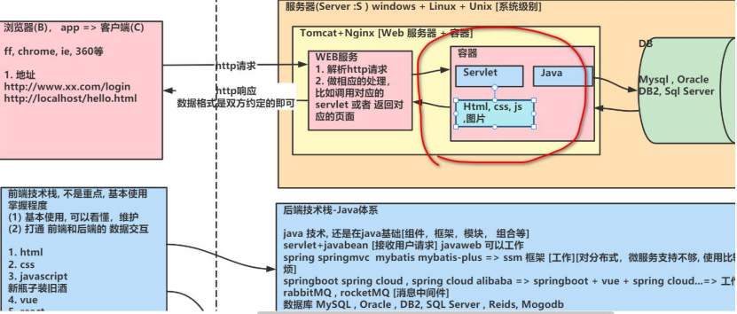
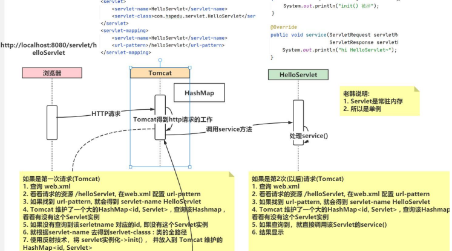
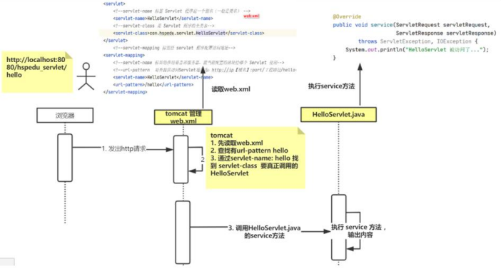
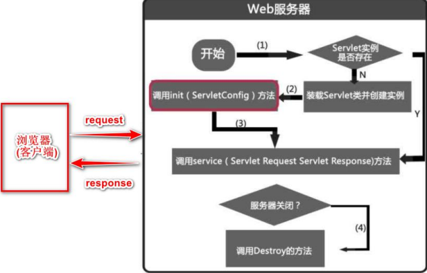
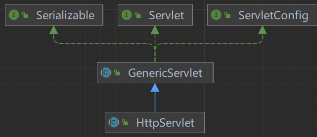

# Servlet



## 什么是Servlet

- Servlet(java服务器小程序)
1. 由服务器端调用和执行(Tomcat解析和运行)
2. 是用java语言编写的，本质就是Java类
3. 是按照Servlet规范开发的(除了tomcat，还有weblogic等)
4. 功能强大，可以完成激活所有的网站功能

## Servlet基本使用

### Servlet开发方式说明

1. servlet3.0前使用 `web.xml`，servlet3.0版本及以后**支持注解**，同时支持 `web.xml`
2. 通过在 `servlet-api.jar/META-INF/MANIFEST.MF` 查看servlet版本
   - `Specification-Version: 3.1`

### 快速入门-手动开发Servlet

> 需求说明
> 1. 开发一个 HelloServlet
> 2. 当浏览器 访问 http://localhost:8080/web 应用名/helloServlet 时，后台输出 "hi HelloServelt"

- 具体步骤

1. 编写类 `HelloServlet` 实现接口 `Servlet`
2. 实现 `service` 方法，处理请求，并响应数据
3. 在 `web.xml` 中配置servlet程序的访问地址

> 1. 创建hspedu_servlet JavaWeb工程，并配置好Tomcat
> 2. 添加servlet-api.jar(在tomcat/lib下) 到工程, 因为servlet.jar 不是jdk自带的, 要引入
>    - 在 `Tomcat/lib/servlet-api.jar` 因为Tomcat支持Servlet
>    - 放在 `web/lib` 下
> 3. 在src 下 包 com.servlet.HelloServlet.java ，并实现Servlet接口
> 4. 在 `web/WEB-INF/web.xml` 配置HelloServlet，即给HelloServlet提供对外访问地址
>    - `<url-pattern>/helloServlet</url-pattern>` 即通过web工程/helloServlet访问Servlet
> 5. 通过浏览器访问HelloServlet，看是否正确(记得要redeploy[快]或者restart[慢])

```java
package com.servlet;

import javax.servlet.*;
import java.io.IOException;

/**
 * 1. 开发Servlet需要实现Servlet接口
 * 2. 实现Servlet接口的5个方法
 */
public class HelloServlet implements Servlet {
    /**
     * 1. 初始化 servlet
     * 2. 当创建 HelloServlet 实例时，会调用 init方法
     * 3. 该方法只会调用一次
     */
    @Override
    public void init(ServletConfig servletConfig) throws ServletException {

    }

    /**
     * 返回 ServletConfig 即返回 Servlet的配置
     */
    @Override
    public ServletConfig getServletConfig() {
        return null;
    }

    /**
     * 1. service方法处理浏览器的请求(包括get/post)
     * 2. 当浏览器每次请求 Servlet 时，就会调用一次service方法
     * 3. 当 Tomcat 调用该方法时，会把 http 请求的数据封装成实现了 ServletRequest接口的 request对象
     * 4. 通过 servletRequest对象，可以得到用户提交的数据
     * 5. servletResponse对象可以用于返回数据给 Tomcat->浏览器
     */
    @Override
    public void service(ServletRequest servletRequest,
                        ServletResponse servletResponse) throws ServletException, IOException {

    }

    /**
     * 返回servlet信息，使用较少
     */
    @Override
    public String getServletInfo() {
        return null;
    }

    /**
     * 1. 该方法在servlet销毁时，被调用
     * 2. 只会调用一次
     */
    @Override
    public void destroy() {

    }
}

```

```xml
<?xml version="1.0" encoding="UTF-8"?>
<web-app xmlns="http://xmlns.jcp.org/xml/ns/javaee"
         xmlns:xsi="http://www.w3.org/2001/XMLSchema-instance"
         xsi:schemaLocation="http://xmlns.jcp.org/xml/ns/javaee http://xmlns.jcp.org/xml/ns/javaee/web-app_4_0.xsd"
         version="4.0">
    <!--web.xml主要用来配置web应用使用到的Servlet
        1. servlet-name：给Servlet取名(程序员决定)，该名字唯一，一般是类名
        2. servlet-class：Servlet的类的全路径/全类名：Tomcat在反射生成Servlet时需要使用
        3. url-pattern：servlet访问的url的配置(路径)，程序员自定义
        4. 此时应该这样访问servlet http://localhost:8080/servlet/helloServlet
    -->
    <!--配置HelloServlet-->
    <servlet>
        <servlet-name>HelloServlet</servlet-name>
        <servlet-class>com.servlet.HelloServlet</servlet-class>
    </servlet>
    
    <!--servlet-mapping标签是给 servlet 程序配置访问地址-->
    <servlet-mapping>
        <!--告诉服务器，当前配置的地址给那个 Servlet 使用-->
        <servlet-name>HelloServlet</servlet-name>
        <!--对外提供访问 Servlet 地址为 `http://ip[域名]:port/过程路径/helloServlet`，/不能少，否则访问不到-->
        <url-pattern>/helloServlet</url-pattern>
    </servlet-mapping>
</web-app>
```

### 浏览器访问Servlet的流程





### Servlet生命周期

- 主要有三个方法
1. `init()`初始化阶段
2. `service()`处理浏览器请求阶段
3. `destroy()`终止阶段



- 初始化阶段

> Servlet容器(比如Tomcat)加载Servlet，加载完成后，Servlet容器会创建一个Servlet实例并调用init()方法，init()方法只会调用一次，
> Servlet容器在下面的情况装在Servlet：
> 1. Servlet 容器(Tomcat)启动时自动装载某些 servlet，实现这个需要在 web.xml 文件中添加
>     <load-on-startup>1</load-on-startup> 1 表示装载的顺序
> 2. 在 Servlet 容器启动后，浏览器首次向 Servlet 发送请求
> 3. Servlet 重新装载时(比如 tomcat 进行 redeploy【redeploy 会销毁所有的 Servlet 实例】)， 
>    浏览器再向 Servlet 发送请求的第 1 次

- 处理浏览器请求阶段(service方法)

> 1. Tomcat每处理一次http请求，就会产生一个新的线程去处理
>    - 通过 `System.out.println("当前线程id= " + Thread.currentThread().getId());` 查看
> 2. 创建一个用于封装 HTTP 请求消息的 ServletRequest 对象和一个代表 HTTP 响应消息的 ServletResponse 对象
> 3. 然后调用 Servlet 的 service()方法并将请求和响应对象作为参数传递进去

- 终止阶段 `destroy` 方法(体现Servlet完整的生命周期)

> 当web应用被终止，或者Servlet容器终止运行，或者Servlet类重新装在时，会调用 `destroy()` 方法。
> 比如重启Tomcat，或者redeploy web应用

### 通过继承HttpServlet开发Servlet



1. 编写一个类继承 `HttpServlet` 类
2. 根据需求重写 `doGet` 和 `doPost` 方法
3. 在 `web.xml` 中配置 Servlet 程序

### Servlet注意事项和细节

1. Servlet是一个供其它Java程序(Servlet引擎)调用的Java类，不能独立运行
2. 针对浏览器的多次Servlet请求，通常情况下，服务器只会创建一个Servlet实例对象，也就是说Servlet实例对象一旦创建，就会驻留在内存中，为后续的其它请求服务
   直至web容器退出/或者redeploy该web应用，servlet实例对象才会销毁
3. 在Servlet的整个声明周期内，init方法只被调用一次。而对每次请求都导致Servlet引擎调用一次servlet的service方法
4. 对于每次访问请求，Servlet 引擎都会创建一个新的 HttpServletRequest 请求对象和一个新的 HttpServletResponse 响应对象，
   然后将这两个对象作为参数传递给它调用的 Servlet 的 service()方法，service 方法再根据请求方式分别调用 doXXX 方
5. 如果在<servlet>元素中配置了一个<load-on-startup>元素，那么 WEB 应用程序在启动时，就会装载并创建 Servlet 的实例对象、以及调用 Servlet 实例对象的 init()方法

> 配置映射 url-pattern 时，如果前面没加 `/` 会报错
> `org.apache.tomcat.util.modeler.BaseModelMBean.invoke Exception invoking method manageApp 
> java.lang.IllegalStateException: ContainerBase.addChild: start: org.apache.catalina.LifecycleException: Failed to start component`

## Servlet-注解方式

### 快速入门

1. 编写类 `OkServlet` 去继承 `HttpServlet`
2. 注解方式配置 OkServlet，一个Servlet支持配置多个urlPattern

```java
package com.servlet.annotation;

import javax.servlet.ServletException;
import javax.servlet.annotation.WebServlet;
import javax.servlet.http.HttpServlet;
import javax.servlet.http.HttpServletRequest;
import javax.servlet.http.HttpServletResponse;
import java.io.IOException;

/**
 * Servlet注解方式快速入门
 * 1. @WebServlet 是一个注解
 * 2. @WebServlet 源码
 * @Target({ElementType.TYPE})
 * @Retention(RetentionPolicy.RUNTIME)
 * @Documented  => javadoc生成文档会有记录
 * public @interface WebServlet {
 *     String name() default "";
 *
 *     String[] value() default {};
 *
 *     String[] urlPatterns() default {};
 *
 *     int loadOnStartup() default -1;
 *
 *     WebInitParam[] initParams() default {};
 *
 *     boolean asyncSupported() default false;
 *
 *     String smallIcon() default "";
 *
 *     String largeIcon() default "";
 *
 *     String description() default "";
 *
 *     String displayName() default "";
 * }
 * 3. urlPatterns 对应 web.xml 的 <url-pattern></url-pattern>
 * 4. {"/ok1", "ok2"} 可以给okServlet配置多个 url-pattern
 * 5. 相当于这个注解 @WebServlet(urlPatterns = {"/ok1", "ok2"}) 代替了 web.xml 的配置
 *      底层使用了 反射+注解+IO 来完成一个支撑
 * 6. 浏览器可以这样访问 OkServlet http://localhost:8080/servlet/ok1 或
 *      http://localhost:8080/servlet/ok2
 */
@WebServlet(urlPatterns = {"/ok1", "/ok2"}) // 记得加上 / ，不然会报错的！
public class OkServlet extends HttpServlet {
    @Override
    protected void doGet(HttpServletRequest req, HttpServletResponse resp) throws ServletException, IOException {
        System.out.println("注解方式 OkServlet doGet()...");
    }

    @Override
    protected void doPost(HttpServletRequest req, HttpServletResponse resp) throws ServletException, IOException {
        System.out.println("注解方式 OkServlet doPost()...");
    }
}

```

```java
package com.servlet.annotation;

import javax.servlet.annotation.WebServlet;
import javax.servlet.http.HttpServlet;
import java.util.HashMap;

/**
 * 模拟Tomcat是如何通过 @WebServlet(url-pattern = {"/ok1", "/ok2"})
 * 来装载一个Servlet的
 */
public class TestAnnotationServlet extends HttpServlet {

    private static final HashMap<String, HttpServlet> hm = new HashMap<>();

    public static void main(String[] args) throws ClassNotFoundException, InstantiationException, IllegalAccessException {
        // 1. 首先要得到扫面的包 路径 io，进而得到类的全路径
        String classAllPath = "com.servlet.annotation.OkServlet";
        // 2. 得到 OkServlet 的 Class对象
        Class<?> cls = Class.forName(classAllPath);
        // 3. 通过Class对象，得到Annotation
        WebServlet annotation = cls.getAnnotation(WebServlet.class);
        System.out.println(annotation);
        String[] strings = annotation.urlPatterns();
        for (String url : strings) {
            System.out.println("url= " + url);
        }
        // 4. 如果匹配url，如果是第一次，tomcat就会创建一个OkServlet实例，放入到HashMap
        HttpServlet instance = (HttpServlet) cls.newInstance();
        System.out.println("instance= " + instance);

        // 简单地模拟
        hm.put("OkServlet", instance);
        System.out.println(hm);
    }
}
```

