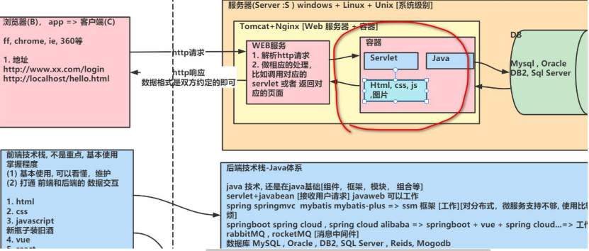
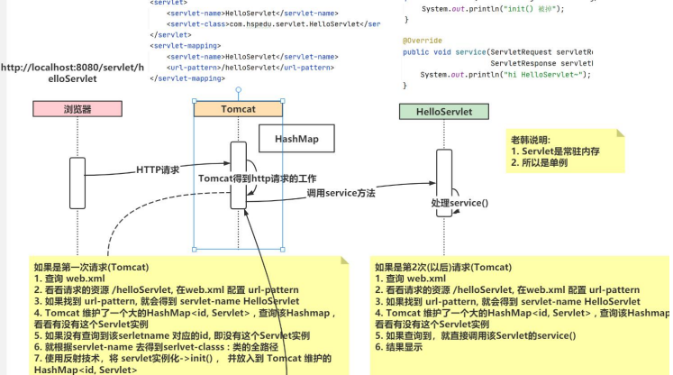
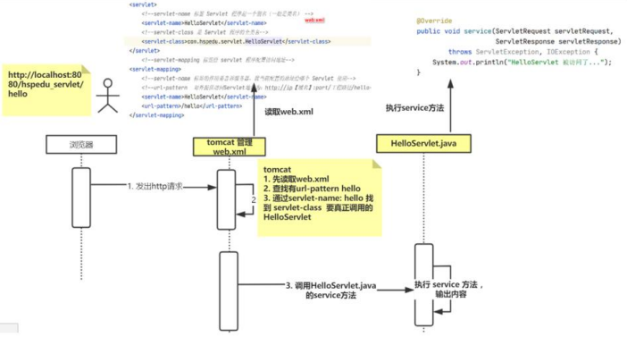
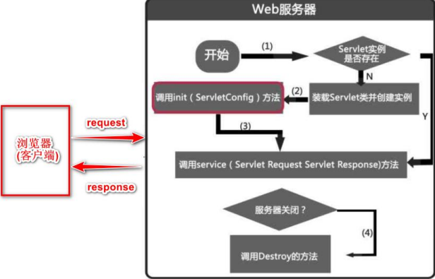
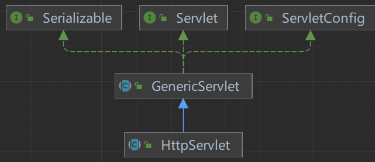
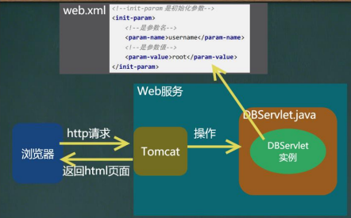
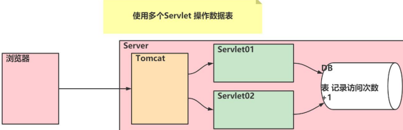
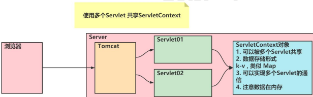
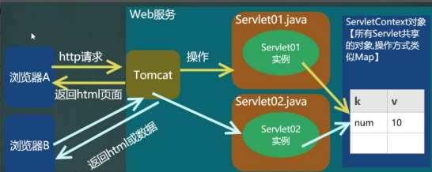

# Servlet



## 什么是Servlet

- Servlet(java服务器小程序)
1. 由服务器端调用和执行(Tomcat解析和运行)
2. 是用java语言编写的，本质就是Java类
3. 是按照Servlet规范开发的(除了tomcat，还有weblogic等)
4. 功能强大，可以完成激活所有的网站功能

## Servlet基本使用

### Servlet开发方式说明

1. servlet3.0前使用 `web.xml`，servlet3.0版本及以后**支持注解**，同时支持 `web.xml`
2. 通过在 `servlet-api.jar/META-INF/MANIFEST.MF` 查看servlet版本
   - `Specification-Version: 3.1`

### 快速入门-手动开发Servlet

> 需求说明
> 1. 开发一个 HelloServlet
> 2. 当浏览器 访问 http://localhost:8080/web 应用名/helloServlet 时，后台输出 "hi HelloServelt"

- 具体步骤

1. 编写类 `HelloServlet` 实现接口 `Servlet`
2. 实现 `service` 方法，处理请求，并响应数据
3. 在 `web.xml` 中配置servlet程序的访问地址

> 1. 创建hspedu_servlet JavaWeb工程，并配置好Tomcat
> 2. 添加servlet-api.jar(在tomcat/lib下) 到工程, 因为servlet.jar 不是jdk自带的, 要引入
>    - 在 `Tomcat/lib/servlet-api.jar` 因为Tomcat支持Servlet
>    - 放在 `web/lib` 下
> 3. 在src 下 包 com.servlet.HelloServlet.java ，并实现Servlet接口
> 4. 在 `web/WEB-INF/web.xml` 配置HelloServlet，即给HelloServlet提供对外访问地址
>    - `<url-pattern>/helloServlet</url-pattern>` 即通过web工程/helloServlet访问Servlet
> 5. 通过浏览器访问HelloServlet，看是否正确(记得要redeploy[快]或者restart[慢])

```java
package com.servlet;

import javax.servlet.*;
import java.io.IOException;

/**
 * 1. 开发Servlet需要实现Servlet接口
 * 2. 实现Servlet接口的5个方法
 */
public class HelloServlet implements Servlet {
    /**
     * 1. 初始化 servlet
     * 2. 当创建 HelloServlet 实例时，会调用 init方法
     * 3. 该方法只会调用一次
     */
    @Override
    public void init(ServletConfig servletConfig) throws ServletException {

    }

    /**
     * 返回 ServletConfig 即返回 Servlet的配置
     */
    @Override
    public ServletConfig getServletConfig() {
        return null;
    }

    /**
     * 1. service方法处理浏览器的请求(包括get/post)
     * 2. 当浏览器每次请求 Servlet 时，就会调用一次service方法
     * 3. 当 Tomcat 调用该方法时，会把 http 请求的数据封装成实现了 ServletRequest接口的 request对象
     * 4. 通过 servletRequest对象，可以得到用户提交的数据
     * 5. servletResponse对象可以用于返回数据给 Tomcat->浏览器
     */
    @Override
    public void service(ServletRequest servletRequest,
                        ServletResponse servletResponse) throws ServletException, IOException {

    }

    /**
     * 返回servlet信息，使用较少
     */
    @Override
    public String getServletInfo() {
        return null;
    }

    /**
     * 1. 该方法在servlet销毁时，被调用
     * 2. 只会调用一次
     */
    @Override
    public void destroy() {

    }
}

```

```xml
<?xml version="1.0" encoding="UTF-8"?>
<web-app xmlns="http://xmlns.jcp.org/xml/ns/javaee"
         xmlns:xsi="http://www.w3.org/2001/XMLSchema-instance"
         xsi:schemaLocation="http://xmlns.jcp.org/xml/ns/javaee http://xmlns.jcp.org/xml/ns/javaee/web-app_4_0.xsd"
         version="4.0">
    <!--web.xml主要用来配置web应用使用到的Servlet
        1. servlet-name：给Servlet取名(程序员决定)，该名字唯一，一般是类名
        2. servlet-class：Servlet的类的全路径/全类名：Tomcat在反射生成Servlet时需要使用
        3. url-pattern：servlet访问的url的配置(路径)，程序员自定义
        4. 此时应该这样访问servlet http://localhost:8080/servlet/helloServlet
    -->
    <!--配置HelloServlet-->
    <servlet>
        <servlet-name>HelloServlet</servlet-name>
        <servlet-class>com.servlet.HelloServlet</servlet-class>
    </servlet>
    
    <!--servlet-mapping标签是给 servlet 程序配置访问地址-->
    <servlet-mapping>
        <!--告诉服务器，当前配置的地址给那个 Servlet 使用-->
        <servlet-name>HelloServlet</servlet-name>
        <!--对外提供访问 Servlet 地址为 `http://ip[域名]:port/工程路径/helloServlet`，/不能少，否则访问不到-->
        <url-pattern>/helloServlet</url-pattern>
    </servlet-mapping>
</web-app>
```

### 浏览器访问Servlet的流程





### Servlet生命周期

- 主要有三个方法
1. `init()`初始化阶段
2. `service()`处理浏览器请求阶段
3. `destroy()`终止阶段



- 初始化阶段

> Servlet容器(比如Tomcat)加载Servlet，加载完成后，Servlet容器会创建一个Servlet实例并调用init()方法，init()方法只会调用一次，
> Servlet容器在下面的情况装在Servlet：
> 1. Servlet 容器(Tomcat)启动时自动装载某些 servlet，实现这个需要在 web.xml 文件中添加
>     <load-on-startup>1</load-on-startup> 1 表示装载的顺序
> 2. 在 Servlet 容器启动后，浏览器首次向 Servlet 发送请求
> 3. Servlet 重新装载时(比如 tomcat 进行 redeploy【redeploy 会销毁所有的 Servlet 实例】)， 
>    浏览器再向 Servlet 发送请求的第 1 次

- 处理浏览器请求阶段(service方法)

> 1. Tomcat每处理一次http请求，就会产生一个新的线程去处理
>    - 通过 `System.out.println("当前线程id= " + Thread.currentThread().getId());` 查看
> 2. 创建一个用于封装 HTTP 请求消息的 ServletRequest 对象和一个代表 HTTP 响应消息的 ServletResponse 对象
> 3. 然后调用 Servlet 的 service()方法并将请求和响应对象作为参数传递进去

- 终止阶段 `destroy` 方法(体现Servlet完整的生命周期)

> 当web应用被终止，或者Servlet容器终止运行，或者Servlet类重新装在时，会调用 `destroy()` 方法。
> 比如重启Tomcat，或者redeploy web应用

### 通过继承HttpServlet开发Servlet



1. 编写一个类继承 `HttpServlet` 类
2. 根据需求重写 `doGet` 和 `doPost` 方法
3. 在 `web.xml` 中配置 Servlet 程序

### Servlet注意事项和细节

1. Servlet是一个供其它Java程序(Servlet引擎)调用的Java类，不能独立运行
2. 针对浏览器的多次Servlet请求，通常情况下，服务器只会创建一个Servlet实例对象，也就是说Servlet实例对象一旦创建，就会驻留在内存中，为后续的其它请求服务
   直至web容器退出/或者redeploy该web应用，servlet实例对象才会销毁
3. 在Servlet的整个声明周期内，init方法只被调用一次。而对每次请求都导致Servlet引擎调用一次servlet的service方法
4. 对于每次访问请求，Servlet 引擎都会创建一个新的 HttpServletRequest 请求对象和一个新的 HttpServletResponse 响应对象，
   然后将这两个对象作为参数传递给它调用的 Servlet 的 service()方法，service 方法再根据请求方式分别调用 doXXX 方
5. 如果在<servlet>元素中配置了一个<load-on-startup>元素，那么 WEB 应用程序在启动时，就会装载并创建 Servlet 的实例对象、以及调用 Servlet 实例对象的 init()方法

> 配置映射 url-pattern 时，如果前面没加 `/` 会报错
> `org.apache.tomcat.util.modeler.BaseModelMBean.invoke Exception invoking method manageApp 
> java.lang.IllegalStateException: ContainerBase.addChild: start: org.apache.catalina.LifecycleException: Failed to start component`

## Servlet-注解方式

### 快速入门

1. 编写类 `OkServlet` 去继承 `HttpServlet`
2. 注解方式配置 OkServlet，一个Servlet支持配置多个urlPattern

```java
package com.servlet.annotation;

import javax.servlet.ServletException;
import javax.servlet.annotation.WebServlet;
import javax.servlet.http.HttpServlet;
import javax.servlet.http.HttpServletRequest;
import javax.servlet.http.HttpServletResponse;
import java.io.IOException;

/**
 * Servlet注解方式快速入门
 * 1. @WebServlet 是一个注解
 * 2. @WebServlet 源码
 * @Target({ElementType.TYPE})
 * @Retention(RetentionPolicy.RUNTIME)
 * @Documented  => javadoc生成文档会有记录
 * public @interface WebServlet {
 *     String name() default "";
 *
 *     String[] value() default {};
 *
 *     String[] urlPatterns() default {};
 *
 *     int loadOnStartup() default -1;
 *
 *     WebInitParam[] initParams() default {};
 *
 *     boolean asyncSupported() default false;
 *
 *     String smallIcon() default "";
 *
 *     String largeIcon() default "";
 *
 *     String description() default "";
 *
 *     String displayName() default "";
 * }
 * 3. urlPatterns 对应 web.xml 的 <url-pattern></url-pattern>
 * 4. {"/ok1", "ok2"} 可以给okServlet配置多个 url-pattern
 * 5. 相当于这个注解 @WebServlet(urlPatterns = {"/ok1", "ok2"}) 代替了 web.xml 的配置
 *      底层使用了 反射+注解+IO 来完成一个支撑
 * 6. 浏览器可以这样访问 OkServlet http://localhost:8080/servlet/ok1 或
 *      http://localhost:8080/servlet/ok2
 */
@WebServlet(urlPatterns = {"/ok1", "/ok2"}) // 记得加上 / ，不然会报错的！
public class OkServlet extends HttpServlet {
    @Override
    protected void doGet(HttpServletRequest req, HttpServletResponse resp) throws ServletException, IOException {
        System.out.println("注解方式 OkServlet doGet()...");
    }

    @Override
    protected void doPost(HttpServletRequest req, HttpServletResponse resp) throws ServletException, IOException {
        System.out.println("注解方式 OkServlet doPost()...");
    }
}

```

```java
package com.servlet.annotation;

import javax.servlet.annotation.WebServlet;
import javax.servlet.http.HttpServlet;
import java.util.HashMap;

/**
 * 模拟Tomcat是如何通过 @WebServlet(url-pattern = {"/ok1", "/ok2"})
 * 来装载一个Servlet的
 */
public class TestAnnotationServlet extends HttpServlet {

    private static final HashMap<String, HttpServlet> hm = new HashMap<>();

    public static void main(String[] args) throws ClassNotFoundException, InstantiationException, IllegalAccessException {
        // 1. 首先要得到扫面的包 路径 io，进而得到类的全路径
        String classAllPath = "com.servlet.annotation.OkServlet";
        // 2. 得到 OkServlet 的 Class对象
        Class<?> cls = Class.forName(classAllPath);
        // 3. 通过Class对象，得到Annotation
        WebServlet annotation = cls.getAnnotation(WebServlet.class);
        System.out.println(annotation);
        String[] strings = annotation.urlPatterns();
        for (String url : strings) {
            System.out.println("url= " + url);
        }
        // 4. 如果匹配url，如果是第一次，tomcat就会创建一个OkServlet实例，放入到HashMap
        HttpServlet instance = (HttpServlet) cls.newInstance();
        System.out.println("instance= " + instance);

        // 简单地模拟
        hm.put("OkServlet", instance);
        System.out.println(hm);
    }
}
```

### Servlet urlPattern配置

```java
/***
 * 1. 精确匹配
 * 配置路径：@WebServlet("ok/zs")
 * 访问servlet：localhost:8080/servlet/ok/zs
 * 2. 目录匹配
 * 配置路径：@WebServlet("ok/*")
 * 访问servlet：localhost:8080/servlet/ok/aa   /ok/bb  ok/aa/cc...
 * 3. 扩展名匹配
 * 配置路径：@WebServlet("*.action") 注意：不允许带 /，否则Tomcat会报错
 * 访问servlet：localhost:8080/servlet/zs.action 或 localhost:8080/servlet/ls.action
 * 4. 任意匹配
 * 配置路径：@WebServlet("/")    @WebServlet("/*")
 * 访问servlet：localhost:8080/servlet/aa  /bb     /cc.cpp 任意都可以...
 * 提醒： / 和 /* 的配置会匹配所有的请求，比较麻烦，要避免。会覆盖掉Toncat的默认配置，无法访问static资源
 */
```

注意事项和使用细节
1. 当Servlet配置了 `/` ，会覆盖tomcat的 `DefaultServlet` (tomcat/conf/web.xml)，当其他的url-pattern都匹配不上市，都会走这个Servlet。
   这样可以拦截到其它静态资源。
   ```xml
     <!-- The default servlet for all web applications, that serves static     -->
     <!-- resources.  It processes all requests that are not mapped to other   -->
     <!-- servlets with servlet mappings (defined either here or in your own   -->
     <!-- web.xml file).  This servlet supports the following initialization   -->
     <!-- parameters (default values are in square brackets):                  -->
       <servlet>
        <servlet-name>default</servlet-name>
        <servlet-class>org.apache.catalina.servlets.DefaultServlet</servlet-class>
        <init-param>
            <param-name>debug</param-name>
            <param-value>0</param-value>
        </init-param>
        <init-param>
            <param-name>listings</param-name>
            <param-value>false</param-value>
        </init-param>
        <load-on-startup>1</load-on-startup>
    </servlet>
   ```
2. 当Servlet配置了 `/*` ，表示可以匹配任意访问路径
3. **优先级遵守**：精确路径("/ok/aa") > 目录路径("/ok/*") > 扩展名路径("*cpp") > `/*` > `/`

## ServletConfig

### ServletConfig基本介绍

1. ServletConfig类是为Servlet程序配置信息的类
2. Servlet对象和ServletConfig对象都是由Tomcat负责创建
3. Servlet程序默认是第1次访问的时候创建,ServletConfig在Servlet程序创建时,就创建了一个对应的ServletConfig对象

### ServletConfig类能干什么

1. 获取 Servlet 程序的 servlet-name 的
2. 获取初始化参数 init-param
3. 获取 ServletContext 对象

### ServletConfig应用实例

> 需求:编写 `DBServlet.java` 完成如下功能
> 1. 在 web.xml 配置连接 mysql 的用户名和密码
> 2. 在 DBServlet 执行 doGet()/doPost() 时，可以获取到 web.xml 配置的用户名和密码



```xml
<?xml version="1.0" encoding="UTF-8"?>
<web-app xmlns="http://xmlns.jcp.org/xml/ns/javaee"
         xmlns:xsi="http://www.w3.org/2001/XMLSchema-instance"
         xsi:schemaLocation="http://xmlns.jcp.org/xml/ns/javaee http://xmlns.jcp.org/xml/ns/javaee/web-app_4_0.xsd"
         version="4.0">
   <!--配置DBServlet-->
   <servlet>
      <servlet-name>DBServlet</servlet-name>
      <servlet-class>com.servlet.DBServlet</servlet-class>
      <!--配置信息,而非硬编码到程序-->
      <init-param>
         <param-name>username</param-name>
         <param-value>charlie</param-value>
      </init-param>
      <init-param>
         <param-name>pwd</param-name>
         <param-value>123456</param-value>
      </init-param>
   </servlet>
   <servlet-mapping>
      <servlet-name>DBServlet</servlet-name>
      <url-pattern>/db</url-pattern>
   </servlet-mapping>
</web-app>
```

```java
package com.servlet;

import javax.servlet.ServletConfig;
import javax.servlet.ServletException;
import javax.servlet.http.HttpServlet;
import javax.servlet.http.HttpServletRequest;
import javax.servlet.http.HttpServletResponse;
import java.io.IOException;

public class DBServlet extends HttpServlet {
    /***
     * ServletConfig config 使用流程
     * 1. 当DBServlet对象初始化时,Tomcat会同时创建一个 ServletConfig对象
     * 2. 这是如果 DBServlet init() 方法中调用 super.init(config);
     * 3. 会调用父类 GenericServlet
     *     public void init(ServletConfig config) throws ServletException {
     *         this.config = config;    // 把Tomcat创建的ServletConfig对象赋给 GenericServlet的属性 config
     *         this.init();
     *     }
     * 4. 因此如果重写 init() 方法,记得如果在其它方法通过 getServletConfig() 方法获取 ServletConfig
     *      ,则一定记得要调用 super.init(config); 否则,GenericServlet的config为默认值 null
     *
     * @param config
     * @throws ServletException
     */
    @Override
    public void init(ServletConfig config) throws ServletException {
        super.init(config);
    }

    @Override
    protected void doGet(HttpServletRequest req, HttpServletResponse resp) throws ServletException, IOException {
        // 在 DBServlet 执行 doGet()/doPost() 时，可以获取到 web.xml 配置的用户名和密码
        // OOP -> 通过现有的方法或对象来搞定
        // DBServlet的父类GenericServlet有 getServletConfig()方法
        /**
         * 1. getServletConfig() 方法是 GenericServlet
         * 2. 返回的 servletConfig 对象是 private transient ServletConfig config;
         * 3. 当一个属性被 transient 修饰,表示该属性不会被串行化(有些重要信息,不希望保存到文件)
         */
        ServletConfig servletConfig = getServletConfig();
        String username = servletConfig.getInitParameter("username");
        String pwd = servletConfig.getInitParameter("pwd");
        System.out.println("初始化参数username= " + username);
        System.out.println("初始化参数pwd= " + pwd);
    }

    @Override
    protected void doPost(HttpServletRequest req, HttpServletResponse resp) throws ServletException, IOException {
        doGet(req, resp);
    }
}
```

## ServletContext

### 为什么需要ServletContext

1. 需求:当我们希望统计某个web应用中所有Servlet被访问的次数时,该怎么办?
2. 方案1-DB
   
3. 方案2-ServletContext
   

### ServletContext基本介绍



1. ServletContext是一个接口(interface),表示Servlet上下文对象
2. 一个WEB工程,只有一个ServletContext对象实例
3. ServletContext对象是在web工程启动的时候创建,在web工程停止时销毁
4. ServletContext对象可以通过ServletContext.getServletContext()方法获得对ServletContext对象的引用,
   也可以通过 `this.getServletContext()` 来获得其对象的引用
5. 由于一个WEB应用中所有Servlet共享同一个ServletContext对象,因此Servlet对象之间可以通过ServletContext对象
   来实现多个Servlet间通讯,ServletContext对象通常也被称之为**域对象**

### ServletContext功能

1. 获取 `web.xml` 中配置的上下文参数 `context-param` [信息和整个web应用相关,而不是属于某个Servlet]
2. 获取当前的工程路径,格式如 `/servlet` 或 `/http`
3. 获取工程捕获后在服务器硬盘上的绝对路径,如 `E:\javaweb\servlet\out\production\servlet\com\servlet\annotation\OkServlet.class`
4. 像Map一样存取数据,多个Servlet共享数据

### ServletContext应用实例

#### 实例1

1. 获取 `web.xml` 中配置的上下文参描述 context-param
2. 获取当前的工程路径，格式: `/工程路径`
3.  获取工程部署后在服务器硬盘上的绝对路径

```
web.xml中网站信息配置
    <!--配置整个网站的信息-->
    <context-param>
        <param-name>website</param-name>
        <param-value>https://www.flyhenan.net</param-value>
    </context-param>
    <context-param>
        <param-name>career</param-name>
        <param-value>荷兰刺史</param-value>
    </context-param>
```

```java
package com.servlet.servletcontext;

import javax.servlet.ServletContext;
import javax.servlet.ServletException;
import javax.servlet.http.HttpServlet;
import javax.servlet.http.HttpServletRequest;
import javax.servlet.http.HttpServletResponse;
import java.io.IOException;

public class ServletContext_ extends HttpServlet {
    @Override
    protected void doGet(HttpServletRequest req, HttpServletResponse resp) throws ServletException, IOException {
        // 获取web.xml中context-param
        // 1. 获取ServletContext对象
        ServletContext servletContext = getServletContext();
        // 2. 获取context-param参数
        String website = servletContext.getInitParameter("website");
        String career = servletContext.getInitParameter("career");
        // 3. 获取当前工程路径,如 /servlet
        String contextPath = servletContext.getContextPath();
        // 4. 获取项目发布后,在硬盘中真正的工作路径
        // / 表示项目(发布后)的 根路径 E:\javaweb\servlet\out\artifacts\servlet_war_exploded
        String realPath = servletContext.getRealPath("/");

        System.out.println("website= " + website);              // website= https://www.flyhenan.net
        System.out.println("career= " + career);                // career= 荷兰刺史
        System.out.println("项目路径:" + contextPath);           // 项目路径:/servlet
        System.out.println("项目发布后的绝对路径:" + realPath);    // 项目发布后的绝对路径:E:\javaweb\servlet\out\artifacts\servlet_war_exploded\
    }

    @Override
    protected void doPost(HttpServletRequest req, HttpServletResponse resp) throws ServletException, IOException {
        doGet(req, resp);
    }
}
```

### 实例2

1.  完成一个简单的网站访问次数计数器
2. 浏览器通过 `/servlet/orderServlet` 和 `/sservlet/payServlet` 访问时显示访问次数,每访问一次增加一次访问次数

> 实现了工具类 `WebUtils`

```java
package com.servlet.servletcontext;

import javax.servlet.ServletContext;

public class WebUtils {
    public static Integer visitCount(ServletContext servletContext) {
        // 从servletContext获取 visit_count 属性 k-v
        // 判断 visit_count是否为null
        Object visitCount = servletContext.getAttribute("visit_count");
        if (visitCount == null) {   // 如果为null,说明是第一次访问
            servletContext.setAttribute("visit_count", 1);  // "visit_count" - Integer
            visitCount = 1; // 自动装箱
        } else {
            // 去除visitCount属性的值 + 1
            visitCount = Integer.parseInt(visitCount + "") + 1;
            servletContext.setAttribute("visit_count", visitCount);
        }

        return Integer.parseInt(visitCount + "");
    }
}
```

```java
package com.servlet.servletcontext;

import javax.servlet.ServletContext;
import javax.servlet.ServletException;
import javax.servlet.http.HttpServlet;
import javax.servlet.http.HttpServletRequest;
import javax.servlet.http.HttpServletResponse;
import java.io.IOException;
import java.io.PrintWriter;

public class OrderServlet extends HttpServlet {
    @Override
    protected void doGet(HttpServletRequest req, HttpServletResponse resp) throws ServletException, IOException {
        // 获取到ServletContext对象
        ServletContext servletContext = getServletContext();
//        System.out.println("OrderServlet的servletContext:" + servletContext +
//                "\n运行类型:" + servletContext.getClass()); // 运行类型:class org.apache.catalina.core.ApplicationContextFacade

        // 从servletContext获取 visit_count 属性 k-v
        // 判断 visit_count是否为null
//        Object visitCount = servletContext.getAttribute("visit_count");
//        if (visitCount == null) {   // 如果为null,说明是第一次访问
//            servletContext.setAttribute("visit_count", 1);  // "visit_count" - Integer
//            visitCount = 1; // 自动装箱
//        } else {
//            // 去除visitCount属性的值 + 1
//            visitCount = Integer.parseInt(visitCount + "") + 1;
//            servletContext.setAttribute("visit_count", visitCount);
//        }

        Integer visit_count = WebUtils.visitCount(servletContext);

        // 输出提示
        resp.setContentType("text/html;charset=utf-8");
        PrintWriter writer = resp.getWriter();
        writer.println("<h1>该网站被访问的次数是" + visit_count + "</h1>");
        writer.flush();
        writer.close();
    }

    @Override
    protected void doPost(HttpServletRequest req, HttpServletResponse resp) throws ServletException, IOException {
        doGet(req, resp);
    }
}
```

## HttpServletRequest


