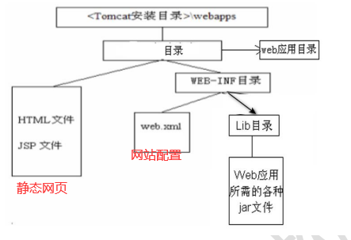
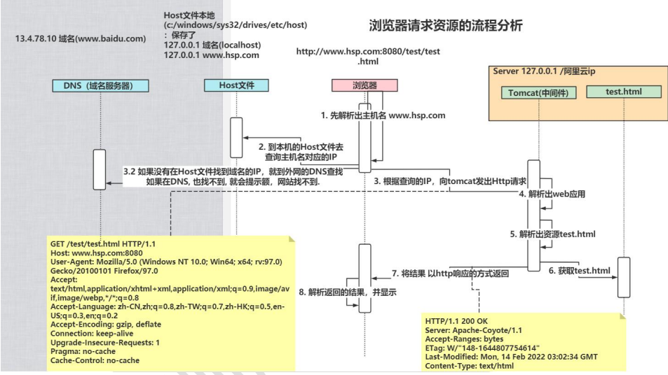
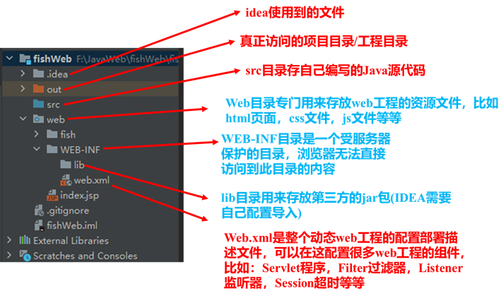

# Tomcat

## Tomcat

### Tomcat启动

1. 双击bin目录下的`start.bat`文件
2. 输入 http://localhost:8080/ ，默认在8080端口
3. 注意，不要关闭黑窗口，关闭了，tomcat服务就停止了
4. 在开发中，查看哪些接口在监听

> 输入 netstat -anb


使用catalina启动Tomcat

1. 进入到Tomcat的bin/目录下，输入cmd然后回车
2. 执行命令 `catalina run`

停止Tomcat的方法
1. 点击tomcat服务器窗口，直接点击关闭按钮
2. 进入Tomcat的bin/目录下，双击`shutdown.bat`，就可以停止Tomcat服务器(推荐)

### Tomcat目录结构


1. bin/：该目录存放启动和关闭Tomcat的脚本文件
2. conf/：存放Tomcat服务器的各种配置文件
   1. server.xml：用于配置tomcat的基本设置(启动端口，关闭端口，主机名)
   2. web.xml：用于指定tomcat运行时配置(比如servet等)
3. lib/：存放Tomcat服务器的支撑jar包
4. webapps/：该目录用于存放web应用，就是网站

### Tomcat服务中部署WEB应用



部署方式1：将web工程目录拷贝到Tomcat的`webapps`目录下，如`webapps/news/`
- 浏览器输入：`http://ip[域名]:port[端口号]/news[WEB应用/工程]/子目录.../文件名[应用下的某个资源]`

部署方式2：通过配置文件来部署
1. 在Tomcat下`conf/Catalina/localhost/`下，配置文件，比如`hsp.xml`
2. 通过配置，可以把一个web应用，映射到指定的目录，可以解决次磁盘空间分配问题

```xml
<?xml version="1.0" encoding="UTF-8" ?>
<!--Context 表示一个工程上下文 path表示工程的访问路径 docBase表示web目录在哪里-->
<Context path="/hsp" docBase="D:/album"/>
<!--
    浏览器访问：http://localhost:10000/hsp/index.html
    就表示访问 D:/album 目录下的index.html
-->
```

### 浏览器请求资源的流程分析(重点)



浏览器输入`http://localhost:8080/test/test.html` 或 `http://www.hsp.cpm:8080/test/test.html`

1. 浏览器解析出主机名 `localhost/www.hsp.com`
2. 到本机的Host文件(位置`c:/windows/sytem32/drives/etc/hosts`)去查询主机名对应的IP
3. 根据查询的IP，向tomcat发出HTTP请求
   - 如果没有在Host文件找到域名的IP，就到外网的DNS查找
   - 如果在DNS也找不到，就会提示网站找不到
4. Tomcat解析出web应用
5. 解析出资源`test.html`
6. 获取`test.html`
7. 将结果以HTTP响应的方式返回
8. 浏览器解析返回的结果

```
# host文件内容
## Copyright (c) 1993-2009 Microsoft Corp.
#
# This is a sample HOSTS file used by Microsoft TCP/IP for Windows.
#
# This file contains the mappings of IP addresses to host names. Each
# entry should be kept on an individual line. The IP address should
# be placed in the first column followed by the corresponding host name.
# The IP address and the host name should be separated by at least one
# space.
#
# Additionally, comments (such as these) may be inserted on individual
# lines or following the machine name denoted by a '#' symbol.
#
# For example:
#
#      102.54.94.97     rhino.acme.com          # source server
#       38.25.63.10     x.acme.com              # x client host
# localhost name resolution is handled within DNS itself.
#	127.0.0.1       localhost
#	::1             localhost
#61.164.246.245 windown.macxf.com

# 将域名 www.hsp.com 映射到IP地址 127.0.0.1
127.0.0.1 www.hsp.com
```

### 修改Tomcat服务端口

1. Tomcat目录下`conf`目录，修改`server.xml`配置文件
   ```xml
   <Server port="8005" shutdown="SHUTDOWN">
      <!--将服务端口修改为8888-->
       <Connector port="8888" protocol="HTTP/1.1"
                  connectionTimeout="20000"
                  redirectPort="8443" />
      
       <!--8009端口监听关闭Tomcat服务，bin/shutdowm.bat执行关闭指令-->
       <Connector port="8009" protocol="AJP/1.3" redirectPort="8443" />
   </Server>
   ```
2. `http://localhost`，默认访问80端口，即 `http://localhost:80` 等价于 `http://localhost`

## IDEA开发JavaWeb工程

### 操作流程

新建JavaWeb工程
1. 先创建一个java项目
2. 搜索 `Add Framework Support` 操作，点击
3. 导入 `Web Application`，点击ok即可

配置Tomcat&启动项目
1. 点击右上角的编辑配置 `Edit Configuration`
2. 点击+号，找到 `Tomcat Server` 下 `Local`
3. 选择一个本地下载好的Tomcat
4. 在右边的部署栏 `Deployment` 中点击+号，添加构建，选择 `Artifact...`
   - `+`：将要部署的web工程，加入到Tomcat运行实例中
   - `-`：从Tomcat实例中，删除不需要的web模块
5. 修改 `Application context` 即工程路径，建议改成当前Web改成名(项目名)，便于区分
6. 选择热加载，点击ok完成运行环境部署
7. 运行Tomcat，访问项目。直接选择Tomcat，点击运行按钮

> 1. 热加载选项说明
>    - on update action: 表示当我们更新操作时, Tomcat会自动更新类和资源(当jsp/html文
>      件修改时，可以生效, 但是如果你修改的 java 文件, 需要 redeploy 才会生效)
>    - on frame deactivation: 表示 IDEA 失去焦点(比如最小化), 也会导致 jsp/html 发生更
>      新 , 但是 java 修改了，还是需要 redeploy
> 2. 端口修改：只会影响到当前的项目，而不是去修改 `server.xml`
> 3. out目录是什么？
>   - 当 tomcat 启动时，会生成 out 目录，该目录就是 原项目资源的映射，我们浏览器访问的
>      资源是 out 目

### JavaWeb工程的目录介绍


