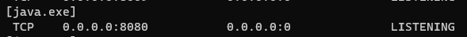
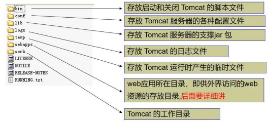
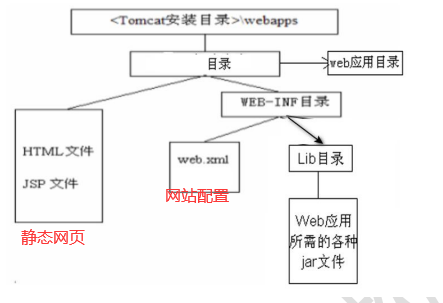

# Tomcat

### Tomcat启动

1. 双击bin目录下的`start.bat`文件
2. 输入 http://localhost:8080/ ，默认在8080端口
3. 注意，不要关闭黑窗口，关闭了，tomcat服务就停止了
4. 在开发中，查看哪些接口在监听

> 输入 netstat -anb

使用catalina启动Tomcat

1. 进入到Tomcat的bin/目录下，输入cmd然后回车
2. 执行命令 `catalina run`

停止Tomcat的方法
1. 点击tomcat服务器窗口，直接点击关闭按钮
2. 进入Tomcat的bin/目录下，双击`shutdown.bat`，就可以停止Tomcat服务器(推荐)

### Tomcat目录结构

1. bin/：该目录存放启动和关闭Tomcat的脚本文件
2. conf/：存放Tomcat服务器的各种配置文件
   1. server.xml：用于配置tomcat的基本设置(启动端口，关闭端口，主机名)
   2. web.xml：用于指定tomcat运行时配置(比如servet等)
3. lib/：存放Tomcat服务器的支撑jar包
4. webapps/：该目录用于存放web应用，就是网站

### Tomcat服务中部署WEB应用

部署方式1：将web工程目录拷贝到Tomcat的`webapps`目录下，如`webapps/news/`
- 浏览器输入：`http://ip[域名]:port[端口号]/news[WEB应用/工程]/子目录.../文件名[应用下的某个资源]`

部署方式2：通过配置文件来部署
1. 在Tomcat下`conf/Catalina/localhost/`下，配置文件，比如`hsp.xml`
2. 通过配置，可以把一个web应用，映射到指定的目录，可以解决次磁盘空间分配问题
