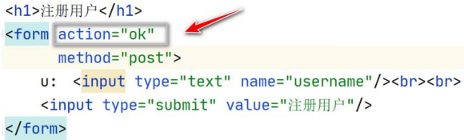
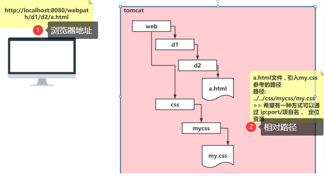

# WEB路径专题

## 工程路径问题

```html
<!DOCTYPE html>
<html lang="en">
<head>
    <meta charset="UTF-8">
    <title>base 标签</title>
</head>
<body>
<h1>注册用户</h1>
<!--
    1. 原来访问一个web资源的路径非常麻烦
    2. 目前定位访问的是 ok web资源
-->
<form action="http://localhost:8080/webpath/ok" method="get">
    用户名: <input type="text" name="username"><br/>
    密&nbsp;&nbsp;&nbsp;码: <input type="password" name="psw"><br/>
    <input type="submit" value="提交">
</form>
<h1>讨论区</h1>
<form action="http://localhost:8080/webpath/ok" method="post">
    讨论内容：<textarea cols="50" rows="5"></textarea><br/>
    <input type="submit" value="发布">
</form>
</body>
<h1>回复</h1>
<form action="http://localhost:8080/webpath/ok" method="post">
    回复内容：<textarea cols="50" rows="5"></textarea><br/>
    <input type="submit" value="回复">
</form>
</body>
</html>
```

> 问题：
> 
> 当填写工程路径地址 `"http://localhost:8080/webpath/ok"` 时，过于麻烦

## 工程路径解决方案

### 方案1. 相对路径

1. 使用相对路径来解决，因为页面所有的相对路径，在默认情况下，都会参考当前浏览器地址栏的路径 `http://ip:port/工程名/` + 资源来进行跳转
    所以，可以直接写成这样：`ok`
   
2. 相对路径带来的问题举例
   
3. 如果需要**指定页面相对路径参考的路径**，可以使用 `base` 标签来指定

### 方案2. base标签

1. base 标签是 HTML 语言中的基准网址标记，它是一个单标签，位于网页头部文件的 head 标签内。
2. 一个页面最多只能使用一个 base 元素，用来提供一个指定的默认目标，是一种表达路径和连接网址的标记。
3.  常见的 url 路径形式分别有相对路径与绝对路径，如果 base 标签指定了目标，浏览器将通过这个目标来解析当前文档中的所有相对路径，包括的标签有（a、img、link、form）
4. 也就是说，浏览器解析时会在路径前加上 base 给的目标，而页面中的相对路径也都转换成了绝对路径。使用了 base 标签就应带上 href 属性和 target 属性

- 如下演示 `base` 标签的使用，以及 `Servlet` 转发

```html
<!DOCTYPE html>
<html lang="en">
<head>
    <meta charset="UTF-8">
    <title>b.html</title>
    <!-- 老韩解读
    1. 如果没有<base href="http://localhost:10000/hspedu_servlet/">
    2. 当点击 返回 a.html 超链接，将会以当前浏览器的地址为路径来确定 路径
    3. 如果增加了<base href="http://localhost:10000/hspedu_servlet/">
    4. 将以 base 指定的 href 的地址为路径，来确定 超链接的路径
    -->
    <!--<base href="http://localhost:10000/hspedu_servlet/">-->

<!--    使用base标签来确定
    1. <base href="http://localhost:8080/webpath/">
    2. 标识的含义就是当前这个页面访问所有的资源都是以此作为参考
    3. `webpath/` 最后带上 / 表示路径，不带则表示资源
    4. 此时不能在使用相对路径
-->
<!--    <base href="http://localhost:8080/webpath/">-->
<!--    上面方法可以简化为以下
    1. base 标签是由浏览器进行解析
    2. 浏览器在解析到第一个 / 时候，会解析成 http://localhost:8080/
    3. 浏览器解析 href="/webpath/"  =>  href="http://localhost:8080/webpath/"
    4. 浏览器解析 <a href="a.html">返回 a.html~(base方法)</a> ，参考 base => 最后
        href="http://localhost:8080/webpath/webpath/a.html"
-->
    <base href="/webpath/">

</head>
<body>
<h1>这是/d1/d2/b.html</h1>
<!--<a href="../../a.html">返回 a.html~(相对路径方法)</a><br/>-->
<a href="a.html">返回 a.html~(base方法)</a>
<!--
    返回 a.html 文件
    1. 相对路径 => 使用前面的相对路径 http://localhost:8080/webpath/d1/d2/
    2. 因此相对路径为 ../../a.html => http://localhost:8080/webpath/  +  a.html
    3. 相对路径会让项目相互调用关系变得复杂
    4. 使用 base 标签解决
-->
</body>
</html>
```

```java
package com.charlie.servlet;

import javax.servlet.ServletException;
import javax.servlet.http.HttpServlet;
import javax.servlet.http.HttpServletRequest;
import javax.servlet.http.HttpServletResponse;
import java.io.IOException;

public class Servlet03 extends HttpServlet {
    @Override
    protected void doGet(HttpServletRequest req, HttpServletResponse resp) throws ServletException, IOException {
        System.out.println("Servlet03 进行转发...");
        // 通过转发来定位到 b.html
        /*
        1. 因为请求转发是在服务器端进行解析的，此时第一个 / 会被解析成
            http://ip:port/项目名(application context)/
        2. "/d1/d2/b.html" => http://localhost:8080/webpath/d1/d2/b.html
         */
        req.getRequestDispatcher("/d1/d2/b.html").forward(req, resp);
        // 3. 在服务器进行转发时，没有 / 就按照默认的方式参考定位 http://localhost:8080/webpath/
//        req.getRequestDispatcher("d1/d2/b.html").forward(req, resp);  // 效果同上
    }

    @Override
    protected void doPost(HttpServletRequest req, HttpServletResponse resp) throws ServletException, IOException {
        doGet(req, resp);
    }
}
```

## 工程路径注意事项和细节

1. Web路径的相对路径和绝对路径
   - 相对路径：
     - `.`表示当前路径
     - `..`表示上一级目录
     - 资源名 表示当前目录/资源名
   - 绝对路径：`http://ip:port/application_context/resource`
2. 在实际开发中，路径都要使用绝对路径，而不是相对路径
3. 在web中 `/` 斜杠 如果被**浏览器解析**，得到的地址是 `http://ip[域名]:port/` 。
4. 在web中 `/` 斜杠 如果被服务器解析，得到的地址是：`http://ip[域名]:port/工程路径/` 。下面的几种情况就是如此：
    - `<url-pattern>/servleturl</url-pattern>`
    - `servletContext.getRealPath("/");` ===> 是得到执行路径
    - `req.getRequestDispactcher("/");`
    ```
   package com.charlie.servlet;

    import javax.servlet.ServletException;
    import javax.servlet.annotation.WebServlet;
    import javax.servlet.http.HttpServlet;
    import javax.servlet.http.HttpServletRequest;
    import javax.servlet.http.HttpServletResponse;
    import java.io.IOException;
    
    @WebServlet(urlPatterns = {"/hello"})
    public class HelloServlet extends HttpServlet {
    @Override
    protected void doGet(HttpServletRequest req, HttpServletResponse resp) throws ServletException, IOException {
    System.out.println("HelloServlet 被调用...");

        // realPath 是项目的工作路径
        String realPath = getServletContext().getRealPath("/");
        System.out.println("realPath= " + realPath);    // realPath= E:\javaweb\webpath\out\artifacts\webpath_war_exploded\

        // contextPath 是tomcat配置的 application context
        // 将来可以在服务器渲染技术 jsp/thymeleaf 动态获取工程路径
        String contextPath = getServletContext().getContextPath();
        System.out.println("contextPath= " + contextPath);  // contextPath= /webpath
    }

    @Override
    protected void doPost(HttpServletRequest req, HttpServletResponse resp) throws ServletException, IOException {
        doGet(req, resp);
    }
    }
   ```
5. **在javaWeb中路径最后带 `/` 和不带含义不同，一定要注意！**
   - `<a href="/a/servlet03">网址</a>`：servlet03表示**资源**
   - `<a href="/a/servlet03/">网址</a>`：servlet03表示**路径**
6. 特别说明：`resp.sendRedirect("/")` 重定向，该语句虽然是**在服务器执行的，但是服务器是把斜杠 `/` 发送给浏览器解析**，
    。因此得到地址 `http://ip:port/`

> 在编写资源路径时，要考虑以下几点：
> 1. 路径前面有无 `/`
> 2. 路径在哪里被解析(浏览器/服务器)。如果前面有 `/`，浏览器解析为 `http://ip:port/`；服务器解析为 `/application_context/`
> 3. 如果路径前没有 `/`，并且在浏览器解析，则以浏览器当前的地址来去掉资源部份，作为一个相对路径。
> 4. 路径最后有没有 `/`。如果最后有 `/` 表示路径，如果没有则表示资源

- 使用重定向方式

```java
package com.charlie.servlet.homework;

import javax.servlet.ServletException;
import javax.servlet.annotation.WebServlet;
import javax.servlet.http.HttpServlet;
import javax.servlet.http.HttpServletRequest;
import javax.servlet.http.HttpServletResponse;
import java.io.IOException;

@WebServlet(urlPatterns = {"/myServlet02"})
public class MyServlet02 extends HttpServlet {
    @Override
    protected void doGet(HttpServletRequest req, HttpServletResponse resp) throws ServletException, IOException {
        System.out.println("MyServlet02 重定向方式....");
        // 通过重定向来定位 /views/user/user.html
        /*
        1. 重定向发生在浏览器
        2. 写法1：http://localhost:8080/webpath/views/user/user.html
        3. 写法2：views/user/user.html 浏览器当前资源为登录界面 http://localhost:8080/webpath/login.html
            则该写法为 http://localhost:8080/webpath/ 拼接上 views/user/user.html
        4. 写法3：/webpath/views/user/user.html    其中 / 解析为 http://localhost:8080/
        5. 推荐写法 contextPath + "/views/user/user.html"
         */
        String contextPath = getServletContext().getContextPath();
        resp.sendRedirect(contextPath + "/views/user/user.html");
    }

    @Override
    protected void doPost(HttpServletRequest req, HttpServletResponse resp) throws ServletException, IOException {
        doGet(req, resp);
    }
}
```

## WEB工程路径优化

- 动态获取工程名 `application context`，如 `/webpath`
- 使用 `jsp/thymeleaf` 加入标签，动态获取即可

```jsp
<%--
  Created by IntelliJ IDEA.
  User: HX
  Date: 2023/11/30
  Time: 19:30
  To change this template use File | Settings | File Templates.
--%>
<%@ page contentType="text/html;charset=UTF-8" language="java"  isELIgnored="false" %>
<html>
  <head>
    <title>$Title$</title>
  </head>
  <body>
<%-- /webpath --%>
  $END$ 动态地获取到工程路径： <%=request.getContextPath()%>
  </body>
</html>
```
